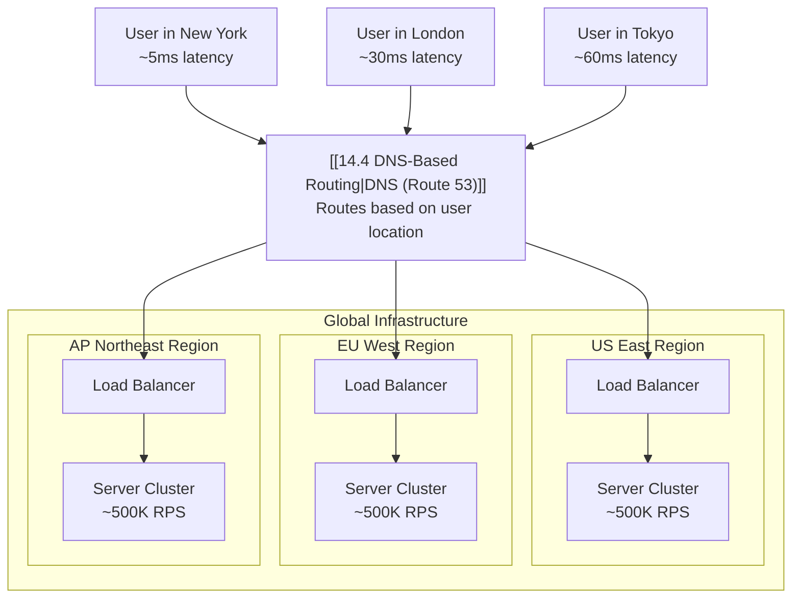

# Geographic Distribution

#networking/latency #architecture/global #scaling/geo

> **Definition**: Geographic distribution is the practice of deploying application servers in multiple physical locations (regions, data centers, or points of presence) around the world so that users are served by the nearest server, minimizing network latency and providing fault tolerance against regional outages.

## The Physics of Latency

Light travels through fiber optic cables at approximately **200,000 km/second** (two-thirds the speed of light in vacuum, due to the refractive index of glass). This physical limit creates hard latency floors that no amount of software optimization can overcome:

| Path | Distance (approx) | Minimum one-way latency |
|---|---|---|
| Same data center | 0.1 km | ~0.001 ms |
| Same city | 50 km | ~0.25 ms |
| Same region (e.g., US East) | 1,000 km | ~5 ms |
| Cross-country (NY ↔ LA) | 4,000 km | ~20 ms |
| Cross-continent (NY ↔ London) | 5,500 km | ~28 ms |
| New York ↔ Tokyo | 10,800 km | ~54 ms |
| New York ↔ Sydney | 16,000 km | ~80 ms |

These are **theoretical minimums**. Real-world latency includes routing hops, packet processing at each router, and queuing delays. A real New York ↔ Tokyo request typically takes 120–180ms round-trip.

For an application handling 1 million requests per second, even a 100ms extra latency per request dramatically impacts user experience. A user in Tokyo waiting 200ms for each API response will perceive your application as sluggish, regardless of how fast your servers in Virginia are.

## How Geographic Distribution Works

Each region runs its own full stack: [[14.1 What is Load Balancing|load balancers]], application servers, and often a local database replica. Global total: if each region handles 500K RPS, three regions give you 1.5M RPS globally.

## The Video's Key Insight

The video makes a crucial observation: **Amazon doesn't use one supercomputer.** Amazon serves billions of requests per day using thousands of servers distributed across dozens of data centers worldwide. No single machine — no matter how powerful — can handle global-scale traffic alone.

This is the architectural principle behind everything from Netflix to Google: **distribute, don't centralize.**

## Data Replication Across Regions

Geographic distribution introduces a new challenge: **data consistency**. If a user in New York creates an account, when will that account be visible to a user in Tokyo?

| Strategy | Consistency | Latency | Complexity | Use Case |
|---|---|---|---|---|
| **Single-region writes** | Strong (all reads go to primary) | High for non-primary readers | Low | Most applications |
| **Multi-master replication** | Eventual (changes propagate async) | Low everywhere | High | Global social media, chat |
| **Synchronous multi-region** | Strong | High (waits for all regions) | Very high | Financial transactions |

The simplest approach (and what most companies start with): write to one primary region, asynchronously replicate to read replicas in other regions. Users in any region can read quickly, but writes always go to the primary (adding some latency for non-primary users).

## Legal and Compliance Requirements

Geographic distribution isn't just about performance — it's often a **legal requirement**:

- **GDPR (Europe)**: EU citizens' personal data must be stored and processed within the EU, or with explicit consent and appropriate safeguards.
- **Data sovereignty laws**: Some countries (China, Russia, Australia) require that certain data never leaves their borders.
- **Industry regulations**: HIPAA (healthcare), PCI DSS (payment cards), and SOC 2 may impose data residency requirements.

## CDNs: The First Layer of Distribution

Before you even get to application servers, [[14.3 CDNs|Content Delivery Networks]] handle static content (images, CSS, JavaScript, fonts) from edge locations worldwide. This offloads a massive amount of traffic from your application servers. A well-configured CDN can serve 80-90% of total requests without those requests ever reaching your application tier.

## Cost Implications

Running infrastructure in multiple regions multiplies your [[13.7 Cloud Cost Estimation|costs]]:

- **Compute**: N regions × N servers per region
- **Data transfer**: Cross-region replication adds inter-region data transfer costs ($0.02-$0.12/GB)
- **Databases**: Multi-region RDS/Aurora deployments with read replicas in each region

This is why geographic distribution is typically adopted in stages: start with one region, add a second when you have users in another geography, expand further as the business grows.

## Common Mistakes

- **Distributing too early**: The operational complexity of multi-region deployment is enormous. Don't do it until you have real users in multiple geographies with measurable latency complaints.
- **Ignoring cross-region costs**: Data transfer between regions is expensive and often the largest hidden cost in global architectures.
- **Not testing regional failover**: A region outage should trigger automatic traffic rerouting. Test this regularly with game days.

## Further Reading

- [[14.3 CDNs]] — edge caching for static content
- [[14.4 DNS-Based Routing]] — how users are routed to the nearest region
- [[14.1 What is Load Balancing]] — load balancing within each region
- [[13.7 Cloud Cost Estimation]] — the cost of multi-region deployment