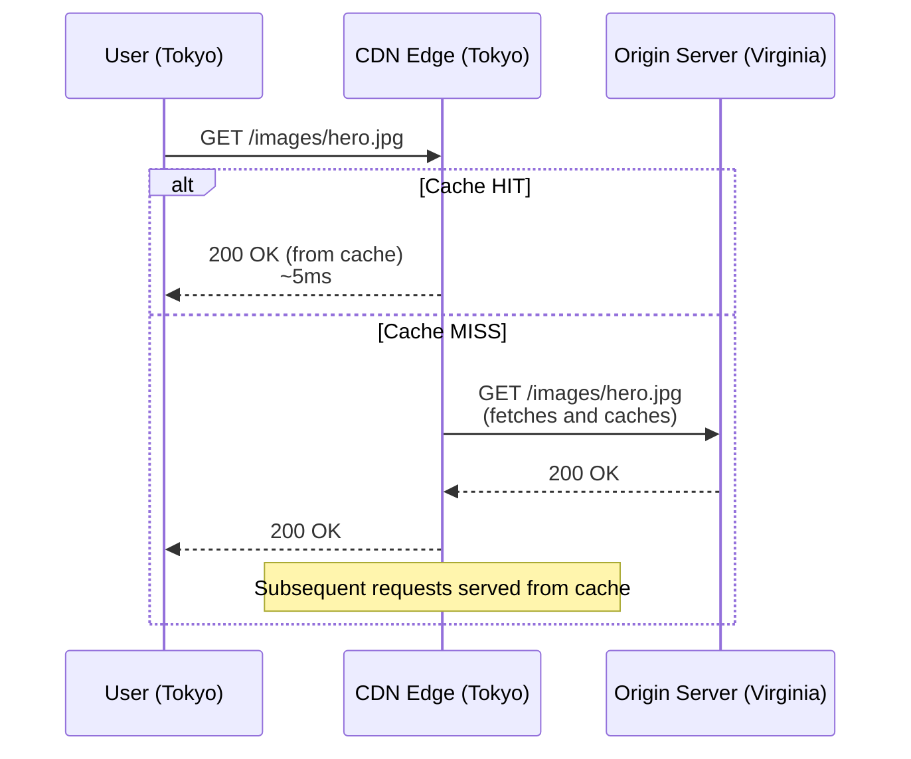

# CDNs (Content Delivery Networks)

#networking/cdn #scaling/edge #performance/latency

> **Definition**: A Content Delivery Network (CDN) is a globally distributed network of proxy servers (edge nodes) that cache and serve content from locations geographically close to users, dramatically reducing latency and offloading traffic from origin servers.

## The Core Mechanism

Without a CDN, every user request — whether for an HTML page, an image, or a CSS file — travels all the way to your origin server (e.g., an EC2 instance in Virginia). With a CDN, static content is cached at edge locations worldwide. When a user in Tokyo requests an image:

**Cache hit latency**: ~1–10ms (user to nearest edge)
**Cache miss latency**: ~100–200ms (edge to origin, then edge to user)
**Direct (no CDN) latency**: ~150–300ms (user to origin directly)

After the first request populates the cache, every subsequent request for that resource is served locally at edge speed — regardless of how many users request it.

## What CDNs Cache

### Static Content (Always Cached)
- Images (JPEG, PNG, WebP, SVG)
- CSS stylesheets
- JavaScript bundles
- Fonts (WOFF, WOFF2)
- Videos (progressive download, HLS/DASH segments)
- PDFs and downloadable files

### Dynamic Content (Cached with Configuration)
- API responses (with appropriate `Cache-Control` headers)
- HTML pages (for fully static sites or with stale-while-revalidate)
- JSON configuration data

### Never Cached
- Personalized content (user profiles, dashboards)
- Real-time data (stock prices, chat messages)
- Payment and authentication endpoints
- POST/PUT/DELETE requests (by default)

## Major CDN Providers

| Provider | Edge Locations | Key Differentiator |
|---|---|---|
| **Cloudflare** | 300+ cities in 100+ countries | Free tier, security features (WAF, DDoS), Workers edge compute |
| **AWS CloudFront** | 600+ points of presence | Deep AWS integration, tight with S3/ALB/Lambda |
| **Akamai** | 1,000+ networks in 140+ countries | Largest network, enterprise features, premium pricing |
| **Fastly** | 80+ PoPs in 30+ countries | Instant purge, real-time logging, VCL edge logic |
| **BunnyCDN** | 100+ PoPs | Extremely cost-effective, simple pricing |

## Edge Computing

Modern CDNs go beyond caching. They allow you to **run code at the edge**:

- **Cloudflare Workers**: JavaScript/TypeScript executed at every edge location. Can modify responses, implement authentication, do A/B testing, or serve entire applications.
- **AWS Lambda@Edge**: Runs Lambda functions in response to CloudFront events (viewer request, origin request, origin response, viewer response).
- **Deno Deploy**: Server-side JavaScript at the edge with built-in database connectivity.

Edge computing enables architectures where **the edge handles the request entirely**, never reaching the origin server. For a simple "return user profile JSON" API, an edge function could read from a replicated key-value store (like Cloudflare KV or Durable Objects) and respond in under 10ms globally.

## Cache Invalidation at Scale

The hardest problem with CDNs is **cache invalidation** — when your content changes, how do you ensure every edge node serves the updated version?

### Time-to-Live (TTL) Expiration
Set `Cache-Control: max-age=3600` — the edge serves the cached version for 1 hour, then revalidates. Simple but means updates take up to 1 hour to propagate.

### Active Purge
Call the CDN API to explicitly purge cached content: `POST /purge { "files": ["/images/hero.jpg"] }`. Cloudflare and Fastly offer instant purging. AWS CloudFront purges can take 60–300 seconds.

### Cache Keys
By default, the cache key is the full URL (including query parameters). You can customize cache keys to ignore certain parameters (e.g., ignore `utm_source` for analytics tracking that doesn't affect content).

### Stale-While-Revalidate
`Cache-Control: max-age=3600, stale-while-revalidate=86400` — serve stale content while asynchronously fetching a fresh version. Users always get fast responses, and the cache updates in the background.

## Why CDNs Are Essential at Scale

Consider a popular product page that receives 10,000 requests per second globally. Without a CDN, your origin server handles all 10,000 RPS. With a CDN:

- The page's HTML (5KB) might be cached at the edge → 0 origin requests
- Its images (total 500KB) are cached → 0 origin requests
- Its JavaScript bundle (200KB) is cached → 0 origin requests

Only the **dynamic API calls** (user cart, recommendations) reach your origin — perhaps 500 RPS. The CDN absorbs 95% of the traffic.

## Common Mistakes

- **Not setting appropriate Cache-Control headers**: Without explicit caching headers, CDNs may not cache at all (or may cache for too long). Always be explicit.
- **Forgetting to invalidate**: Deploying a new version of your JavaScript bundle but forgetting to purge the CDN means users get the old version until TTL expires.
- **Caching personalized content**: If a CDN caches a response that includes user-specific data (e.g., a "Welcome, John" header), all users will see "Welcome, John." Always set `Vary: Cookie` or `Cache-Control: private` for personalized content.

## Further Reading

- [[14.2 Geographic Distribution]] — CDNs are the first layer of geographic distribution
- [[14.4 DNS-Based Routing]] — DNS routes users to the nearest CDN edge
- [[14.1 What is Load Balancing]] — load balancing between CDN edge and origin