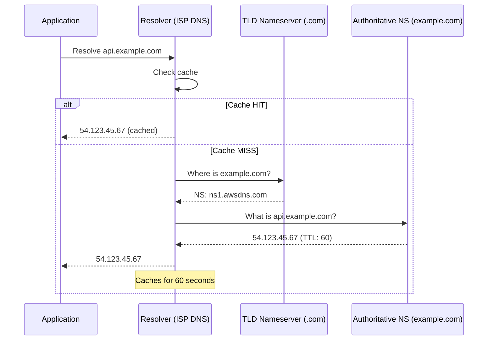
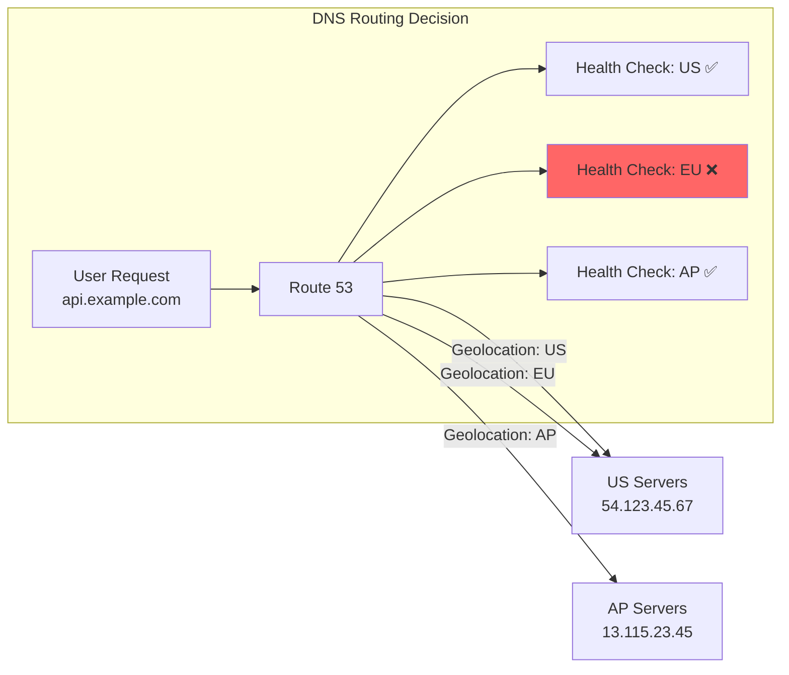

# DNS-Based Routing

#networking/dns #scaling/global #networking/routing

> **Definition**: DNS-based routing uses the Domain Name System not just for name resolution (translating domain names to IP addresses) but as an active traffic management tool — directing users to different servers based on geographic location, server health, latency measurements, or weighted distribution.

## DNS Fundamentals

The Domain Name System is a hierarchical, distributed database that translates human-readable domain names (`api.example.com`) into machine-readable IP addresses (`54.123.45.67`). The resolution process follows a chain of queries:



### TTL (Time to Live)

Every DNS record includes a TTL value that tells resolvers how long to cache the response. A TTL of 60 seconds means the resolver will re-query the authoritative nameserver after 60 seconds. Lower TTLs enable faster failover but increase DNS query volume.

## DNS as Load Balancing: Round-Robin DNS

The simplest form of DNS-based load balancing is **round-robin DNS**: configure a single domain name to resolve to multiple IP addresses, with the DNS server rotating the order of results:

```
; Query: api.example.com
; Response:
api.example.com. 60 IN A 54.123.45.67    # Server 1 (US East)
api.example.com. 60 IN A 52.14.78.90    # Server 2 (EU West)
api.example.com. 60 IN A 13.115.23.45   # Server 3 (AP Northeast)
```

The client (or its local resolver) typically picks the first IP in the list. Since the DNS server rotates the order on each query, traffic is roughly distributed across all servers.

### Limitations of Round-Robin DNS

1. **No health awareness**: DNS doesn't know if Server 2 is down. It will still return Server 2's IP to ~33% of users, who will get connection errors.
2. **Client-side caching**: Even with a 60-second TTL, some ISPs and operating systems cache DNS results for much longer (30 seconds to 5 minutes). This means failover is slow.
3. **Uneven distribution**: Not all clients pick the first IP. Some pick randomly, some pick the last. Distribution is statistical, not deterministic.
4. **No weight control**: You can't say "send 70% of traffic to Server 1 and 30% to Server 2."

## Advanced DNS Routing: AWS Route 53

AWS Route 53 (named after DNS port 53) addresses these limitations with **routing policies**:

### Geolocation Routing
Routes traffic based on the user's geographic location (country or continent). Users in the EU are sent to EU servers, users in Asia to Asian servers. This is the primary mechanism behind [[14.2 Geographic Distribution|geographic distribution]].

```
api.example.com:
  US records    → 54.123.45.67  (US East servers)
  EU records    → 52.14.78.90  (EU West servers)
  Asia records  → 13.115.23.45 (AP Northeast servers)
  Default       → 54.123.45.67 (fallback to US)
```

### Latency-Based Routing
Route 53 continuously measures the latency between users and each region's servers. Users are routed to the region with the lowest measured latency. This is better than geolocation when network conditions don't align with geography (e.g., a user in eastern Russia might have lower latency to US West than to AP Northeast).

### Weighted Routing
Distribute traffic by percentage weights. Useful for canary deployments: send 5% of traffic to the new version, 95% to the current version.

### Failover Routing
Define a primary and secondary record. Route 53 monitors the primary's health. If the primary fails health checks, all traffic automatically routes to the secondary.

### Health Checks
Route 53 can monitor the health of your endpoints by making HTTP(S), TCP, or HTTPS requests at regular intervals (every 10 or 30 seconds). If an endpoint fails 3 consecutive health checks, Route 53 stops returning its IP address in DNS responses.



## DNS as the First Layer

DNS-based routing is the **outermost layer** of a multi-layered [[14.1 What is Load Balancing|load balancing]] architecture:

1. **DNS (Route 53)**: Routes users to the nearest [[14.2 Geographic Distribution|region]] — latency-based or geolocation.
2. **CDN (CloudFront)**: Caches and serves static content from edge locations.
3. **Application Load Balancer**: Distributes traffic across servers within the region.
4. **PM2 Cluster**: Distributes connections across worker processes within each server.

Each layer handles a different scale of distribution. DNS is coarse-grained (regional), ALB is medium-grained (per-server), and PM2 is fine-grained (per-process).

## Common Mistakes

- **TTL too high**: A 24-hour TTL means a failed server's IP is returned to users for up to 24 hours after it goes down. For production, use 60–300 seconds.
- **Relying solely on DNS for health checking**: DNS health checks run every 10–30 seconds, and client-side caching adds more delay. Use [[14.1 What is Load Balancing|real load balancers with health checks]] for server-level failover within a region.
- **Not understanding the resolution chain**: DNS changes propagate through ISP resolvers, browser caches, and OS caches. The "propagation time" is really the time for all these caches to expire based on TTL.
- **Using CNAME at the zone apex**: You can't create a CNAME record for `example.com` (the root). Use Route 53's Alias records instead, which work like CNAMEs at the apex.

## Further Reading

- [[14.1 What is Load Balancing]] — DNS is the outermost load balancing layer
- [[14.2 Geographic Distribution]] — DNS enables geographic routing
- [[14.3 CDNs]] — DNS routes users to the nearest CDN edge
- [[13.1 Amazon Web Services (AWS)]] — Route 53 is an AWS service