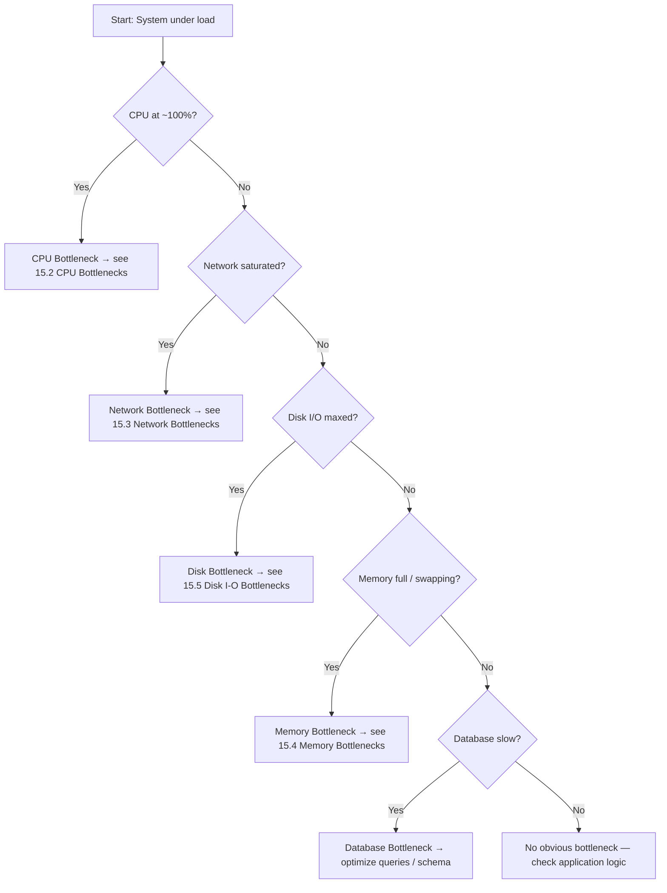

# Identifying Bottlenecks

#scaling/bottleneck #performance/diagnosis #fundamentals

## Definition

A **bottleneck** is the single component in a system that constrains the overall throughput or performance of the entire pipeline. No matter how fast every other component operates, the system's maximum throughput is bounded by the slowest link — the bottleneck. This is a direct consequence of the theory of constraints: a chain is only as strong as its weakest link, and a pipeline is only as fast as its slowest stage.

## Amdahl's Law

[[Amdahl's Law]] provides the mathematical foundation for understanding bottlenecks. It states that the maximum speedup achievable by improving a single component is limited by the fraction of time that component actually consumes:

$$S = \frac{1}{(1 - p) + \frac{p}{s}}$$

Where $S$ is the overall speedup, $p$ is the proportion of execution time affected by the improvement, and $s$ is the speedup of that component. The critical insight: **if 20% of your request processing time is spent on a single database query, even making that query infinitely fast only yields a maximum 1.25× speedup.** At extreme scale, this law becomes ruthlessly apparent — you must identify and address the *dominant* bottleneck first.

## Types of Bottlenecks

Every system component can become a bottleneck under the right (wrong) conditions:

| Bottleneck Type | Key Metric | Common Symptom |
|---|---|---|
| **CPU** | % utilization, load average | Response time degrades linearly with load |
| **Memory** | Used bytes, swap activity | OOM kills, sudden latency spikes |
| **Network** | Bytes/sec, packets/sec | CPU idle but throughput flatlines |
| **Disk** | IOPS, throughput, iowait | High iowait%, slow writes |
| **Database** | Query latency, connection count | Slow queries dominate request time |
| **Code Complexity** | Cyclomatic complexity, algorithmic complexity | $O(n^2)$ algorithms under load |

## The Diagnostic Process

Identifying a bottleneck is fundamentally a process of elimination. You must **monitor all resources simultaneously** and find the one at or near 100% utilization. The decision tree below captures the systematic approach:

## Video Route Examples

The course demonstrates bottleneck identification through three deliberately crafted routes:

- **`/simple` route**: Returns a small JSON response. The CPU becomes the bottleneck because the server is doing computation (JSON serialization, HTTP framing) for every request. [[15.2 CPU Bottlenecks]] covers this in depth.
- **`/patch` route**: Returns a large JSON payload (e.g., 6 KB per response). Here the CPU is *not* at 100%, but the network card is saturated. This is a **network bottleneck** — covered in [[15.3 Network Bottlenecks]].
- **`/code` route**: Writes data to the database on every request. The bottleneck shifts to database I/O and disk operations. See [[15.5 Disk I-O Bottlenecks]].

## The Cascade Effect

Perhaps the most important insight about bottlenecks is this: **fixing one bottleneck inevitably reveals the next one.** This is not a failure of analysis — it is the fundamental nature of systems engineering. When you add CPU capacity, you'll hit the network ceiling. When you upgrade the network, you'll saturate the disk. When you speed up the disk, you'll exhaust memory. This cascade continues until every component is balanced.

> **Common Mistake:** Engineers often optimize the wrong component. They add caching when the bottleneck is CPU, or they upgrade the database when the network is saturated. The *only* way to know for certain is to measure. Intuition is unreliable at scale.

## Best Practices

1. **Monitor everything simultaneously** — use tools like `mpstat`, `iostat`, `sar`, `nethogs`, and application-level metrics
2. **Establish baselines** — know what "normal" looks like before diagnosing "abnormal"
3. **Change one variable at a time** — if you add CPU *and* memory simultaneously, you won't know which fixed the bottleneck
4. **Automate the diagnosis** — at 1M RPS, manual observation is too slow; use alerting and dashboards
5. **Accept the cascade** — plan for iterative optimization, not a one-time fix

## Further Reading

- [[15.2 CPU Bottlenecks]] — deep dive into CPU-bound systems
- [[15.3 Network Bottlenecks]] — when bandwidth, not compute, is the limit
- [[15.4 Memory Bottlenecks]] — the hidden cost of every allocation
- [[15.5 Disk I-O Bottlenecks]] — why IOPS matter more than you think
- [[5.6 Resource Monitoring]] — tools and techniques for measurement