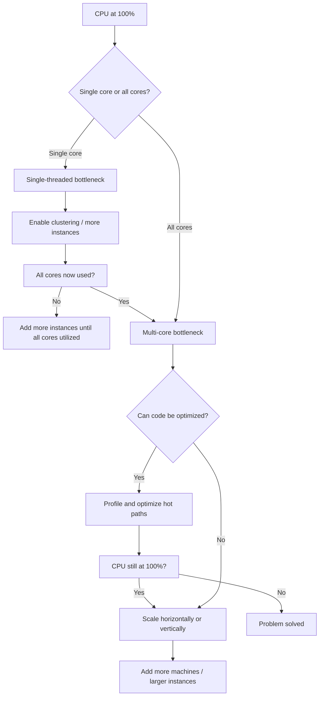

# CPU Bottlenecks

#scaling/bottleneck #performance/cpu #fundamentals

## Definition and Signs

A **CPU bottleneck** occurs when the processor(s) in a system are operating at or near 100% utilization, and additional incoming requests cannot be processed because there are no available CPU cycles. The characteristic signs are unmistakable:

- **CPU utilization** sits at 95–100% across all cores (or a single core, in single-threaded runtimes)
- **Load average** (in Linux) consistently equals or exceeds the number of available cores
- **Response times** degrade linearly as request rate increases — each new request must wait in a queue for CPU time
- **Throughput plateaus** — adding more network bandwidth or faster storage does nothing because the CPU is the limiting factor

## Why CPU Is Often the First Bottleneck

The CPU is the "brain" of every request. No matter what your application does — parsing HTTP, serializing JSON, executing business logic, querying a database driver, compressing a response — **every single operation requires CPU cycles**. Unlike network or disk, which can be idle for certain request types, the CPU is *always* involved. This is why, for compute-bound workloads like API servers, CPU is typically the first ceiling you hit.

Think of it as an analogy: if you have a factory where every product must pass through a single worker's workstation, that worker is your bottleneck regardless of how fast the conveyor belts (network) or warehouse (storage) operate.

## Single-Threaded vs. Multi-Core CPU Bottlenecks

### Single-Threaded Bottleneck

Languages and runtimes like **Node.js** (by default), Python's GIL-bound threads, and Ruby's MRI operate on a single thread of execution. On a 128-core machine, only **one core** will be at 100% while the other 127 sit idle. This is catastrophically wasteful but easily diagnosed — run `mpstat -P ALL 1` and observe that only CPU 0 is maxed.

The fix is [[12.1 Process Clustering]]: launch multiple instances (e.g., via Node.js `cluster` module, PM2, or Kubernetes pod replicas) so that all cores are utilized.

### Multi-Core Bottleneck

After clustering, you may find *all* cores at 100%. This is the harder problem — it means you've truly exhausted the computational capacity of the machine. Solutions include:

1. **Vertical scaling**: Move to a larger instance (more cores, higher clock speed)
2. **Horizontal scaling**: Add more machines behind a [[14.2 Geographic Distribution|load balancer]]
3. **Code optimization**: Profile and optimize hot paths — see [[12.2 Code Profiling]]
4. **Algorithmic improvement**: Replace $O(n^2)$ algorithms with $O(n \log n)$ equivalents
5. **Language migration**: Rewrite critical paths in Rust, Go, or C++ for 5–10× CPU efficiency

## Video Example: Scaling from 8K to 42K RPS

The course demonstrates this vividly. On a Mac Studio with a single Node.js instance, the `/simple` route achieves approximately **8,000 RPS** with one core at 100%. By launching **12 clustered instances** (one per logical core), throughput jumps to approximately **42,000 RPS** — a ~5.25× improvement that falls short of 12× due to overhead from the operating system scheduler, memory bus contention, and cluster management IPC.

## The Cost of CPU at Scale

At extreme scale, CPU is expensive. The video uses AWS **c8i.32xlarge** instances with 128 vCPUs, priced at approximately **$6/hour** on-demand. To handle 1M RPS, the architecture requires two such instances plus a database server — totaling roughly $18–20/hour just for compute.

> **Key Insight:** At 1M RPS, every CPU cycle matters. A single unnecessary object allocation, an inefficient string operation, or a redundant serialization step — when multiplied by 1 million requests per second — can consume entire cores. This is why companies operating at this scale invest heavily in profiling, benchmarking, and often rewrite performance-critical paths in systems-level languages.

## CPU Bottleneck Decision Framework

## Common Mistakes

- **Optimizing without profiling** — you guess the slow function, but it's usually something unexpected
- **Ignoring scheduler overhead** — context switching between thousands of processes costs real CPU cycles
- **Over-allocating** — more instances than cores causes thrashing, not improvement
- **Forgetting about NUMA** — on multi-socket systems, cross-socket memory access is significantly slower

## Further Reading

- [[15.1 Identifying Bottlenecks]] — the systematic diagnostic process
- [[2.2 Core Utilization]] — understanding CPU cores and threads
- [[12.1 Process Clustering]] — how to use all available cores
- [[12.2 Code Profiling]] — finding the slow code
- [[16.1 Cloud Cost Models]] — the financial cost of CPU at scale