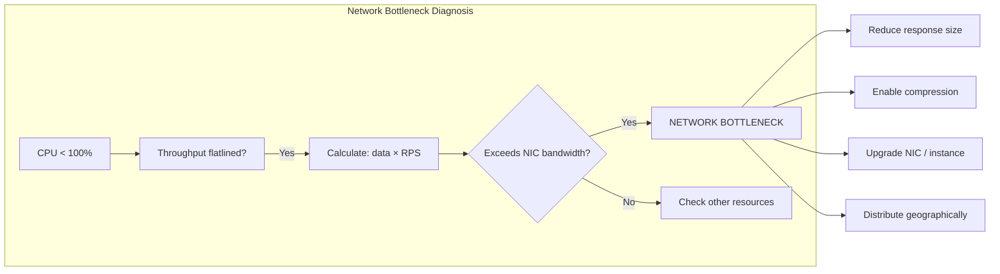

# Network Bottlenecks

#scaling/bottleneck #network/bandwidth #performance/diagnosis

## The Counter-Intuitive Bottleneck

Most engineers intuitively believe that **CPU or database** is always the bottleneck. At extreme scale, this assumption is often wrong. A **network bottleneck** occurs when the CPU has spare capacity, the database is responsive, and the disk is idle — but you *still cannot push more requests per second* because you've hit the physical bandwidth limit of the [[2.6 Network Cards and Bandwidth|network interface card (NIC)]].

The hallmark sign: **CPU is NOT at 100%, yet throughput is completely flat.** No amount of CPU optimization will help. The network card simply cannot move more bits per second.

## The Bandwidth Ceiling

Network bandwidth is a hard physical limit governed by [[2.5 Bits, Bytes, and Data Units|the data rate of the NIC]] and the underlying switch infrastructure. You cannot send more data than the wire allows. The relationship is straightforward:

$$\text{data\_per\_request} \times \text{requests\_per\_second} \leq \text{network\_bandwidth}$$

If each response is 6 KB and your NIC provides 50 Gbps (6.25 GB/s), your theoretical maximum is:

$$\frac{6.25 \text{ GB/s}}{6 \text{ KB}} \approx 1,041,000 \text{ RPS}$$

But in practice, protocol overhead (TCP headers, IP headers, Ethernet framing, TLS encryption overhead, ACK packets) consumes 10–20% of raw bandwidth, reducing the effective maximum significantly.

## Video Example: The /patch Route

The `/patch` route in the course returns a large JSON payload (approximately 6 KB per response). When benchmarked on a 50 Gbps network, the system pushes approximately **6 GB/s** of data — dangerously close to the 6.25 GB/s theoretical maximum of the 50 Gbps NIC. At this point, the CPU is only at ~30–40% utilization. The network is the unequivocal bottleneck.

This is a profound realization: **even with abundant CPU and a fast database, the network card can be the binding constraint.** The conventional wisdom that "the database is always the bottleneck" breaks down when you're moving massive amounts of data.

## Network Card Speeds

| NIC Speed | Throughput (GB/s) | Typical Use Case |
|---|---|---|
| 1 Gbps | 0.125 GB/s | Development, small applications |
| 10 Gbps | 1.25 GB/s | Medium-scale web servers |
| 25 Gbps | 3.125 GB/s | High-traffic API servers |
| 50 Gbps | 6.25 GB/s | High-performance compute, the video's setup |
| 100 Gbps | 12.5 GB/s | Data centers, backbone infrastructure |
| 300–400 Gbps | 37.5–50 GB/s | Cutting-edge data center interconnects |

AWS's **Elastic Network Adapter (ENA)** supports up to 100 Gbps depending on the instance type. The c8i.32xlarge used in the video is capped at **50 Gbps** — a hard, non-negotiable limit. See [[17.3 Network Interface Cards at Scale]] for deeper NIC internals.

## Solutions to Network Bottlenecks

### 1. Reduce Response Size
The most direct attack: send fewer bytes per response. Trim unnecessary JSON fields, use shorter key names, remove whitespace, and eliminate redundant data. A 10% reduction in response size yields a 10% increase in achievable RPS.

### 2. Compression (gzip / Brotli)
Enable HTTP compression at the load balancer or application level. Brotli typically achieves 15–25% better compression than gzip. However, compression consumes CPU — so you're trading a network bottleneck for potential CPU pressure. At scale, this tradeoff is usually worth it because CPU is easier to scale (add instances) than NIC bandwidth.

### 3. More Powerful Network Cards
Upgrading from a 10 Gbps to a 50 Gbps NIC gives a 5× bandwidth increase. However, this often requires upgrading the entire instance type and the underlying switch infrastructure. On AWS, NIC bandwidth is tied to the instance family.

### 4. Geographic Distribution
Rather than pushing 1M RPS through a single data center, distribute across 5–10 regions, each handling 100K–200K RPS. This reduces per-server network load and also improves latency for users. See [[14.2 Geographic Distribution]].

## Why "The Database Is Always the Bottleneck" Is Wrong

This is perhaps the most important conceptual shift in the course. At typical scales (hundreds to low thousands of RPS), the database is indeed often the bottleneck. But at **extreme scale** — hundreds of thousands to millions of RPS — the network frequently becomes the binding constraint *before* the database does, especially for read-heavy workloads or workloads with large response payloads. The only way to know is to measure.

## Common Mistakes

- **Assuming CPU is always the bottleneck** — check network utilization first
- **Ignoring protocol overhead** — actual throughput is 80–90% of theoretical NIC speed
- **Enabling compression without measuring CPU impact** — you might swap one bottleneck for another
- **Forgetting about ingress traffic** — requests also consume bandwidth, not just responses

## Further Reading

- [[15.1 Identifying Bottlenecks]] — the full diagnostic framework
- [[2.5 Bits, Bytes, and Data Units]] — understanding data size calculations
- [[2.6 Network Cards and Bandwidth]] — NIC fundamentals
- [[17.3 Network Interface Cards at Scale]] — advanced NIC topics (SR-IOV, DPDK)
- [[14.2 Geographic Distribution]] — distributing to reduce per-region network load