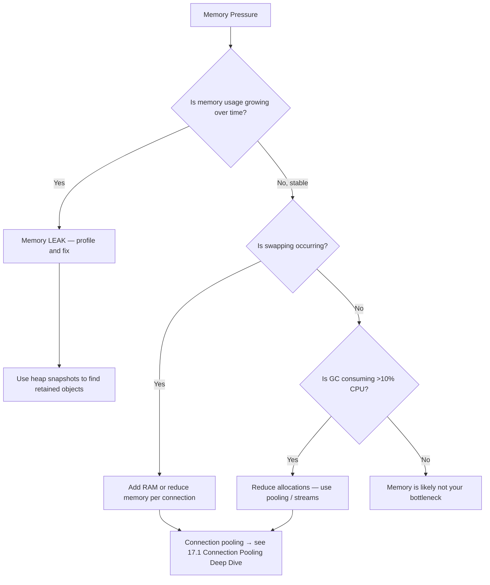

# Memory Bottlenecks

#scaling/bottleneck #performance/memory #fundamentals

## Definition and Signs

A **memory bottleneck** occurs when a system does not have sufficient RAM to hold all the data structures, connection buffers, and working sets required by the running processes. The characteristic signs include:

- **High memory utilization** — the system is using 90%+ of available RAM
- **Swapping activity** — the operating system pages memory to disk, causing catastrophic latency spikes (disk I/O is ~1000× slower than RAM)
- **OOM (Out of Memory) kills** — the Linux OOM killer terminates processes when the system is completely out of memory, often killing your application server or even the database
- **Increased GC pressure** — in garbage-collected languages (Node.js, Java, Go), high allocation rates trigger frequent garbage collection pauses, stealing CPU cycles from request processing

## Why Memory Matters at Scale

Every component of a request-processing pipeline consumes memory. This is not optional — it is the cost of doing business:

| Component | Approximate Memory per Unit |
|---|---|
| PostgreSQL connection | ~10 MB (working memory, buffers, caches) |
| Node.js HTTP request object | ~several KB (headers, body, internal state) |
| Open TCP connection | ~3–16 KB (kernel socket buffer) |
| Redis connection | ~2–5 KB |
| JSON parsed response | 2–10× the raw JSON size in memory |
| Application-level objects | varies wildly by codebase |

Consider a system with 128 application instances, each maintaining 10 database connections: that's **1,280 PostgreSQL connections × 10 MB = ~12.8 GB** of memory consumed *just by database connection buffers*. On a machine with 256 GB of RAM, that's 5% gone before any actual request processing occurs. See [[10.5 Connection Pooling]] for the pooling solution and [[17.1 Connection Pooling Deep Dive]] for advanced details.

## The Multiplicative Effect at Scale

At 1M RPS, even small per-request memory allocations become enormous. Consider:

- **1,000,000 requests/sec × 10 KB/request = ~10 GB/sec** of memory allocation
- Even with efficient garbage collection, this creates massive GC pressure
- The garbage collector itself consumes CPU cycles — creating a compound bottleneck where memory pressure *causes* CPU pressure

This is why [[8.5 Memory Management]] is critical: memory optimization is not just about avoiding OOM kills — it's about reducing GC frequency to keep CPU available for actual request processing.

## Memory Leaks

A **memory leak** is a gradual, persistent increase in memory usage over time, typically caused by retaining references to objects that are no longer needed. In long-running server processes, even a small leak (e.g., 1 KB per request that isn't freed) becomes catastrophic:

$$1 \text{ KB/request} \times 1{,}000{,}000 \text{ requests/sec} = 1 \text{ GB/sec}$$

Your server would exhaust 256 GB of RAM in approximately **4 minutes**. Memory leaks are among the most dangerous bugs in high-throughput systems because they manifest slowly under normal load but become catastrophic during traffic spikes.

## Solutions

### Connection Pooling
Instead of creating a new database connection per request (expensive in both memory and time), maintain a pool of reusable connections. This reduces the total number of simultaneous connections from potentially millions to a fixed, manageable number. See [[10.5 Connection Pooling]] and [[17.1 Connection Pooling Deep Dive]].

### Object Reuse and Object Pooling
Reuse objects across requests rather than allocating new ones. In Node.js, this might mean reusing buffer objects. In Java, it means using object pools for frequently allocated types.

### Stream Processing
Instead of loading entire responses into memory, process data as streams. For a 1 MB response, streaming uses ~KB of memory at any given moment versus 1 MB (or more, due to parser overhead) for full materialization.

### Memory Profiling
Use tools like Node.js `--inspect`, Chrome DevTools Memory panel, `heapdump`, or Valgrind (for C/C++ extensions) to identify which objects are consuming the most memory and which are leaking.

## Why 256 GB RAM for 128-Core Machines

High-core-count machines like the c8i.32xlarge (128 vCPUs) are paired with large amounts of RAM because **each core needs its own working set**. With 128 clustered processes, each needs:

- Its own V8 heap (Node.js) — typically 512 MB–2 GB
- Its own connection pool buffers
- Its own request queue and in-flight request buffers
- Operating system page cache for the process

128 instances × 1–2 GB each = 128–256 GB just for application processes, before the OS, database, and caching layers. This is why large instances come with proportional RAM.

## Common Mistakes

- **Ignoring GC metrics** — high GC pause times are a symptom of memory pressure even if OOM hasn't occurred
- **Over-allocating connection pools** — 100 connections per instance × 128 instances = 12,800 database connections, each consuming ~10 MB
- **Loading entire datasets into memory** — always ask: "can I stream this instead?"
- **Not setting memory limits** — without explicit limits (e.g., Node.js `--max-old-space-size`), a single misbehaving process can consume all available RAM

## Further Reading

- [[15.1 Identifying Bottlenecks]] — the diagnostic process
- [[8.5 Memory Management]] — memory management fundamentals
- [[10.5 Connection Pooling]] — reducing connection memory overhead
- [[17.1 Connection Pooling Deep Dive]] — advanced pooling internals