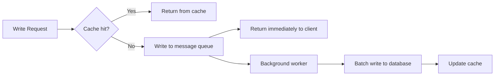

# Disk I-O Bottlenecks

#scaling/bottleneck #storage/iops #database/performance

## Definition and Signs

A **disk I/O bottleneck** occurs when the storage subsystem cannot keep up with the rate of read or write operations demanded by the application. The telltale indicators are:

- **High `iowait`** — the `iowait` column in `mpstat` or `top` shows the percentage of time CPU cores are idle *waiting for I/O operations to complete*. Values above 5–10% suggest a disk problem.
- **Low CPU utilization with slow responses** — the CPU has nothing to do because it's waiting on disk
- **Elevated disk queue length** — operations are lining up waiting for the storage device
- **Slow database queries** — especially INSERT, UPDATE, and complex SELECT operations that require disk reads

## IOPS: The Key Metric

**IOPS (Input/Output Operations Per Second)** is the fundamental currency of disk performance. See [[10.1 IOPS]] for the full treatment. Every database write, every log append, every file read counts as one or more IOPS. The number of IOPS a disk can deliver depends on the storage medium:

| Storage Type | Typical IOPS | Latency |
|---|---|---|
| HDD (7200 RPM) | 80–200 | 5–10 ms |
| SATA SSD | 50,000–100,000 | 0.1–0.5 ms |
| NVMe SSD | 500,000–1,000,000+ | 0.01–0.05 ms |
| AWS gp3 (baseline) | 3,000 | ~variable |
| AWS gp3 (max IOPS) | 16,000 | ~variable |
| AWS io2 Block Express | 256,000 | ~sub-ms |

## Sequential vs. Random I/O

Disk performance varies dramatically based on the *pattern* of access:

- **Sequential I/O**: Reading or writing data in contiguous blocks. HDDs handle this reasonably well (~100+ MB/s) because the read head moves minimally.
- **Random I/O**: Accessing non-contiguous blocks. This is the killer for HDDs — seek times dominate, dropping throughput to single-digit MB/s. SSDs handle random I/O far better due to the absence of mechanical components, but even SSDs have limits.

Database workloads are predominantly **random I/O** — B-tree index lookups jump to different disk locations for each row access. This is why databases benefit enormously from SSD storage.

## Write Amplification

**Write amplification** is the phenomenon where one logical write at the application level results in multiple physical writes at the storage level. In SSDs, this occurs because:

1. SSDs must erase entire blocks before rewriting them
2. Wear-leveling algorithms move data around to distribute writes evenly
3. Journaling filesystems (ext4, XFS) write data to a journal before the final location
4. Database WAL (Write-Ahead Log) writes every change twice — once to the WAL, once to the data file

A single `INSERT` statement might cause **3–5×** the physical writes you'd expect. This makes write IOPS far more expensive than read IOPS in practice.

## Video Example: IOPS Scaling

The course demonstrates the dramatic impact of IOPS on write throughput:

- **3,000 IOPS** (AWS gp3 baseline): ~30,000 database writes per second
- **12,000 IOPS** (gp3 with additional IOPS provisioned): ~66,000 database writes per second

This is not a linear improvement (4× IOPS → 2.2× throughput) because other factors — CPU for query parsing, network for client communication, lock contention — begin to contribute. But the improvement is substantial and directly attributable to storage performance.

## Solutions to Disk I/O Bottlenecks

### 1. Provision More IOPS
On cloud platforms, you can provision additional IOPS (at additional cost). AWS allows up to 16,000 IOPS on gp3 and 256,000 on io2. This is the most straightforward but often most expensive solution.

### 2. Batch Writes
Instead of writing one row at a time, accumulate multiple rows and write them in a single `INSERT ... VALUES (...), (...), (...)` statement. This converts N individual IOPS into 1 IOPS (plus index updates). See [[11.4 Batch Processing]] for the full strategy.

### 3. Write-Through Cache
Use Redis or Memcached as a write-through cache: write to the cache first (fast), then asynchronously flush to the database. This decouples the write path from disk latency.

### 4. Separate Write Servers
Dedicate specific database instances to writes while directing reads to replicas. Write servers can be tuned with faster storage (io2) while read replicas use cheaper storage (gp3).

## The Ultimate Realization

At extreme scale, the most profound insight about disk I/O is this: **you don't even want your database to be doing work.** Every database write is an IOPS consumed, a disk operation performed, a CPU cycle spent on query parsing and transaction management. The architecture that achieves 1M RPS minimizes database interaction through aggressive caching, batching, and eventually **moving writes entirely out of the synchronous request path** (into message queues and background processors).

## Common Mistakes

- **Using HDD-backed storage for databases** — always use SSD/NVMe
- **Not monitoring iowait** — CPU metrics look fine while the system is actually I/O-bound
- **Individual writes instead of batches** — 10,000 individual INSERTs vs. 1 batch INSERT is night-and-day
- **Ignoring WAL and journaling overhead** — plan for 2–5× write amplification

## Further Reading

- [[10.1 IOPS]] — the fundamental metric explained
- [[11.4 Batch Processing]] — reducing IOPS through batching
- [[15.1 Identifying Bottlenecks]] — the systematic diagnostic process
- [[15.5 Disk I-O Bottlenecks]] — this note (self-reference for navigation)