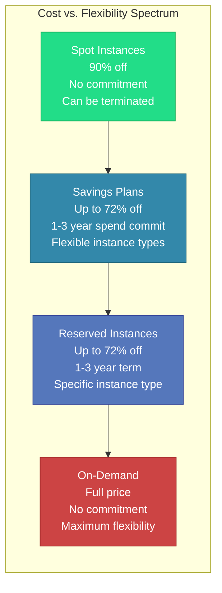

# Cloud Cost Models

#cost/cloud-pricing #cloud/aws #fundamentals

## Overview

Cloud computing pricing is not a single model — it is a spectrum of commitment levels, each trading flexibility for cost savings. Understanding these models is essential for [[16.4 Total Cost of Ownership|TCO optimization]] and is a critical skill for senior engineers architecting systems that must be both performant and financially sustainable. See [[1.4 Cost of Operating at Scale]] for the broader context.

## The Four Primary Models

### 1. On-Demand Instances

**Pay per hour (or per second) with no commitment.** You can start and stop instances at any time. This is the most flexible but most expensive option.

- **Pricing**: Full list price (e.g., c8i.32xlarge at ~$6/hour)
- **Commitment**: None
- **Best for**: Development, testing, short-lived workloads, unpredictable traffic
- **Risk**: None — you only pay for what you use
- **Discount vs. On-Demand**: 0% (this IS the baseline)

### 2. Reserved Instances (RIs)

**Commit to using an instance for 1 or 3 years in exchange for a significant discount.** Reserved Instances are the workhorse of cost optimization for production workloads.

- **Pricing**: Up to **72% discount** over On-Demand (Standard RI, 3-year, All Upfront)
- **Commitment**: 1-year or 3-year term
- **Best for**: Stable, predictable, long-running production workloads
- **Risk**: You pay even if you don't use the instance (though you can sell unused RIs on the marketplace)
- **Discount vs. On-Demand**: 30–72% depending on term, payment option, and RI type

See [[16.2 Reserved Instances vs On-Demand]] for a deep comparison.

### 3. Spot/Preemptible Instances

**Bid on unused cloud capacity at dramatically reduced prices.** The cloud provider can terminate your instance with minimal notice (typically 2 minutes in AWS) if capacity is needed elsewhere.

- **Pricing**: Up to **90% discount** over On-Demand
- **Commitment**: None — but the instance can be terminated at any time
- **Best for**: Batch processing, CI/CD, stateless services with graceful degradation
- **Risk**: Instance termination, which can cause in-flight request failures
- **Discount vs. On-Demand**: 50–90%

### 4. Savings Plans

**A flexible pricing model that provides discounts in exchange for a commitment to spend a specific dollar amount per hour.** Unlike RIs, Savings Plans apply across instance families, regions, and even OS types.

- **Pricing**: Up to 72% discount (comparable to RIs)
- **Commitment**: 1-year or 3-year spend commitment
- **Best for**: Organizations with diverse instance types that want RI-level savings without RI-level rigidity
- **Risk**: Similar to RIs — you commit to a spending level

## The Video's Cost Calculation

The course's 1M RPS demonstration used **On-Demand pricing exclusively**:

| Resource | Instance Type | Rate | Count | Hourly Cost |
|---|---|---|---|---|
| Application Server | c8i.32xlarge | $6/hr | 2 | $12/hr |
| Database | db.r5.16xlarge | $6/hr | 1 | $6/hr |
| Storage (gp3 + IOPS) | EBS | — | — | ~$1.50/hr |
| **Total** | | | | **~$19.50/hr ≈ $15,000/mo** |

Why On-Demand? The test was a **short-lived benchmark** — instances were launched, tested, and terminated within hours. Making a 1-year or 3-year commitment for a few hours of testing makes no financial sense.

## How Real Companies Actually Buy

Production systems at scale use a **hybrid strategy**:

1. **Baseline capacity on Reserved Instances or Savings Plans** (60–80% of total capacity) — handles steady-state traffic
2. **Burst capacity on Spot Instances** (10–30%) — handles traffic spikes, with graceful termination handling
3. **Small On-Demand buffer** (5–10%) — handles unexpected spikes beyond Spot + Reserved

This hybrid approach can reduce compute costs by **50–70%** compared to all-On-Demand, which is the difference between a $15,000/month bill and a $5,000–7,500/month bill.

## Common Mistakes

- **Using On-Demand for everything in production** — leaving 50–70% savings on the table
- **Over-committing on Reserved Instances** — buying RIs for capacity you might not need in 6 months
- **Ignoring Spot Instance interruption handling** — Spot without graceful shutdown causes data loss
- **Not tracking utilization** — if your Reserved Instances are running at 20% utilization, you've over-provisioned

## Further Reading

- [[16.2 Reserved Instances vs On-Demand]] — detailed RI analysis
- [[16.3 Serverless vs Dedicated]] — another cost axis
- [[16.4 Total Cost of Ownership]] — the complete cost picture
- [[1.4 Cost of Operating at Scale]] — broader cost context
- [[13.7 Cloud Cost Estimation]] — estimation techniques