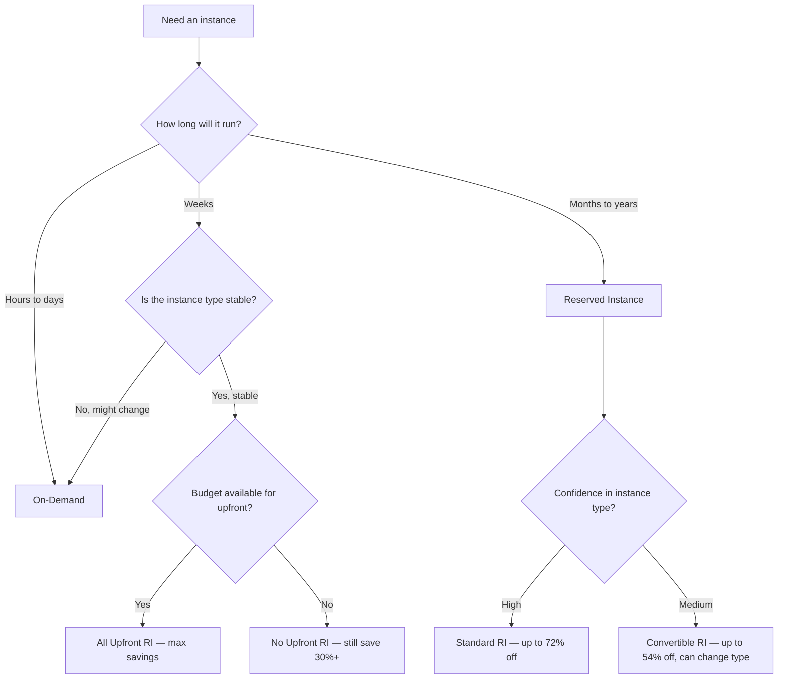

# Reserved Instances vs On-Demand

#cost/cloud-pricing #cloud/aws #cost-optimization

## The Fundamental Trade-Off

The choice between Reserved Instances (RIs) and On-Demand pricing is one of the most consequential financial decisions in cloud architecture. It boils down to a single question: **are you willing to trade flexibility for a guaranteed lower price?**

On-Demand gives you complete freedom — start, stop, resize, and terminate at will. RIs lock you into a specific instance type, region, and operating system for 1 or 3 years in exchange for up to 72% savings. The decision should be driven by **workload predictability**, not intuition.

## Reserved Instance Types

AWS offers three RI flavors, each with different discount levels and flexibility:

| RI Type | Max Discount | Flexibility | Best For |
|---|---|---|---|
| **Standard RI** | Up to 72% | Fixed instance type, region, OS, tenancy | Steady-state production with no expected changes |
| **Convertible RI** | Up to 54% | Can change instance family, OS, tenancy during term | Production workloads that may need to change instance types |
| **Scheduled RI** | Variable | Reserve capacity for specific time windows (e.g., every Saturday) | Periodic batch jobs, scheduled workloads |

## Payment Options

Within each RI type, you choose how to pay — and the payment method affects the discount:

1. **All Upfront**: Pay the entire commitment upfront. Highest discount (e.g., 72% for 3-year Standard). Best if you have the capital and are confident in your needs.
2. **Partial Upfront**: Pay a portion upfront (typically ~40-50% of the total), with monthly payments for the remainder. Moderate discount. Good middle ground.
3. **No Upfront**: No upfront payment — commit to paying the discounted hourly rate for the full term. Lowest RI discount but still 30-40%+ savings. Best for teams without upfront budget.

## Break-Even Analysis

The break-even point for an RI depends on the discount level and payment option. For a **3-year Standard RI with All Upfront** at 72% discount:

- If the On-Demand price is $6/hour, the RI effective price is $1.68/hour
- If you terminate the RI early (or stop using the instance), you've prepaid for capacity you're not using
- The RI pays for itself if the instance runs for approximately **3-4 months** continuously (depending on the specific pricing math)

For **No Upfront** RIs, there is essentially no risk — you're simply committing to a lower hourly rate. The only cost is that you pay the hourly rate even when the instance is stopped.

## When Reserved Makes Sense

- **Production workloads** running 24/7 with predictable capacity needs
- **Database instances** that are always on
- **Known growth trajectories** — if you know you'll need this capacity for 3 years
- **Organizations with mature FinOps practices** that track utilization

## When On-Demand Makes Sense

- **Development and testing** environments that are frequently started and stopped
- **Prototyping and experimentation** — instance types may change daily
- **Short-lived benchmarks** — the video's use case: launch, test, terminate in hours
- **Unpredictable workloads** — if you can't forecast usage, commitment is risky

## The Risk of Reserved Instances

The primary risk is **over-provisioning**: committing to instance capacity you don't actually need. Common scenarios:

- Your application becomes more efficient and needs fewer instances
- You migrate to a different architecture (e.g., serverless → no instances needed)
- Your traffic declines due to market changes
- A newer, more cost-effective instance family is released (Convertible RIs mitigate this)

AWS partially mitigates this with the **RI Marketplace**, where you can sell unused RIs to other AWS customers. However, resale typically recovers only 40-60% of the original cost.

## Common Mistakes

- **Buying RIs too early** — start with On-Demand, understand your baseline, then commit
- **Buying RIs for the wrong instance type** — Standard RIs can't change instance families
- **Not tracking RI utilization** — AWS provides RI utilization reports; use them
- **Ignoring Savings Plans** — often a better choice than RIs for organizations with diverse workloads (see [[16.1 Cloud Cost Models]])

## Further Reading

- [[16.1 Cloud Cost Models]] — the full spectrum of pricing models
- [[16.4 Total Cost of Ownership]] — how RIs fit into the complete cost picture
- [[13.7 Cloud Cost Estimation]] — techniques for forecasting cloud costs