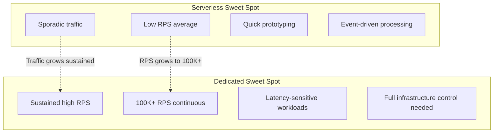

# Serverless vs Dedicated

#cost/comparison #architecture/serverless #architecture/dedicated

## The Two Paradigms

**Serverless computing** (e.g., AWS Lambda, Cloudflare Workers, Google Cloud Functions) abstracts away server management entirely. You pay per request (or per execution duration) and the platform handles scaling, patching, and availability automatically. **Dedicated infrastructure** (e.g., EC2 instances, bare metal servers) gives you fixed-capacity machines that you manage, optimize, and pay for on a time basis regardless of traffic.

The choice between these paradigms is one of the most significant architectural and financial decisions a team can make. At extreme scale, the cost difference is staggering.

## Cost Comparison at 1M RPS

The video provides a concrete, head-to-head comparison that should permanently dispel the notion that serverless is always cheaper:

### Serverless: Cloudflare Workers at 1M RPS

Cloudflare Workers pricing: **$0.50 per million requests** for the first 10 billion, then $0.30/million. However, Workers have a **CPU time limit of 30ms per request** (paid plan). For simple requests this may suffice, but for any non-trivial processing, you need the paid plan with higher limits.

At 1M RPS:
- Requests per month: 1,000,000 × 86,400 × 30 = **2.592 trillion** (sustained)
- Even at the lowest tier: 2,592,000 million × $0.30 = **~$777,600/month**
- With premium features, Durable Objects, and egress: **$3.9M/month** (as cited in the video)

### Dedicated: EC2 at 1M RPS

Two c8i.32xlarge instances + one db.r5.16xlarge:
- Compute: 2 × $6/hr = $12/hr
- Database: $6/hr
- Storage: ~$1.50/hr
- **Total: ~$19.50/hr ≈ ~$15,000/month** (On-Demand pricing)

### The Ratio

$$\frac{\text{Serverless cost}}{\text{Dedicated cost}} = \frac{\$3{,}900{,}000}{\$15{,}000} \approx 260\times$$

Serverless is approximately **260 times more expensive** than dedicated infrastructure for sustained 1M RPS workloads. This is not a marginal difference — it is an order-of-magnitude (actually, two orders-of-magnitude) difference that can make or break a business.

## Why Serverless Is NOT Cost-Effective at Extreme Sustained Load

Serverless pricing models are designed for **spiky, intermittent workloads**. The per-request pricing is profitable for the cloud provider because:

1. **Amortized infrastructure**: The provider runs many customers' functions on shared hardware, extracting high utilization
2. **Premium for convenience**: You're paying for zero management overhead
3. **Economies of scale work in reverse at extreme load**: The per-unit price is low, but multiplied by billions of requests, it becomes astronomical

At 1M RPS sustained (86.4 billion requests/day), you are no longer a "small customer with variable traffic" — you are a **massive, predictable consumer of compute**. At this point, dedicated infrastructure is dramatically cheaper because you're paying wholesale (per-hour instance pricing) rather than retail (per-request pricing).

## When Serverless IS Cost-Effective

Serverless shines in specific scenarios:

- **Variable/spiky traffic**: An API that gets 100 RPS most of the day but spikes to 10,000 RPS for 2 hours. Serverless scales automatically; dedicated would be over-provisioned 90% of the time.
- **Low average RPS**: If your API averages 10–100 RPS, the absolute cost is minimal regardless of the model.
- **Rapid prototyping**: No infrastructure to set up means faster iteration.
- **Event-driven workloads**: Processing S3 events, SQS messages, or webhooks where invocation frequency is truly unpredictable.

## The Video's Conclusion

> "Launching your own computer is way more cost justified."

This statement captures the fundamental insight: **at scale, the convenience premium of serverless becomes economically unsustainable.** The engineering investment required to manage dedicated infrastructure (auto-scaling, monitoring, patching, failover) is significant, but it is a *one-time or ongoing-operations* cost rather than a *per-request* cost. At 1M RPS, the per-request cost dwarfs everything else.

## Other Considerations Beyond Cost

- **Latency**: Dedicated instances provide predictable, low latency. Serverless has cold start latency (though Cloudflare Workers mitigates this via V8 isolates).
- **Control**: Dedicated gives you full control over the OS, runtime, networking stack, and tuning parameters.
- **Compliance**: Some regulatory requirements mandate dedicated infrastructure (data residency, encryption key management).
- **Vendor lock-in**: Serverless ties you deeply to a specific provider's API and execution model.

## Further Reading

- [[1.4 Cost of Operating at Scale]] — the broader cost context
- [[16.1 Cloud Cost Models]] — On-Demand, Reserved, Spot, Savings Plans
- [[16.4 Total Cost of Ownership]] — all costs, not just compute
- [[17.6 Real-World Architecture for 1M RPS]] — how dedicated infrastructure is used in practice