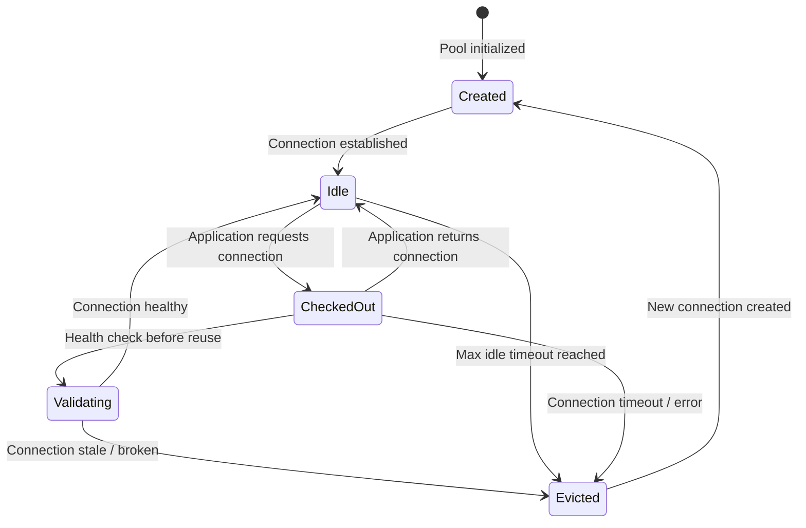

# Connection Pooling Deep Dive

#database/connection-pooling #architecture/patterns #performance/optimization

## Why Connection Pooling Exists

Establishing a database connection is one of the most expensive operations in a typical request lifecycle. A PostgreSQL connection requires:

1. **TCP handshake** (SYN, SYN-ACK, ACK) — 1–2 round trips
2. **PostgreSQL authentication** — password hash verification, SCRAM-SHA-256 exchange
3. **Session initialization** — setting search_path, timezone, encoding, temp tables
4. **Memory allocation** — PostgreSQL allocates ~10 MB per connection for work_mem, buffers, and internal state

This process takes **5–50 milliseconds**. At 1M RPS, if every request opened a new connection, you'd spend 5,000–50,000 seconds per second on connection establishment alone — an impossibility. Connection pooling eliminates this by reusing existing connections.

## How Connection Pooling Works Internally

A connection pool is a data structure (typically a queue or stack) that maintains a set of pre-established, idle database connections. The lifecycle:



**Pool creation**: On application startup, the pool establishes a minimum number of connections (min pool size).

**Checkout**: When a request needs a database connection, it checks one out from the pool. If no idle connections are available and the pool hasn't reached its maximum size, a new connection is created. If the pool is at maximum, the request **blocks** (waits) until a connection is returned.

**Return**: When the request completes, the connection is returned to the pool. It is NOT closed — it's reset and made available for the next request.

**Eviction**: Connections that are idle for too long, or that have become stale (network interruption, database restart), are evicted and replaced.

## Pool Sizing

The classic formula for optimal pool size comes from database performance research:

$$\text{optimal\_connections} = \text{cores} \times 2 + \text{effective\_spindle\_count}$$

For a modern SSD database server with 16 cores: $16 \times 2 + 1 = 33$ connections. For the video's architecture with 128 application instances each needing connections, this creates a critical design challenge: **128 instances × even 10 connections = 1,280 connections**, far exceeding the optimal pool size for a single database server.

## PgBouncer: External Connection Pooler for PostgreSQL

When you have many application instances connecting to one database, you use an **external connection pooler** like **PgBouncer** that sits between the application servers and PostgreSQL:

```
128 app instances × 10 connections = 1,280 client connections to PgBouncer
PgBouncer maintains ~50-100 connections to PostgreSQL
```

### PgBouncer Pool Modes

| Mode | Behavior | Connection Lifetime | Use Case |
|---|---|---|---|
| **Session** | One server connection per client for the entire session | Full session | Applications that use session-level features (SET commands, prepared statements, advisory locks) |
| **Transaction** | One server connection per client *per transaction* — connection is returned after each COMMIT/ROLLBACK | Single transaction | **Most efficient mode.** Best for web applications where each HTTP request = 1-2 transactions. |
| **Statement** | One server connection per client *per SQL statement* — connection returned after each query | Single statement | Maximum multiplexing, but breaks features that depend on multi-statement transactions |

**Transaction mode is the most efficient** and is the recommended default for web applications. It allows PgBouncer to multiplex thousands of client connections onto a small number of server connections, dramatically reducing PostgreSQL's memory and CPU overhead.

## Connection Storms

A **connection storm** occurs when many application instances simultaneously request connections (e.g., after a deployment restart or a cache invalidation that causes all requests to hit the database). Symptoms:

- All connections checked out simultaneously
- New requests block, waiting for connections
- Timeouts cascade, causing retries, amplifying the storm
- PostgreSQL may reject new connections (`FATAL: too many connections`)

**Mitigation strategies:**
- Stagger application restarts (rolling deployments)
- Set reasonable checkout timeouts (fail fast rather than queue forever)
- Use circuit breakers to shed load when the pool is exhausted
- Warm up the pool before accepting traffic

## Connection Health Checking

Pooled connections can become stale due to:
- Network interruptions (TCP RST)
- Database restarts
- Firewall timeout killing idle connections

Solutions include:
- **Keepalive packets**: TCP-level keepalives to prevent firewall-induced disconnections
- **Validation queries**: Simple `SELECT 1` before checkout (adds latency but ensures validity)
- **Prepared statement validation**: PgBouncer in transaction mode doesn't support prepared statements across transactions

## Real Numbers from the Video's Architecture

- 128 application instances (clustered Node.js processes across 2 servers)
- Each maintains a pool of 10 connections to PgBouncer
- Total client connections: 128 × 10 = **1,280**
- PgBouncer multiplexes these onto ~50–100 PostgreSQL connections
- Without PgBouncer, PostgreSQL would need 1,280 × ~10 MB = **~12.8 GB** just for connection buffers
- With PgBouncer, PostgreSQL uses ~0.5–1 GB for connections

## Further Reading

- [[10.5 Connection Pooling]] — the introductory treatment
- [[15.4 Memory Bottlenecks]] — why connection memory matters
- [[17.6 Real-World Architecture for 1M RPS]] — pooling in the complete architecture