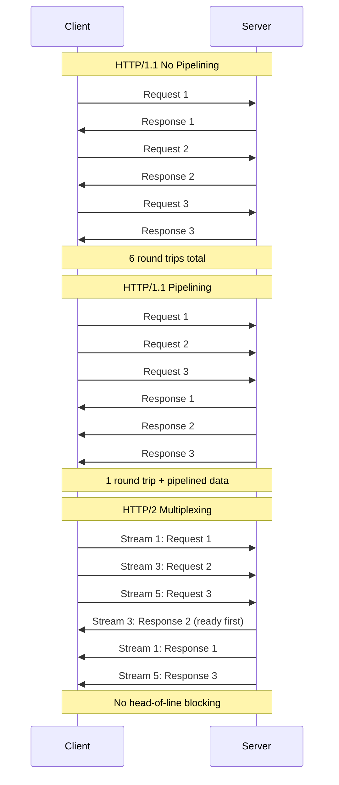

# HTTP Pipelining Deep Dive

#network/http #performance/optimization #benchmarking

## What Is HTTP Pipelining?

**HTTP pipelining** is the technique of sending multiple HTTP requests on a single TCP connection without waiting for the responses to arrive. In a non-pipelined (normal) HTTP/1.1 exchange, the client sends a request, waits for the response, and only then sends the next request. With pipelining, the client can send requests 2, 3, 4... before receiving any response.

This is analogous to a factory assembly line: instead of waiting for one product to complete all stages before starting the next (serial), you start the next product as soon as the first moves to the next stage (pipelined).

## HTTP/1.1 Pipelining: The Flawed Specification

HTTP/1.1 pipelining was defined in RFC 2616 (1999) and technically allows clients to send multiple requests without waiting. However, it suffered from critical problems:

1. **Head-of-line blocking**: Responses MUST be returned in the order requests were sent. If request #1 is slow (e.g., a complex database query), responses #2, #3, and #4 are blocked even if they're ready. This makes pipelining fragile in practice.
2. **Poor server support**: Many intermediaries (proxies, CDNs, load balancers) incorrectly implemented pipelining, reordering responses or dropping pipelined requests. This led to widespread disabling of pipelining support.
3. **Browser abandonment**: Chrome, Firefox, and Safari all disabled HTTP/1.1 pipelining due to these reliability issues.

Despite these problems, pipelining remains relevant for **benchmarking tools** like Autocannon, where the client and server are known, controlled, and the benchmark is measuring raw throughput rather than real-world browser behavior.

## HTTP/2 Multiplexing: The Modern Solution

HTTP/2 (RFC 7540, 2015) solves pipelining's problems through **streams**. Each request-response pair is assigned a unique stream ID within a single TCP connection. Responses can be returned in any order (no head-of-line blocking at the application layer), and frames from multiple streams are interleaved on the same connection.

## Why Pipelining Matters for Benchmarking

Autocannon's `-p` (pipelining) flag is a critical parameter for throughput benchmarking. With `-p 100`, Autocannon sends up to 100 pipelined requests per connection before waiting for responses. This dramatically increases throughput by:

1. **Reducing connection overhead**: Fewer TCP connections needed for the same request rate
2. **Hiding latency**: Network round-trip time is amortized across multiple requests
3. **Saturating the server**: The server always has work to do; it's never idle waiting for the next request

In the video's cloud benchmark, pipelining of 100 was used because at 1M RPS, you cannot afford to waste time on connection setup or serial request-response cycles.

## TCP-Level Implications

Pipelining interacts with TCP internals in important ways:

### Window Size and Buffer Management
TCP uses a **sliding window** to control the rate of data transmission. With pipelining, the send buffer must hold multiple outstanding requests, and the receive buffer must hold multiple outstanding responses. If buffers are too small, the TCP window fills up and the sender blocks — negating the benefits of pipelining.

On Linux, buffer sizes are controlled by `net.core.wmem_max`, `net.core.rmem_max`, and per-socket settings. At 1M RPS with large payloads, you may need to increase these significantly.

### TCP_NODELAY and Nagle's Algorithm
Nagle's algorithm buffers small outgoing packets to improve efficiency. For pipelined HTTP requests, this is usually undesirable — you want each request sent immediately. The `TCP_NODELAY` socket option disables Nagle's algorithm and should be enabled for HTTP pipelining.

## Practical Considerations

- **Pipelining depth** must be tuned: too low and you don't benefit; too high and you risk timeouts and excessive memory usage
- **Server-side limits** on pipelined requests vary — some servers limit the number of pipelined requests per connection
- **TLS overhead** is amortized across all pipelined requests on a connection, making pipelining especially valuable for HTTPS

## Further Reading

- [[3.2 HTTP Protocol]] — HTTP fundamentals
- [[5.4 Connections, Pipelining, and Workers]] — the introductory treatment of pipelining
- [[2.6 Network Cards and Bandwidth]] — the network layer below TCP
- [[15.3 Network Bottlenecks]] — when pipelining hits network limits