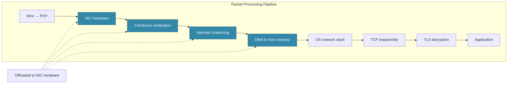

# Network Interface Cards at Scale

#network/hardware #network/bandwidth #infrastructure

## The Challenge of Millions of Packets Per Second

At 1M RPS, the network interface card (NIC) must process not just the data payload but the entire packet processing pipeline: Ethernet framing, IP routing, TCP segment processing, checksum verification, and (for HTTPS) TLS decryption. At 1M RPS with an average of 20 packets per request (including TCP handshake, TLS handshake, request, response, ACKs, window updates), the NIC handles **~20 million packets per second**. This is the domain where NIC architecture becomes critical.

## NIC Offloading

Modern NICs implement hardware offloading — moving work from the CPU to dedicated silicon on the NIC:

### TCP Segmentation Offload (TSO) / Large Receive Offload (LRO)
Instead of the CPU splitting a large data buffer into MTU-sized TCP segments, TSO allows the CPU to pass a large buffer to the NIC, which handles segmentation in hardware. LRO does the reverse: the NIC coalesces multiple incoming segments into a single large buffer before passing it to the OS. This can reduce CPU utilization for network processing by **30–50%**.

### Checksum Offload
TCP and IP header checksums are computed in hardware rather than by the CPU. At 20M packets/sec, this saves substantial CPU cycles.

### Interrupt Coalescing
Without coalescing, the NIC generates one CPU interrupt per packet — at 20M packets/sec, this would overwhelm the CPU with interrupt handling. Interrupt coalescing batches multiple packets into a single interrupt, trading slight latency for dramatically reduced CPU overhead.

## SR-IOV: Single Root I/O Virtualization

In cloud environments, multiple virtual machines share physical hardware. **SR-IOV** allows a single physical NIC to present itself as multiple **Virtual Functions (VFs)**, each directly assignable to a VM. This bypasses the hypervisor's network stack entirely, reducing latency and CPU overhead.

- **Physical Function (PF)**: The primary NIC interface, managed by the hypervisor
- **Virtual Function (VF)**: A lightweight NIC interface assigned directly to a guest VM

SR-IOV provides **near-line-rate performance** for VMs, which is why it's used in high-performance cloud instances.

## AWS Elastic Network Adapter (ENA)

AWS's proprietary NIC solution, the **Elastic Network Adapter (ENA)**, is a custom-designed NIC optimized for cloud workloads. Key characteristics:

- **Up to 100 Gbps** depending on instance type
- **Designed for high packet rates** (millions of packets per second)
- **Managed by a custom Linux kernel driver** (`ena`)
- **SR-IOV based** — provides low-latency, bypass-friendly access

### The 50 Gbps Hard Limit on c8i.32xlarge

The c8i.32xlarge instance is **capped at 50 Gbps** by AWS. This is not a software configuration issue — it's a deliberate AWS limit tied to the instance type. Even if the underlying ENA hardware supports 100 Gbps, AWS limits the c8i family to 50 Gbps (at the time of the video). To get 100 Gbps, you'd need a different instance family (e.g., some x2ie or p5 instances). See [[15.3 Network Bottlenecks]] for how this limit manifests as a bottleneck.

## Network Tuning Parameters

For extreme throughput, several kernel and NIC parameters require tuning:

| Parameter | Purpose | Typical Tuning |
|---|---|---|
| `net.core.rmem_max` | Maximum receive buffer size | 268,435,456 (256 MB) |
| `net.core.wmem_max` | Maximum send buffer size | 268,435,456 (256 MB) |
| Ring buffer size (ethtool) | NIC's descriptor ring size | Maximize (4096+) |
| Interrupt moderation | How long to wait before interrupting | Balance latency vs. CPU |
| Multi-queue (RSS) | Distribute packets across CPU cores | Enable, one queue per core |

## The Future: DPDK and SmartNICs

### DPDK (Data Plane Development Kit)
DPDK is a set of libraries that allow applications to **bypass the OS kernel entirely** and process network packets in user space. This eliminates system call overhead, context switches, and interrupt handling. DPDK applications can achieve **tens of millions of packets per second** on commodity hardware. Used extensively in NFV (Network Function Virtualization) and high-frequency trading.

### SmartNICs
SmartNICs are NICs with embedded processors (ARM, FPGA, or programmable ASICs) that can run network functions directly on the NIC. This offloads not just packet processing but entire network functions (firewalling, load balancing, TLS termination) from the server CPU. Examples: NVIDIA BlueField, AWS Nitro Cards.

### 400 Gbps and Beyond
Data center interconnects are moving to 400 Gbps (and 800 Gbps in development). These speeds are achieved through PAM4 modulation (2 bits per symbol) and advanced DSP (Digital Signal Processing) on the transceiver chips.

## Further Reading

- [[2.6 Network Cards and Bandwidth]] — NIC fundamentals
- [[15.3 Network Bottlenecks]] — when NIC bandwidth is the limit
- [[17.4 Private Networks (VPC)]] — the network infrastructure around NICs