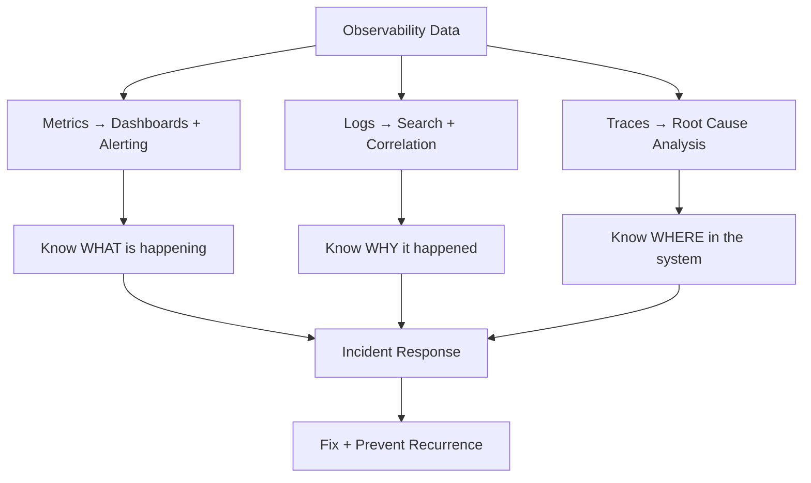

# Monitoring and Observability

#operations/monitoring #operations/observability #fundamentals

## Why Monitoring Is Non-Negotiable

> "If you are not doing resource monitoring, you're doing it wrong."

This statement from the course captures a hard truth: at 1M RPS, you cannot diagnose problems by intuition, log inspection, or guesswork. Systems operating at this scale produce billions of data points per hour. The only way to understand system behavior is through comprehensive, automated, continuously running monitoring. Monitoring is not an afterthought or a "nice to have" — it is a **first-class architectural requirement**.

Without monitoring, you cannot:
- Identify which resource is the [[15.1 Identifying Bottlenecks|bottleneck]]
- Detect regressions after deployments
- Plan capacity (when do you need more instances?)
- Respond to incidents with data-driven decisions
- Prove that your optimizations actually improved performance

## The Three Pillars of Observability

Modern observability is built on three complementary pillars:

### 1. Metrics
**Metrics** are numeric measurements collected at regular intervals. They are efficient to store and query, making them ideal for dashboards, alerting, and trend analysis.

Key metrics for a 1M RPS system:

| Category | Specific Metrics | Tool |
|---|---|---|
| **CPU** | Utilization %, load average, context switches/sec, steal time | `mpstat`, `vmstat`, CloudWatch |
| **Memory** | Used/available bytes, swap in/out, page faults, OOM kills | `free`, `/proc/meminfo` |
| **Network** | Bytes in/out, packets in/out, errors, drops, TCP retransmissions | `nload`, `sar -n DEV` |
| **Disk** | IOPS, read/write throughput, iowait%, queue length | `iostat`, `sar -b` |
| **Application** | Request rate, error rate, p50/p95/p99 latency, active connections | Prometheus, CloudWatch |
| **Database** | Query rate, slow query count, connection utilization, replication lag | pg_stat_statements, CloudWatch RDS |

### 2. Logs
**Logs** are immutable, timestamped records of discrete events. They provide the *context* that metrics cannot — the "why" behind the "what."

- **Application logs**: Request processing details, errors, warnings (structured JSON preferred)
- **Access logs**: HTTP method, path, status code, latency per request
- **Error logs**: Stack traces, unhandled exceptions
- **Database slow query logs**: Queries exceeding a duration threshold (e.g., 100ms)
- **System logs**: Kernel messages, service start/stop, OOM killer events

At 1M RPS, logging every request produces 1M log entries/second = 86.4 billion entries/day. This makes **log sampling** or **structured log level management** essential. Most production systems log errors and a sample of successful requests (e.g., 1 in 1000).

### 3. Traces
**Distributed traces** follow a single request across multiple services, showing exactly where time is spent in a microservices architecture. A trace consists of multiple **spans**, each representing work done by a single service.

Tools: Jaeger, Zipkin, AWS X-Ray, Datadog APM

Example trace for a request:
```
[API Gateway: 2ms] → [Auth Service: 5ms] → [App Server: 15ms] → [Redis: 1ms] → [PostgreSQL: 8ms]
Total: 31ms
```

## Alerting

Alerting connects monitoring to human action. An alert is a rule: "when metric X exceeds threshold Y for duration Z, notify channel W."

Best practices:
- **Alert on symptoms, not causes**: Alert on high p99 latency, not high CPU. High CPU might be fine if latency is acceptable.
- **Set thresholds based on SLOs**: If your SLO is p99 < 200ms, alert at p99 > 150ms (leave margin).
- **Avoid alert fatigue**: Every alert should require human action. If an alert fires and nobody does anything, it's noise.
- **Use severity levels**: P1 (page someone immediately), P2 (respond within 30 min), P3 (next business day).

## Dashboards

Dashboards provide at-a-glance visibility into system health. Popular tools:

- **Grafana**: Open-source, highly customizable, connects to Prometheus, CloudWatch, InfluxDB
- **AWS CloudWatch Dashboards**: Native AWS integration, less customizable
- **Datadog**: Commercial, all-in-one platform (metrics + logs + traces)

## Why the Video Used `mpstat` Instead of `htop`

When monitoring a 128-core machine, `htop` is **unreadable** — it displays 128 individual CPU bars, making it impossible to see patterns. `mpstat -P ALL 1` provides a concise tabular view showing each core's utilization alongside averages, making it immediately apparent whether a single core is saturated (single-threaded bottleneck) or all cores are loaded (multi-core bottleneck). See [[5.6 Resource Monitoring]] and [[15.2 CPU Bottlenecks]].



## Common Mistakes

- **Monitoring only after things break** — monitoring must be in place before incidents
- **Too many alerts** — alert fatigue causes real alerts to be ignored
- **Not correlating metrics** — CPU spike + network drop + error spike at the same time tells a story
- **Ignoring percentile metrics** — averages hide outliers; always track p95 and p99

## Further Reading

- [[5.6 Resource Monitoring]] — monitoring tools and techniques
- [[15.1 Identifying Bottlenecks]] — monitoring is the foundation of bottleneck diagnosis
- [[17.6 Real-World Architecture for 1M RPS]] — monitoring in the complete production architecture