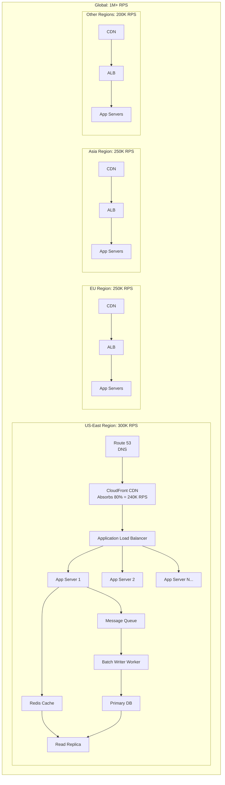
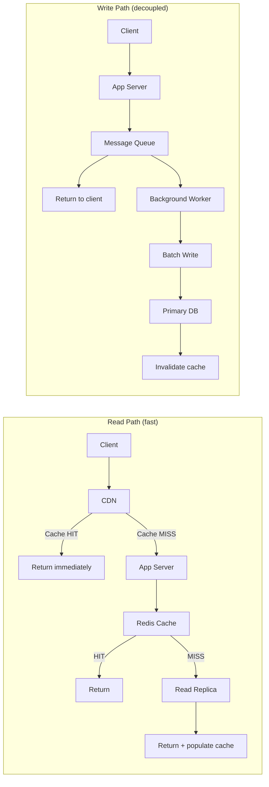

# Real-World Architecture for 1M RPS

#architecture/production #architecture/distributed #scaling/horizontal

## The Single-Machine Illusion

The video's demonstration achieves 1M RPS using a concentrated architecture: two large application servers and one database server. This is a **benchmarking configuration**, not a production architecture. No real company handles 1M+ RPS on a handful of machines. The actual approach used by companies like Uber, Netflix, Amazon, and Cloudflare is **massive horizontal distribution** — hundreds or thousands of servers spread across multiple geographic regions.

This note synthesizes every concept from the previous 16 chapters into the complete picture.

## Multi-Region Architecture

At 1M+ RPS, traffic is distributed across **5–10 geographic regions**, each handling 100K–500K RPS. This is driven by three imperatives:

1. **Latency**: Users in Tokyo should not wait 200ms for a response from us-east-1. See [[14.2 Geographic Distribution]]
2. **Fault tolerance**: If an entire region fails, others absorb the traffic
3. **Network bandwidth**: No single region needs to handle the full 1M RPS of data transfer

## Per-Region Architecture

Each region follows a layered architecture that addresses every bottleneck identified in [[15.1 Identifying Bottlenecks]]:

### Layer 1: CDN (Content Delivery Network)
- **Absorbs 80–90% of total traffic** for cacheable responses
- At 1M RPS total, the CDN handles 800K–900K RPS
- Only 100K–200K RPS reaches the origin infrastructure
- Providers: CloudFront, Cloudflare, Fastly
- This single layer is why the origin infrastructure doesn't need to handle the full 1M RPS

### Layer 2: Load Balancer
- **Application Load Balancer (ALB)** distributes traffic across application servers
- Handles TLS termination (offloading CPU work from app servers)
- Health checking, sticky sessions (if needed), rate limiting
- Sits in a [[17.4 Private Networks (VPC)|public subnet]], forwarding to [[17.4 Private Networks (VPC)|private subnet]] app servers

### Layer 3: Application Servers
- **Horizontally scaled**: 10–50+ servers per region depending on per-server capacity
- [[12.1 Process Clustering|Process clustering]] within each server to utilize all cores
- [[13.6 Security Groups|Security groups]] restrict inbound traffic to only the ALB
- Each server connects to Redis and the message queue

### Layer 4: Caching (Redis)
- **Read path**: application checks Redis first; only cache misses hit the database
- Typical cache hit rate: 90–99% for read-heavy workloads
- Redis cluster for high availability and sharding
- See [[11.1 Redis]] for Redis fundamentals

### Layer 5: Message Queue (Write Path)
- **Write requests go to a message queue** (Kafka, SQS, RabbitMQ) instead of directly to the database
- The application returns a response to the client immediately after enqueueing
- Background workers consume from the queue and batch-write to the database
- This completely decouples write latency from request latency
- See [[11.4 Batch Processing]] for the batching strategy

### Layer 6: Database
- **Primary** for writes (receives batched writes from workers)
- **Read replicas** (1–5 per region) for read queries
- [[17.1 Connection Pooling Deep Dive|PgBouncer]] as external connection pooler
- Data replicated across regions asynchronously for disaster recovery
- See [[10.1 IOPS]] for storage considerations

## The Read Path vs. Write Path

## Cost Optimization in Production

- **Reserved Instances** ([[16.2 Reserved Instances vs On-Demand]]) for baseline capacity (70% of total)
- **Spot Instances** ([[16.1 Cloud Cost Models]]) for stateless app servers with graceful degradation
- **Auto-scaling** based on CPU and request rate metrics ([[17.5 Monitoring and Observability]])
- **CDN** reduces origin traffic by 80–90%, dramatically cutting [[16.4 Total Cost of Ownership|data transfer costs]]

## Tying All 17 Chapters Together

Every chapter in this vault contributes to the real-world 1M RPS architecture:

| Chapter | Contribution |
|---|---|
| [[1.4 Cost of Operating at Scale]] | Financial justification for architecture choices |
| [[2.2 Core Utilization]] | Understanding how many app servers are needed |
| [[2.5 Bits, Bytes, and Data Units]] | Sizing network and storage requirements |
| [[2.6 Network Cards and Bandwidth]] | NIC selection and network capacity planning |
| [[3.2 HTTP Protocol]] | Protocol optimization (keep-alive, pipelining, HTTP/2) |
| [[5.4 Connections, Pipelining, and Workers]] | Connection management strategy |
| [[5.6 Resource Monitoring]] | Tools to observe the system |
| [[8.5 Memory Management]] | Memory-efficient code to maximize per-server RPS |
| [[10.1 IOPS]] | Database storage provisioning |
| [[10.5 Connection Pooling]] | Reducing database connection overhead |
| [[11.1 Redis]] | Caching layer design |
| [[11.4 Batch Processing]] | Write path optimization |
| [[12.1 Process Clustering]] | Utilizing all CPU cores per server |
| [[12.2 Code Profiling]] | Finding and optimizing hot paths |
| [[13.6 Security Groups]] | Network security boundaries |
| [[13.7 Cloud Cost Estimation]] | Budgeting for the architecture |
| [[14.2 Geographic Distribution]] | Multi-region deployment |
| [[15.1 Identifying Bottlenecks]] through [[15.5 Disk I-O Bottlenecks]] | Systematic performance optimization |
| [[16.1 Cloud Cost Models]] through [[16.4 Total Cost of Ownership]] | Cost engineering |
| [[17.1 Connection Pooling Deep Dive]] through [[17.5 Monitoring and Observability]] | Advanced infrastructure patterns |

## Common Mistakes

- **Starting with a monolith and trying to scale it** — design for distribution from day one
- **Ignoring the CDN layer** — it eliminates 80–90% of origin load
- **Synchronous writes to the database** — always decouple via message queues at scale
- **Single-region deployment** — latency and fault tolerance demand multi-region

## Further Reading

This note is the capstone. Revisit any previous chapter for the detailed treatment of each component.