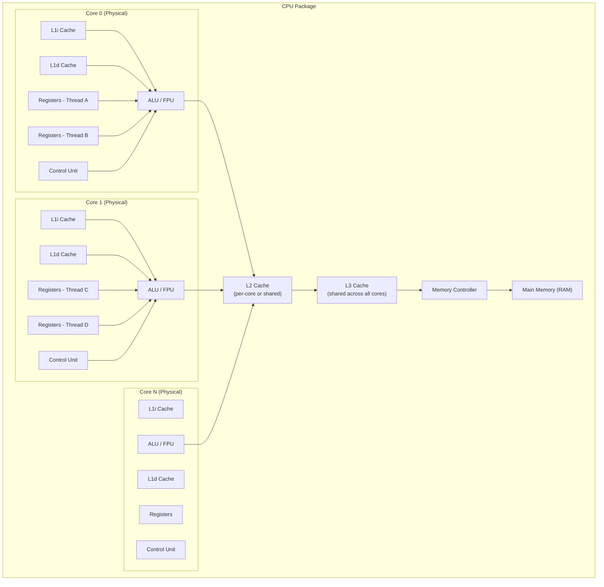

# CPU Cores and Threads

#hardware/cpu #fundamentals/compute #performance/parallelism

## What Is a CPU Core?

A CPU core is an **independent processing unit** capable of executing instructions sequentially. At its most fundamental level, a core contains:

1. **Arithmetic Logic Unit (ALU)**: Performs mathematical operations (add, subtract, multiply, divide) and logical operations (AND, OR, NOT, XOR).
2. **Control Unit (CU)**: Fetches instructions from memory, decodes them, and coordinates execution.
3. **Registers**: Extremely fast, tiny storage locations (typically 32 or 64 bits each) used for the currently executing instruction's operands and results.
4. **L1 Cache**: A small (typically 32-64 KB per core) but extremely fast memory cache, split into instruction cache (L1i) and data cache (L1d).

A modern CPU chip packages multiple cores onto a single die. A 128-core processor has 128 independent processing units, each capable of executing its own instruction stream simultaneously. This is **true parallelism**—not time-sharing, but genuine concurrent execution.

## Physical Cores vs. Logical Cores (Hyperthreading)

This distinction is critical for understanding the actual compute capacity of a machine.

**Physical cores** are the actual, independent processing units etched into the silicon. Each physical core has its own ALU, control unit, registers, and L1 cache.

**Logical cores** (enabled by technologies like Intel's Hyper-Threading or AMD's SMT—Simultaneous Multithreading) allow a single physical core to appear as two cores to the operating system. This works by duplicating the architectural state (registers, instruction pointers) while sharing the actual execution resources (ALU, cache, floating-point units).

The key insight: **two threads on a hyperthreaded core do not execute simultaneously in the truest sense.** They take turns using the shared execution resources. When one thread is stalled (waiting for a memory fetch, for example), the other thread can use the ALU. This provides a **15-30% throughput improvement** for most workloads—not 100%.

| Property              | Physical Core  | Logical Core (HT/SMT) |
|-----------------------|----------------|------------------------|
| Independent ALU       | Yes            | No (shared)            |
| Independent Registers | Yes            | Yes (duplicated)       |
| Independent L1 Cache  | Yes            | No (shared)            |
| True parallelism      | Yes            | Partial                |
| Typical throughput    | 100%           | 115-130% of physical   |

On a C8i.32xlarge (128 vCPUs), you likely have 64 physical cores with hyperthreading enabled, yielding 128 logical cores.

## What Is a Thread?

A **thread** (specifically, an OS-level thread) is the smallest unit of execution that an operating system can schedule for execution on a CPU core. A thread consists of:

- A program counter (PC) pointing to the current instruction
- A stack pointer (SP) for local variables and function call frames
- A set of CPU registers
- A scheduling priority and state (running, ready, blocked)

**One thread can only use one core at a time.** This is a fundamental constraint. No matter how many instructions a thread needs to execute, it can only be executed by one core at any given instant. To achieve parallelism, you need multiple threads distributed across multiple cores.

## How the OS Scheduler Works

The operating system scheduler is responsible for assigning threads to cores. This process involves:

1. **Time slicing**: The scheduler allocates a time quantum (typically 1-10ms) to each thread. When a thread's quantum expires, it is preempted, and another thread is scheduled.
2. **Context switching**: When switching from one thread to another, the OS must save the current thread's register state and load the new thread's register state. This context switch typically costs **1-10 microseconds**, which includes both direct CPU overhead and indirect cache invalidation effects.
3. **Scheduling algorithms**: Modern OS schedulers (CFS in Linux, various algorithms in Windows/macOS) use priority-based, load-balancing algorithms to distribute threads across cores. They consider CPU affinity, NUMA topology, and cache warmth.

At 1M RPS, context switching overhead becomes a significant concern. If each request is handled by a separate thread, and each context switch costs 5 microseconds, then you are spending 5 seconds of CPU time per second just on context switching—**5 full CPU cores doing nothing but switching.** This is why event-driven architectures (Node.js, nginx, asyncio) and thread pooling are essential at scale.

## Why 128 Cores Does Not Mean 128x Performance

This brings us to **Amdahl's Law**, one of the most important principles in parallel computing. Amdahl's Law states that the maximum speedup from parallelization is limited by the sequential (non-parallelizable) portion of the workload:

$$S(n) = \frac{1}{(1 - p) + \frac{p}{n}}$$

Where:
- $S(n)$ is the speedup with $n$ processors
- $p$ is the fraction of the workload that is parallelizable
- $n$ is the number of processors

If only 95% of your code is parallelizable ($p = 0.95$), then even with infinite cores:

$$S(\infty) = \frac{1}{0.05} = 20x$$

You can never exceed a 20x speedup, no matter how many cores you add. In practice, real-world systems have synchronization overhead, memory contention, I/O wait times, and Amdahl's Law limitations that mean 128 cores might deliver only 50-80x throughput over a single core.

This mathematical reality is at the heart of [[1.3 The Engineering Mindset at Scale]]: you cannot simply throw hardware at a problem. You must minimize the sequential fraction of your code.

## CPU Core Architecture Diagram

## Common Mistakes

1. **Confusing logical cores with physical cores.** A 128-vCPU machine does not have 128 independent ALUs. Expect 115-130% of physical core throughput, not 200%.
2. **Ignoring context switching cost.** Creating more threads than cores often *reduces* throughput due to excessive context switching.
3. **Assuming linear scaling.** Amdahl's Law and communication overhead mean that doubling cores rarely doubles throughput beyond a small number of cores.

## Further Reading

- [[1.3 The Engineering Mindset at Scale]] — why understanding hardware matters
- [[2.2 Core Utilization]] — measuring how effectively cores are used
- [[2.3 CPU Utilization Methods]] — different ways to report utilization
- [[2.4 RAM vs Disk vs Network Speeds]] — the memory hierarchy cores depend on