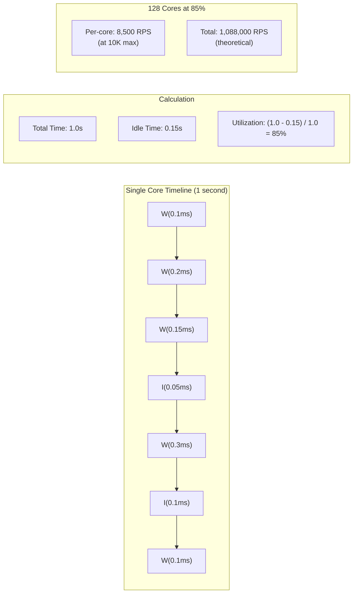

# Core Utilization

#hardware/cpu #metrics/utilization #performance/monitoring

## The Fundamental Formula

Core utilization is the single most important metric for understanding whether your CPU is the bottleneck in a high-throughput system. The formula is deceptively simple:

$$\text{Core Utilization} = \frac{\text{Total Time} - \text{Idle Time}}{\text{Total Time}} \times 100\%$$

This formula applies to **each individual core**. Every core on a CPU is, at any given moment, in exactly one of two states:

1. **Doing work**: Executing instructions—any instructions. This includes mathematical computations, memory loads and stores, branch evaluations, system calls, I/O wait (on some accounting methods), and even the instructions that make up the OS kernel itself.
2. **Idle**: Not executing any instructions. The core is in a low-power state (C-states on x86) waiting for work.

This is a **binary state**: a core is either executing or it is not. There is no "half-executing." The percentage is a time-averaged measurement over a sampling interval.

## Worked Example

Consider a single core monitored over a 1-hour (3,600 second) period:

- **Time spent doing work**: 1,800 seconds
- **Time spent idle**: 1,800 seconds

$$\text{Utilization} = \frac{3600 - 1800}{3600} \times 100\% = 50\%$$

Now consider the same core under heavier load:

- **Time spent doing work**: 3,570 seconds
- **Time spent idle**: 30 seconds

$$\text{Utilization} = \frac{3600 - 30}{3600} \times 100\% = 99.17\%$$

At 99.17% utilization, the core is nearly fully saturated. There are only 30 seconds of idle time in the entire hour—meaning new requests arriving during those 30 seconds can be served immediately, but requests arriving at any other time must wait in a queue until the core finishes its current work.

## What "Doing Work" Actually Means

A common misconception is that "doing work" only means executing your application code. In reality, the CPU cycles attributed to a core's utilization include:

- **User-space application code**: Your HTTP handler, JSON parsing, business logic
- **System/kernel calls**: `read()`, `write()`, `epoll_wait()`, `send()`, `recv()`
- **Memory management**: Page table walks, TLB misses, cache coherency operations
- **Interrupt handling**: Network card interrupts, timer interrupts
- **JIT compilation**: If using a JIT-compiled language (Java, V8/Node.js), the compiler itself consumes cycles
- **Garbage collection**: Languages with GC (Go, Java, Node.js) periodically pause or consume core time for memory reclamation

This is why a core can be at 100% utilization while your application feels "slow"—much of the CPU time may be consumed by GC, system calls, or interrupt handling rather than your actual request processing logic.

## Measuring Core Utilization

### Linux: `mpstat`

The `mpstat` command (part of the `sysstat` package) is the gold standard for per-core utilization on Linux:

```bash
mpstat -P ALL 1
```

This displays utilization for each CPU core, updated every 1 second. Key columns:
- `%usr`: Time spent in user-space applications
- `%sys`: Time spent in the kernel
- `%iowait`: Time spent waiting for I/O operations to complete
- `%idle`: Time spent idle (this is the "Idle Time" in our formula)

### macOS: Activity Monitor

Open Activity Monitor → CPU tab. You will see a per-core utilization graph as well as a combined "CPU Load" percentage. Note that macOS uses the **sum method** (see [[2.3 CPU Utilization Methods]]), so a 4-core Mac at full load shows 400% CPU usage.

### Windows: Task Manager

Open Task Manager → Performance tab → CPU. Windows shows both per-core utilization and an overall "Utilization" percentage. Like macOS, the per-core graphs are individual, but the summary may use averaging depending on the view.

## Why 0% Idle Means Maximum Throughput

When all cores on a machine show 0% idle time, the machine is at **maximum throughput** for its current configuration and workload. There is no unused compute capacity. Every incoming request must wait for a core to finish its current work before it can be processed.

This is the point at which:
- **Queue depths increase**: Requests pile up in the application's request queue, the OS's socket buffer, or the load balancer's connection queue.
- **Latency increases**: As queues grow, the waiting time for each request increases. A system that responds in 1ms at 50% utilization might respond in 100ms at 100% utilization.
- **The system is at the edge of instability**: Any additional load, any slowdown in a dependent service, or any resource contention can cause cascading failures.

However, 100% utilization does not necessarily mean maximum *possible* throughput. If your code is inefficient (e.g., using O(n²) algorithms), you might reach 100% utilization while only processing a fraction of the requests that optimized code could handle. This is why [[1.3 The Engineering Mindset at Scale]] emphasizes that efficiency and throughput are not the same thing.

## Mathematical Relationship to Throughput

If a single core can process 10,000 requests per second at 100% utilization, then:

| Utilization | Throughput per Core | Throughput (128 cores) |
|-------------|---------------------|------------------------|
| 25%         | 2,500 RPS           | 320,000 RPS            |
| 50%         | 5,000 RPS           | 640,000 RPS            |
| 75%         | 7,500 RPS           | 960,000 RPS            |
| 100%        | 10,000 RPS          | 1,280,000 RPS          |

*(Assuming perfect parallel scaling, which is unrealistic—see [[2.1 CPU Cores and Threads]] and Amdahl's Law.)*

## Core Utilization Diagram



## Common Pitfalls

1. **Averaging hides hotspots.** If 64 cores are at 100% and 64 cores are at 50%, the "average" is 75%, but you have a serious bottleneck on half your cores.
2. **iowait is not idle.** High `%iowait` means cores are stalled waiting for disk or network I/O. They are not doing useful work, but they are not available for new work either.
3. **Steal time on cloud VMs.** On AWS, `steal` time represents CPU cycles the hypervisor took away from your VM to serve another tenant. High steal time means you are not getting the CPU you paid for.

## Further Reading

- [[2.1 CPU Cores and Threads]] — understanding the hardware behind utilization
- [[2.3 CPU Utilization Methods]] — how different tools report this metric
- [[2.4 RAM vs Disk vs Network Speeds]] — why cores spend time waiting
- [[1.4 Cost of Operating at Scale]] — the financial impact of underutilization