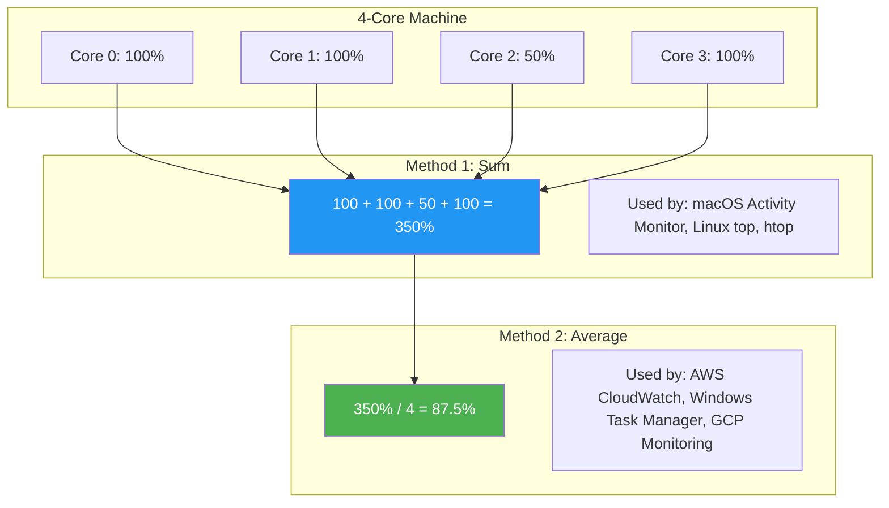

# CPU Utilization Methods

#hardware/cpu #metrics/utilization #monitoring/tools

## The Core Confusion

One of the most persistent sources of confusion in systems engineering is that different tools report "CPU utilization" in fundamentally different ways. A server that reports **400% CPU** on one tool and **100% CPU** on another is not malfunctioning—both numbers are correct, but they use different calculation methods. Misunderstanding this distinction leads to incorrect capacity planning, wrong alerting thresholds, and flawed benchmarking conclusions.

As established in [[2.2 Core Utilization]], the fundamental formula applies to a **single core**:

$$\text{Core Utilization} = \frac{\text{Total Time} - \text{Idle Time}}{\text{Total Time}} \times 100\%$$

The divergence occurs when we aggregate utilization across multiple cores.

## Method 1: Sum of All Core Utilizations

This method simply **adds up the utilization of every core independently**. On a machine with N cores, each core can contribute 0-100%, so the total can range from 0% to (N × 100)%.

### Formula

$$\text{Total Utilization (Sum)} = \sum_{i=1}^{N} \text{Utilization}_i$$

### Examples

| Core | Utilization |
|------|-------------|
| Core 0 | 100% |
| Core 1 | 100% |
| Core 2 | 50% |
| Core 3 | 100% |
| **Sum** | **350%** |

On a 4-core machine, 350% means that 3.5 out of 4 cores are fully utilized on average. This can also be interpreted as the machine having 0.5 cores of headroom.

### Tools Using This Method

- **macOS Activity Monitor**: The "CPU Load" percentage in Activity Monitor uses the sum method. A 4-core MacBook Pro at full load shows ~400%.
- **Linux `top` command**: By default, `top` shows `%Cpu(s)` which is a sum across all cores. Pressing `1` shows per-core breakdown.
- **Linux `htop`**: Shows both per-core bars and a combined average.
- **macOS `top`**: Uses the sum method by default.

### When This Method Is Useful

The sum method is most useful when you need to understand **total compute capacity consumed**. If you are billing customers based on CPU usage, or calculating how much headroom you have before needing to scale, the sum method gives you the raw number.

## Method 2: Average Across Cores

This method **averages the utilization across all cores**, always producing a value between 0% and 100%.

### Formula

$$\text{Total Utilization (Average)} = \frac{1}{N} \sum_{i=1}^{N} \text{Utilization}_i$$

### Examples

Using the same data as above:

| Core | Utilization |
|------|-------------|
| Core 0 | 100% |
| Core 1 | 100% |
| Core 2 | 50% |
| Core 3 | 100% |
| **Average** | **87.5%** |

### Tools Using This Method

- **AWS CloudWatch**: EC2 instance CPU utilization metrics are reported as an average across all vCPUs, always 0-100%.
- **GCP Cloud Monitoring**: Similarly averages across cores.
- **Some Prometheus/Grafana dashboards**: Depending on the query used (e.g., `avg(rate(node_cpu_seconds_total))`).
- **Windows Task Manager**: The main "CPU utilization" graph uses the average method.

### When This Method Is Useful

The average method is most useful for **capacity planning and alerting**. A single 0-100% number is easier to set thresholds against ("alert if CPU > 80%") and easier to visualize on a dashboard.

## Converting Between Methods

The conversion is straightforward:

$$\text{Sum} = \text{Average} \times N$$
$$\text{Average} = \frac{\text{Sum}}{N}$$

Where $N$ is the number of cores.

| Scenario                     | Sum Method | Average Method | Cores |
|------------------------------|------------|----------------|-------|
| 4 cores, all at 100%         | 400%       | 100%           | 4     |
| 4 cores, all at 50%          | 200%       | 50%            | 4     |
| 4 cores, two at 100%, two at 0% | 200%   | 50%            | 4     |
| 128 cores, all at 80%        | 10,240%    | 80%            | 128   |
| 128 cores, 64 at 100%, 64 at 0% | 6,400% | 50%            | 128   |

## Why This Distinction Matters at Scale

At 1 million RPS, you are likely running on machines with 64-128+ cores. The difference between the two methods becomes dramatic:

- **Sum method**: "Our 128-core server is at 11,520% CPU utilization."
- **Average method**: "Our server is at 90% CPU utilization."

Both convey the same information, but the average is far more intuitive. However, the average **hides imbalance**. Consider:

| Scenario | Sum | Average | Interpretation |
|----------|-----|---------|----------------|
| All 128 cores at 90% | 11,520% | 90% | Healthy, balanced load |
| 64 cores at 100%, 64 cores at 80% | 11,520% | 90% | Imbalanced, potential bottleneck |

Both scenarios report 90% average, but the second scenario has half the cores saturated while others have headroom. This could indicate lock contention, uneven request distribution, or a scheduling issue. **Always look at per-core utilization**, not just the aggregate.

## Practical Guidance for Monitoring

1. **Set alerting on the average method** for simplicity (e.g., "alert if average CPU > 85%").
2. **Set a secondary alert on per-core maximum** to detect imbalance (e.g., "alert if any single core > 98% while average < 80%").
3. **When reading any tool, know which method it uses.** Check the documentation.
4. **In benchmarking**, always report per-core utilization alongside the aggregate. At 1M RPS, per-core data reveals whether your application is actually utilizing all available hardware or is bottlenecked on a few cores due to lock contention or single-threaded components.

## Comparison Diagram

## Further Reading

- [[2.2 Core Utilization]] — the per-core formula that underpins both methods
- [[2.1 CPU Cores and Threads]] — understanding what the cores are doing
- [[1.4 Cost of Operating at Scale]] — how utilization translates to cost efficiency