# RAM vs Disk vs Network Speeds

#hardware/memory #performance/bottleneck #fundamentals/hierarchy

## The Memory Hierarchy

The most fundamental performance characteristic of modern computing is the **memory hierarchy**—a layered structure of storage technologies, each faster but smaller and more expensive than the last. Understanding this hierarchy is essential because, at 1 million requests per second, the difference between a cache hit and a disk read is the difference between a functional system and a completely broken one.

```mermaid
graph TB
    subgraph "Speed (Fastest → Slowest)"
        direction TB
        A["Registers<br/>~0.3 ns<br/>~1 KB per core"]
        B["L1 Cache<br/>~1 ns<br/>32-64 KB per core"]
        C["L2 Cache<br/>~3-4 ns<br/>256 KB - 1 MB per core"]
        D["L3 Cache<br/>~10-30 ns<br/>16-64 MB shared"]
        E["Main Memory (RAM)<br/>~50-100 ns<br/>64-1024 GB"]
        F["NVMe SSD<br/>~0.01-0.1 ms (10-100 μs)<br/>1-16 TB"]
        G["SATA SSD<br/>~0.1-0.5 ms<br/>1-8 TB"]
        H["HDD (Spinning Disk)<br/>~5-15 ms<br/>1-20 TB"]
        I["Network (Same Region)<br/>~0.5-2 ms<br/>Unlimited"]
        J["Network (Cross-Region)<br/>~50-200 ms<br/>Unlimited"]
    end
    
    style A fill:#4CAF50,color:#fff
    style B fill:#4CAF50,color:#fff
    style C fill:#8BC34A,color:#000
    style D fill:#CDDC39,color:#000
    style E fill:#FFC107,color:#000
    style F fill:#FF9800,color:#000
    style G fill:#FF9800,color:#000
    style H fill:#f44336,color:#fff
    style I fill:#9C27B0,color:#fff
    style J fill:#9C27B0,color:#fff
```

## Speed Comparison with Concrete Numbers

The gap between each level is not incremental—it is **exponential**. Let us express the speed differences as multipliers relative to RAM:

| Storage Tier     | Access Latency | vs. RAM  | vs. L1 Cache |
|------------------|----------------|----------|--------------|
| CPU Registers    | ~0.3 ns        | 333x faster | 3x faster  |
| L1 Cache         | ~1 ns          | 100x faster | 1x (baseline) |
| L2 Cache         | ~3-4 ns        | 25-33x faster | 3-4x slower |
| L3 Cache         | ~10-30 ns      | 3-10x faster | 10-30x slower |
| **RAM**          | **~50-100 ns** | **1x (baseline)** | 50-100x slower |
| NVMe SSD         | ~10-100 μs     | 100-1,000x slower | 10,000-100,000x slower |
| HDD              | ~5-15 ms       | 50,000-150,000x slower | 5M-15Mx slower |
| Network (local)  | ~0.5-2 ms      | 5,000-20,000x slower | 500K-2Mx slower |
| Network (remote) | ~50-200 ms     | 500K-2Mx slower | 50M-200Mx slower |

**Key insight**: Going from L1 cache to RAM is a 50-100x slowdown. Going from RAM to SSD is another 100-1,000x slowdown. Going from SSD to network is yet another 10-1,000x slowdown. The cumulative effect is staggering: a network round-trip is roughly **1 million times slower** than an L1 cache access.

## Why Memory Is Orders of Magnitude Faster Than Disk

The speed difference is not about engineering effort or cost—it is about **physics**:

- **RAM (DRAM)** stores data as electrical charges in capacitors, accessed through direct addressing via a memory bus. Accessing a memory location involves selecting a row and column in a memory array—an electronic process that takes nanoseconds.
- **SSD (NAND Flash)** stores data as trapped electrical charges in floating-gate transistors. Reading requires charge-sensing circuits, error correction codes (ECC), and flash translation layer (FTL) lookups. Erasing and rewriting requires high-voltage charge injection.
- **HDD** stores data as magnetic domains on a spinning platter. Reading requires physically moving a read/write head to the correct track (seek time: ~5-10ms) and waiting for the platter to rotate to the correct sector (rotational latency: ~2-4ms at 7200 RPM).

The fundamental physics of electromagnetic storage (HDD), charge-storage (SSD), and capacitive storage (RAM) create inherent speed tiers that no amount of software optimization can overcome.

## Why Network Is the Slowest and Most Unpredictable

Network latency is not only the highest but also the most **variable**. Unlike RAM and SSD, which have relatively deterministic access times (within a known range), network latency depends on:

1. **Physical distance**: Light travels at ~200,000 km/s in fiber optic cable. New York to London is ~5,500 km, adding a minimum of ~27ms one-way (55ms round-trip) just from physics.
2. **Router hops**: Each network hop (typically 5-20 for internet traffic) adds 0.1-1ms of processing delay.
3. **Queueing delays**: Routers and switches buffer packets during congestion, adding variable delays.
4. **Packet loss and retransmission**: TCP handles lost packets by retransmitting and waiting for acknowledgements, adding tens to hundreds of milliseconds.
5. **TCP congestion control**: Algorithms like CUBIC and BBR dynamically adjust the sending rate, affecting throughput and latency.

At 1M RPS, a single network round-trip of 1ms means that for any given TCP connection, only 1,000 requests can be in-flight at any time. This severely limits the throughput of a single connection and makes [[3.1 TCP Connections]] and connection pooling critical.

## How This Hierarchy Affects High-Scale System Design

The memory hierarchy has direct, practical implications for designing systems that handle 1M RPS:

1. **Cache everything possible.** If a piece of data is accessed repeatedly, it must be kept in RAM (or better, in CPU cache). A single cache miss that falls through to disk at 1M RPS can saturate your I/O bandwidth.
2. **Minimize memory allocations.** Each allocation potentially evicts useful data from CPU caches. Object pooling and pre-allocation are essential.
3. **Avoid network calls in the hot path.** A database query over the network adds 0.5-5ms per request. At 1M RPS, even 0.5ms of network latency per request would require 500,000 concurrent connections to maintain throughput.
4. **Prefetch and batch.** If you know what data you will need, fetch it before you need it (CPU prefetching) and batch multiple operations into a single network call.
5. **Data locality matters.** Keep related data close together in memory to maximize L1/L2 cache hit rates. This is why data-oriented design and structure-of-arrays (SoA) layouts outperform traditional object-oriented designs for high-throughput systems.

## Common Mistakes

1. **Treating all storage as equivalent.** "It's fast enough" is not a valid statement at 1M RPS. Every nanosecond counts.
2. **Ignoring cache effects.** An O(1) hash map lookup that consistently misses L3 cache is much slower than a linear scan of data that fits in L1.
3. **Network calls in tight loops.** This is the number one performance killer in microservice architectures. Batch or cache aggressively.

## Further Reading

- [[2.1 CPU Cores and Threads]] — how cores interact with the memory hierarchy
- [[2.5 Bits, Bytes, and Data Units]] — how data size affects transfer times
- [[2.6 Network Cards and Bandwidth]] — the hardware behind network speed
- [[3.6 Network Latency and Bandwidth]] — detailed network performance analysis
- Bottleneck identification: [[15.1 Identifying Bottlenecks]] (future note)