# Network Cards and Bandwidth

#hardware/network #networking/nic #fundamentals/bandwidth

## What Is a NIC?

A **Network Interface Card (NIC)**, also called a network adapter or network controller, is the hardware component that connects a computer to a network. It is the bridge between the digital world inside your server and the physical medium (copper cable, fiber optic, or wireless) that carries data to other machines.

Modern NICs are complex systems in their own right. A high-end 100 Gbps NIC contains:
- **PHY (Physical Layer Transceiver)**: Converts digital signals to analog for transmission over fiber or copper
- **MAC (Media Access Control)**: Handles frame construction, addressing, and error detection
- **DMA (Direct Memory Access) engine**: Transfers data directly between the NIC and system RAM without CPU involvement
- **RSS (Receive Side Scaling)**: Distributes incoming packets across multiple CPU cores using a hash of packet headers
- **Offload engines**: Hardware acceleration for TCP segmentation (TSO), checksum calculation, and encryption (IPsec/TLS)

Understanding the NIC is critical at 1M RPS because the NIC is often the **first bottleneck** you encounter—before CPU, before memory, before disk. As explored in [[2.5 Bits, Bytes, and Data Units]], a 10 Gbps card can only transfer 1.25 GB/s, which limits the number of requests per second for any non-trivial payload size.

## The Full Data Path

Data does not magically travel from your application to a remote server. It traverses a long chain of components, each adding latency and imposing constraints:

```mermaid
graph LR
    A["Application<br/>(generates data)"] --> B["OS Kernel<br/>(TCP/IP stack)"]
    B --> C["NIC Driver<br/>(prepares frames)"]
    C --> D["NIC Hardware<br/>(DMA to wire)"]
    D --> E["Physical Cable<br/>(fiber/copper)"]
    E --> F["Network Switch<br/>(routes frames)"]
    F --> G["Physical Cable<br/>(fiber/copper)"]
    G --> H["Remote NIC<br/>(receives frames)"]
    H --> I["Remote NIC Driver"]
    I --> J["Remote OS Kernel<br/>(TCP/IP stack)"]
    J --> K["Remote Application<br/>(processes data)"]
    
    style A fill:#2196F3,color:#fff
    style K fill:#4CAF50,color:#fff
    style D fill:#FF9800,color:#000
    style H fill:#FF9800,color:#000
```

Each step in this chain adds latency:
- **Application to kernel**: System call overhead (~0.1-1 μs)
- **Kernel to NIC**: DMA setup and queue management (~0.5-2 μs)
- **NIC to wire**: Serialization and physical transmission (depends on bandwidth and frame size)
- **Switch processing**: Store-and-forward or cut-through switching (~1-10 μs)
- **Wire propagation**: Speed of light in fiber, ~5 μs per km

The total latency for same-data-center communication (server to server in the same rack) is typically **50-200 μs**. For cross-data-center communication within the same region, add **0.5-2 ms**.

## Bandwidth vs. Throughput vs. Latency

These three terms are frequently confused but measure fundamentally different things:

| Metric | What It Measures | Unit | Example |
|--------|------------------|------|---------|
| **Bandwidth** | Maximum data rate of the link | Gbps | "50 Gbps network card" |
| **Throughput** | Actual data rate achieved | GB/s | "Achieved 4.2 GB/s" |
| **Latency** | Time for one packet to travel end-to-end | ms, μs | "Round-trip time: 0.5 ms" |

**Bandwidth is a hard ceiling.** You physically cannot send more bits per second than the NIC and link allow. A 10 Gbps card cannot transmit 11 Gbps, no matter how optimized your software is. This is a law of physics, not a software limitation.

**Throughput is always ≤ bandwidth.** In practice, throughput is typically 60-90% of bandwidth due to protocol overhead, packet gaps, and TCP flow control.

**Latency is independent of bandwidth** (to a first approximation). A 10 Gbps link and a 100 Gbps link can have the same latency if they traverse the same physical path. However, higher bandwidth links can move more data in a single "burst," which reduces the *perceived* latency for large transfers (a 1 MB file takes 0.8ms on a 10 Gbps link vs. 0.08ms on a 100 Gbps link).

## Network Card Tiers

| Tier | Speed | Throughput | Use Case | Cost (AWS) |
|------|-------|------------|----------|------------|
| 1 Gbps | 1 Gbps | ~125 MB/s | Development, small workloads | Included |
| 10 Gbps | 10 Gbps | ~1.25 GB/s | Medium applications, databases | Included on most instances |
| 25 Gbps | 25 Gbps | ~3.125 GB/s | High-throughput applications | Enhanced networking |
| 50 Gbps | 50 Gbps | ~6.25 GB/s | High-performance compute, big data | C8i instances |
| 100 Gbps | 100 Gbps | ~12.5 GB/s | Hyperscale, AI training, HPC | Specialized instances |
| 400 Gbps | 400 Gbps | ~50 GB/s | Backbone, data center interconnect | Custom hardware |

## Why Bandwidth Is a Hard Ceiling

Consider a server with a 10 Gbps NIC trying to serve 1M RPS with 2 KB responses:
- Required throughput: $1,000,000 \times 2,048 \text{ bytes} = 2.048 \text{ GB/s}$
- Available throughput: **1.25 GB/s**
- **Deficit: 0.8 GB/s**

The server **cannot** achieve 1M RPS at this response size, regardless of how powerful its CPU is. The network card is the bottleneck. You must either:
1. **Upgrade the NIC** (to 25 Gbps or higher)
2. **Reduce response size** (compression, smaller payloads)
3. **Distribute across multiple servers** (each with its own NIC)

This is why AWS C8i.32xlarge instances come with 50 Gbps network interfaces—providing 6.25 GB/s of throughput, which is sufficient for most 1M RPS workloads with reasonably sized payloads.

## How TCP Works Over the Network Card

TCP's interaction with the NIC is more complex than simply "sending data." Key mechanisms include:

1. **TCP Segmentation Offload (TSO)**: The OS passes a large buffer to the NIC, and the NIC hardware splits it into appropriately sized TCP segments. This dramatically reduces CPU overhead for high-throughput connections.

2. **Generic Receive Offload (GRO)**: The NIC combines multiple received packets into a single large buffer before passing it to the OS, reducing per-packet processing overhead.

3. **TCP Window Size**: TCP uses a "sliding window" to control how much unacknowledged data can be in flight. The window size, combined with the round-trip time, determines the maximum throughput of a single TCP connection:
   
   $$\text{Max Throughput} = \frac{\text{Window Size}}{\text{RTT}}$$
   
   With a 64 KB window and 1 ms RTT, max throughput is 64 MB/s (512 Mbps)—far below a 10 Gbps link. Modern TCP with window scaling can use windows up to 1 GB, enabling full link utilization.

4. **RSS (Receive Side Scaling)**: On multi-core systems, the NIC hashes incoming packet headers (source/destination IP and port) to distribute packets across multiple CPU queues. This allows multiple cores to process network traffic in parallel—a critical feature for achieving 1M RPS on a multi-core server.

## Practical Implications for 1M RPS

1. **Choose your instance type based on network bandwidth first.** If the NIC cannot carry the data, CPU power is wasted.
2. **Enable RSS and offloading.** These features can double or triple effective network throughput by better utilizing multi-core architectures.
3. **Monitor NIC utilization.** Tools like `ethtool`, `nicstat`, and `sar -n DEV` provide per-NIC statistics.
4. **Remember: bandwidth is shared.** If your server also makes outbound API calls, writes to a database, and receives health checks, all of this traffic shares the same NIC bandwidth.

## Further Reading

- [[2.5 Bits, Bytes, and Data Units]] — converting between bits and bytes
- [[3.1 TCP Connections]] — how TCP uses the network card
- [[3.6 Network Latency and Bandwidth]] — the interplay of latency and bandwidth
- [[15.3 Network Bottlenecks]] — diagnosing NIC-related issues (future note)