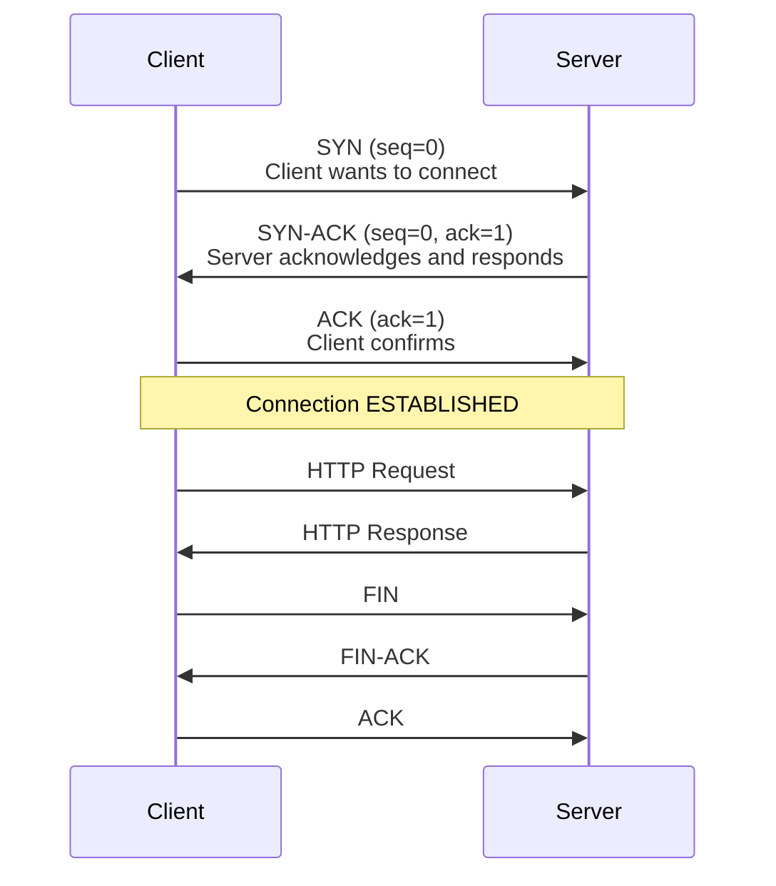

# TCP Connections

#networking/tcp #fundamentals/protocols #performance/connections

## What Is TCP?

The **Transmission Control Protocol (TCP)** is one of the core protocols of the Internet Protocol Suite. It operates at the transport layer (Layer 4 of the OSI model) and provides **reliable, ordered, error-checked delivery** of data between applications. TCP sits directly above IP (which provides best-effort, unordered delivery) and below application-layer protocols like HTTP, SSH, and PostgreSQL's wire protocol.

TCP guarantees:
1. **Reliability**: Lost or corrupted packets are retransmitted automatically.
2. **Ordering**: Data arrives at the receiver in the same order it was sent.
3. **Flow control**: The receiver tells the sender how much data it can accept, preventing buffer overflow.
4. **Congestion control**: The sender adjusts its transmission rate based on network conditions to avoid overwhelming the network.

These guarantees come at a cost: **performance overhead**. Each TCP connection requires state tracking, acknowledgement processing, retransmission buffers, and congestion window management. At 1M RPS, this overhead is a first-order concern.

## The Three-Way Handshake

Every TCP connection begins with a **three-way handshake**, a process that establishes the connection parameters and confirms both sides are ready to communicate:

1. **SYN (Synchronize)**: The client sends a SYN packet with a random initial sequence number. This tells the server: "I want to open a connection, and here is my starting sequence number."
2. **SYN-ACK (Synchronize-Acknowledge)**: The server responds with its own SYN (with its own random sequence number) and an ACK acknowledging the client's SYN.
3. **ACK (Acknowledge)**: The client acknowledges the server's SYN.

After this three-way handshake, the connection is in the **ESTABLISHED** state and data transfer can begin.

**Cost of the handshake**: The three-way handshake adds one full round-trip time (RTT) of latency before any application data can be sent. On a same-data-center connection (~0.1ms RTT), this is negligible. On a cross-region connection (~100ms RTT), this adds 100ms to every new connection.

## Why TCP for HTTP?

HTTP uses TCP because **reliability matters more than speed for web content**. A missing or reordered byte in an HTML page, JSON response, or image file would corrupt the data and break the application. TCP's guaranteed ordered delivery ensures that the application receives complete, correct data.

The alternative, **UDP (User Datagram Protocol)**, provides no reliability, ordering, or flow control. It simply sends packets and hopes they arrive. UDP is used for real-time applications where latency matters more than reliability: video streaming (a dropped frame is acceptable), DNS lookups (simple request-response), and online gaming.

### TCP vs. UDP Comparison

| Property | TCP | UDP |
|----------|-----|-----|
| Reliability | Guaranteed (retransmission) | Best effort (no retransmission) |
| Ordering | Ordered delivery | No ordering guarantee |
| Flow control | Yes (sliding window) | No |
| Connection | Connection-oriented (3-way handshake) | Connectionless |
| Header size | 20-60 bytes | 8 bytes |
| Speed | Slower (overhead) | Faster (minimal overhead) |
| Use cases | Web, APIs, databases, SSH | Streaming, DNS, gaming, VoIP |

## Connection Overhead

Each TCP connection consumes resources on **both the client and the server**:

**Server-side per-connection state:**
- Socket buffer (typically 16-256 KB for send and receive)
- TCP control block (TCB): ~1-2 KB for tracking sequence numbers, timers, congestion state
- File descriptor (an integer in the process's file descriptor table)
- Kernel memory for the connection's retransmission queue

**Client-side:** Similar resources, though typically less concerning since a client has fewer concurrent connections.

On a Linux server, the maximum number of open file descriptors is controlled by `ulimit -n` (soft/hard limits) and `fs.file-max` in `/etc/sysctl.conf`. Default limits are often 1,024 or 65,536, but high-performance servers set this to 1,000,000+.

## Connection Pooling

Because establishing a new TCP connection for every HTTP request is prohibitively expensive at scale (1-3 round trips + TLS handshake for HTTPS), high-performance systems use **connection pooling**:

1. **Keep a pool of pre-established TCP connections** to each backend service.
2. **Reuse connections** for multiple requests.
3. **When a request arrives**, grab an idle connection from the pool, send the request, receive the response, and return the connection to the pool.
4. **Grow and shrink** the pool based on demand.

Without connection pooling, a 1M RPS system would need to establish (and tear down) 1 million TCP connections per second. At 0.1ms per handshake, that would consume 100 seconds of CPU time per second—impossible. With connection pooling, a small number of long-lived connections (e.g., 1,000-10,000) can handle 1M RPS using multiplexing.

## Connection States

TCP connections go through well-defined states during their lifecycle:

| State | Meaning | Duration |
|-------|---------|----------|
| **LISTEN** | Server waiting for connections | Indefinite |
| **SYN_SENT** | Client sent SYN, waiting for SYN-ACK | ~1 RTT |
| **SYN_RCVD** | Server sent SYN-ACK, waiting for ACK | ~1 RTT |
| **ESTABLISHED** | Connection open, data can flow | Variable |
| **FIN_WAIT_1** | Client sent FIN, waiting for ACK | ~1 RTT |
| **FIN_WAIT_2** | Client received ACK for FIN, waiting for server's FIN | Variable |
| **TIME_WAIT** | Connection closed, waiting 2×MSL before reuse | 30-120 seconds |
| **CLOSE_WAIT** | Server received FIN, waiting for application to close | Variable (dangerous if stuck) |

**TIME_WAIT** is particularly important at scale. After a connection is closed, the side that initiated the close enters TIME_WAIT for 2×MSL (Maximum Segment Lifetime, typically 60 seconds on Linux). This prevents delayed duplicate packets from being accepted by a new connection using the same IP:port tuple. At 1M RPS with short-lived connections, TIME_WAIT can exhaust available ports (65,535 per IP address), requiring port reuse strategies (`SO_REUSEADDR`, `SO_REUSEPORT`).

**CLOSE_WAIT** is a danger signal. If a connection remains in CLOSE_WAIT indefinitely, it means the remote side closed the connection but the local application never called `close()` on its socket. This is a **resource leak**—each CLOSE_WAIT connection consumes kernel memory and a file descriptor. At scale, CLOSE_WAIT accumulation is a common cause of server crashes.

## Max Connections Limit

Many services have hard limits on concurrent connections:

- **PostgreSQL**: Default `max_connections = 100`. Can be increased to ~5,000-10,000 with configuration changes, but each connection consumes ~10 MB of memory.
- **MySQL**: Similar limits, with per-connection thread overhead.
- **Nginx**: Can handle 10,000-100,000+ concurrent connections efficiently due to its event-driven architecture.
- **Node.js**: Single-threaded event loop can handle many connections, but CPU-intensive processing per connection reduces throughput.

Connection pooling and multiplexing (see [[10.5 Connection Pooling]]) are essential to work within these limits.

## Further Reading

- [[3.2 HTTP Protocol]] — the application protocol that rides on TCP
- [[3.6 Network Latency and Bandwidth]] — how latency affects TCP throughput
- [[10.5 Connection Pooling]] — advanced connection management (future note)
- [[2.6 Network Cards and Bandwidth]] — the hardware TCP data traverses