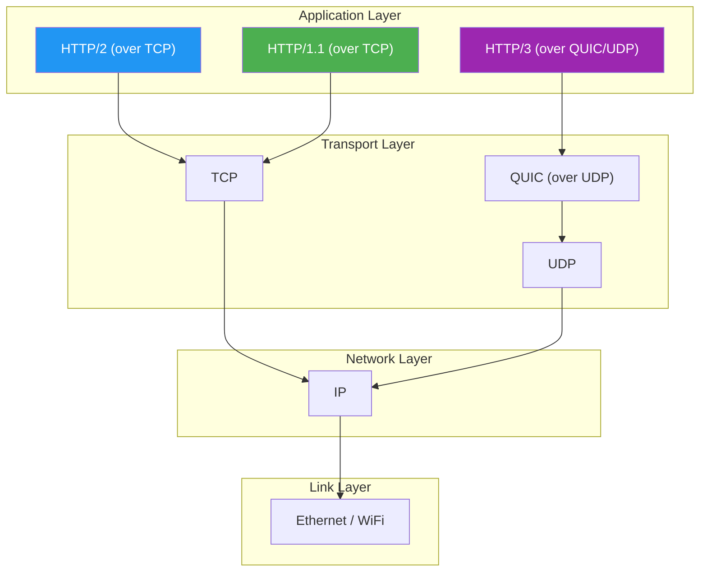

# HTTP Protocol

#networking/http #fundamentals/protocols #performance/http

## What Is HTTP?

The **HyperText Transfer Protocol (HTTP)** is an application-layer protocol (Layer 7 of the OSI model) that defines how clients and servers communicate on the World Wide Web. HTTP sits on top of TCP (see [[3.1 TCP Connections]]) and provides a standardized format for requesting and transmitting resources—HTML pages, JSON data, images, videos, and more.

HTTP is a **stateless, request-response protocol**. The client sends a request, the server sends a response, and the interaction is complete. The server retains no memory of previous requests from the same client (though cookies and tokens can simulate statefulness at the application layer).

This statelessness is both a strength and a weakness. It enables horizontal scaling (any server can handle any request) but requires additional mechanisms for sessions, authentication, and personalization.

## The Evolution: HTTP/1.1, HTTP/2, HTTP/3

### HTTP/1.1 (RFC 7230, 1999/2014)

The workhorse of the web for over two decades. Key characteristics:
- **Text-based**: Requests and responses are human-readable plain text.
- **One request per TCP connection at a time**: The client must wait for the response before sending the next request (unless using pipelining, which was never widely adopted).
- **Keep-Alive connections**: Allows multiple requests to be sent sequentially over the same TCP connection, avoiding the overhead of repeated handshakes.
- **No header compression**: Each request repeats all headers, wasting bandwidth.

At 1M RPS, HTTP/1.1 is problematic because it requires **either** thousands of concurrent TCP connections (each with server-side overhead) **or** serialized requests on a single connection (adding latency). Neither scales well.

### HTTP/2 (RFC 7540, 2015)

A major evolution that addressed HTTP/1.1's scalability limitations:
- **Binary framing**: Requests and responses are encoded in binary, not text. This is more efficient to parse and enables new features.
- **Multiplexing**: Multiple requests and responses can be interleaved on a single TCP connection. This eliminates head-of-line blocking at the HTTP level (though TCP-level HOL blocking remains).
- **Header compression (HPACK)**: Headers are compressed using a static and dynamic table, reducing redundant header data by 70-90%.
- **Server push**: The server can proactively send resources the client will need (e.g., CSS files referenced in an HTML page).

HTTP/2 allows a **single TCP connection** to handle thousands of concurrent requests, dramatically reducing connection overhead. However, TCP-level head-of-line blocking remains: if a single packet is lost, all streams on that connection are blocked until the packet is retransmitted.

### HTTP/3 (RFC 9114, 2022)

Built on **QUIC**, a transport protocol that runs over UDP instead of TCP:
- **No head-of-line blocking**: Each stream is independent. A lost packet on one stream does not block other streams.
- **0-RTT connection establishment**: On repeat connections, data can be sent immediately without waiting for a handshake (similar to TLS 1.3 resumption).
- **Connection migration**: If a client's IP address changes (e.g., switching from WiFi to cellular), the connection can survive without re-establishing.

HTTP/3 is the future of high-performance web communication, particularly for clients on unreliable networks. However, adoption is still growing, and many internal microservice architectures still rely on HTTP/2 or even HTTP/1.1.

## The Request-Response Model

Every HTTP interaction follows this pattern:

1. **Client sends a request** containing:
   - A **request line**: `METHOD /path HTTP/version`
   - **Headers**: Key-value pairs providing metadata
   - An optional **body**: Data being sent (for POST, PUT, PATCH)

2. **Server sends a response** containing:
   - A **status line**: `HTTP/version STATUS_CODE REASON`
   - **Headers**: Key-value pairs providing metadata
   - An optional **body**: The requested data or error details

Example HTTP/1.1 request:
```
GET /api/users/123 HTTP/1.1
Host: api.example.com
Accept: application/json
Connection: keep-alive
```

Example HTTP/1.1 response:
```
HTTP/1.1 200 OK
Content-Type: application/json
Content-Length: 42
Connection: keep-alive

{"id":123,"name":"Alice","email":"alice@example.com"}
```

## Key HTTP Headers

| Header | Direction | Purpose | Example |
|--------|-----------|---------|---------|
| `Host` | Request | Identifies the target host (required in HTTP/1.1) | `api.example.com` |
| `Content-Type` | Both | Specifies the format of the body | `application/json` |
| `Content-Length` | Both | Size of the body in bytes | `42` |
| `Connection` | Both | Controls connection lifecycle | `keep-alive` |
| `Authorization` | Request | Authentication credentials | `Bearer <token>` |
| `Cache-Control` | Response | Caching directives | `max-age=3600` |
| `User-Agent` | Request | Client software identification | `Mozilla/5.0...` |

At 1M RPS, **header size matters**. A typical HTTP/1.1 request with common headers is 200-500 bytes. At 1M requests, that is 200-500 MB/s of just headers—before any payload data. HTTP/2's header compression can reduce this by 70-90%.

## Connection: Keep-Alive vs. Close

The `Connection` header controls whether a TCP connection is reused or closed after a response:

- **`Connection: close`**: The server closes the TCP connection after sending the response. The client must establish a new TCP connection for the next request. This was the default in HTTP/1.0.
- **`Connection: keep-alive`**: The connection remains open after the response, allowing the client to send additional requests without a new handshake. This is the default in HTTP/1.1.

At scale, `keep-alive` is **mandatory**. Without it, every request requires a new TCP connection (and potentially a TLS handshake for HTTPS), adding at least one RTT of latency and significant server-side connection management overhead.

## HTTP Pipelining

HTTP/1.1 pipelining allows the client to send multiple requests without waiting for each response. The server must send responses in the same order as requests were received.

In theory, pipelining reduces latency by eliminating idle time between requests. In practice, pipelining was never widely adopted because:
- Many proxies and servers implemented it incorrectly
- Head-of-line blocking: if the first request's response is slow, all subsequent responses are delayed
- Complex error handling: if a connection drops mid-pipeline, the client must retry all unacknowledged requests

HTTP/2's multiplexing solved the same problem more elegantly, making pipelining effectively obsolete.

## How HTTP Sits on Top of TCP

Understanding the protocol stack is essential for debugging performance issues:



Each layer adds its own headers, increasing the total bytes transmitted. An HTTP/1.1 GET request with 200 bytes of headers, carried over TCP (20-60 byte header) and IP (20 byte header), results in at least 240-280 bytes on the wire—before any application payload. At 1M RPS, that is 240-280 MB/s of pure overhead.

## Further Reading

- [[3.1 TCP Connections]] — the transport layer HTTP depends on
- [[3.3 HTTP Methods]] — the verbs that define request semantics
- [[3.4 HTTP Status Codes]] — the response codes that indicate outcome
- [[3.5 JSON Data Format]] — the most common HTTP body format
- [[5.4 Connections, Pipelining, and Workers]] — HTTP performance optimization (future note)