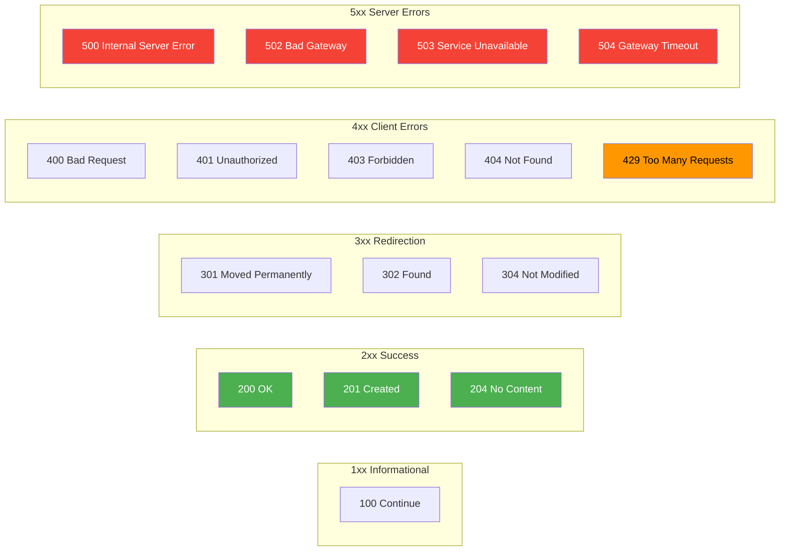

# HTTP Status Codes

#networking/http #monitoring/errors #fundamentals/status-codes

## What Are HTTP Status Codes?

Every HTTP response begins with a **status line** containing a three-digit numeric status code and a human-readable reason phrase. Status codes communicate the outcome of the client's request to the client, intermediaries (proxies, CDNs, load balancers), and monitoring systems.

At 1 million requests per second, status codes are not just informative—they are **operational intelligence**. Monitoring the distribution of status codes across your traffic tells you immediately whether your system is healthy, degraded, or failing. A sudden spike in 5xx codes at 1M RPS means thousands of errors per second—potentially affecting millions of users.

## The Five Categories

Status codes are grouped by their first digit:

## 1xx: Informational

These codes indicate that the request was received and the server is continuing the process. They are rarely seen in typical web traffic.

| Code | Name | Meaning |
|------|------|---------|
| 100 | Continue | Client should continue sending the request body. Used when the client sent an `Expect: 100-continue` header to check if the server is willing to accept the body before sending a large payload. |

At 1M RPS, the `Expect: 100-continue` mechanism is **rarely used** because it adds an extra round-trip. It is more common for large file uploads.

## 2xx: Success

These codes indicate that the request was successfully received, understood, and processed.

| Code | Name | Meaning | Typical Use |
|------|------|---------|-------------|
| 200 | OK | Standard success response | GET requests, successful operations |
| 201 | Created | A new resource was created | POST requests that create resources |
| 202 | Accepted | Request accepted for async processing | Long-running operations (video encoding, batch jobs) |
| 204 | No Content | Success, but no body in response | DELETE requests, PUT/PATCH when no response body is needed |

**Monitoring 2xx codes**: At scale, the 2xx rate is your **success rate**. A healthy system should show >99.9% 2xx responses. If the 2xx rate drops below 99%, something is seriously wrong—millions of requests are failing.

## 3xx: Redirection

These codes indicate that further action is needed to complete the request. The client must follow the redirection (typically via the `Location` header).

| Code | Name | Meaning | Typical Use |
|------|------|---------|-------------|
| 301 | Moved Permanently | Resource has permanently moved to a new URL | URL restructuring, HTTP→HTTPS redirect |
| 302 | Found | Resource temporarily at a different URL | Temporary redirects, auth flows |
| 304 | Not Modified | Client's cached copy is still valid | Conditional requests with `If-None-Match`/`If-Modified-Since` headers |

**304 Not Modified** is particularly important for performance at scale. When a client sends a conditional request (with an `ETag` or `Last-Modified` header) and the resource has not changed, the server responds with 304 and no body. The client uses its cached copy. This saves enormous bandwidth and server processing time—a 304 response is typically only ~200 bytes (headers only) vs. potentially kilobytes or megabytes for a full 200 response.

## 4xx: Client Errors

These codes indicate that the client's request was malformed, unauthorized, or otherwise erroneous. **The server did not fail**—the request itself was the problem.

| Code | Name | Meaning | Common Cause |
|------|------|---------|--------------|
| 400 | Bad Request | Malformed request syntax | Invalid JSON, missing required fields |
| 401 | Unauthorized | Authentication required or failed | Missing/expired token |
| 403 | Forbidden | Authenticated but not authorized | Insufficient permissions |
| 404 | Not Found | Resource does not exist | Typo in URL, deleted resource |
| 405 | Method Not Allowed | HTTP method not supported for this resource | POST to a read-only endpoint |
| 408 | Request Timeout | Client took too long to send the request | Slow client, network issues |
| 413 | Payload Too Large | Request body exceeds server limit | Uploading files > configured max |
| 422 | Unprocessable Entity | Syntactically correct but semantically invalid | Valid JSON but invalid data values |
| 429 | Too Many Requests | Rate limit exceeded | Too many requests from this client |

**429 Too Many Requests** is the most critical 4xx code at scale. It is the server's mechanism for **rate limiting**—preventing any single client from consuming disproportionate resources. At 1M RPS, without rate limiting, a single aggressive client (or a DDoS attack) can consume all available capacity and deny service to legitimate users.

Rate limiting is typically implemented with:
- **Token bucket or leaky bucket algorithms**: Allow bursts up to a threshold, then reject excess requests.
- **Per-client limits**: Based on API key, IP address, or user ID.
- **Distributed rate limiting**: Using Redis or a dedicated rate-limiting service to track counts across multiple server instances.

## 5xx: Server Errors

These codes indicate that the **server failed** to fulfill a valid request. This is always a bug, an infrastructure issue, or a capacity problem.

| Code | Name | Meaning | Common Cause |
|------|------|---------|--------------|
| 500 | Internal Server Error | Unhandled exception in application code | Null pointer, unhandled error, bug |
| 502 | Bad Gateway | Upstream server returned an invalid response | Backend service crashed or misconfigured |
| 503 | Service Unavailable | Server temporarily overloaded or in maintenance | Capacity exceeded, deployment in progress |
| 504 | Gateway Timeout | Upstream server did not respond in time | Backend too slow, database timeout |

**Monitoring 5xx codes is critical at scale.** At 1M RPS, a 0.1% error rate means 1,000 errors per second—86.4 million errors per day. Even a 0.001% error rate means 10 errors per second.

Each 5xx response at 1M RPS has a **cost**:
- Wasted CPU cycles (the server did work before failing)
- Wasted network bandwidth (request was received, response was sent)
- Degraded user experience (failed requests mean failed interactions)
- Potential cascading failures (if clients retry 5xx responses, the retry storm can amplify the original problem)

## Connection to Benchmarking

When running load tests with tools like [[5.2 Autocannon]] (see future note), the distribution of status codes is a primary metric. A benchmark report should always show:
- Total requests per second
- 2xx count and percentage
- Non-2xx count and percentage (broken down by code)
- Latency percentiles (p50, p95, p99, p99.9)

If non-2xx codes increase as load increases, you have found the **breaking point** of your system—the RPS at which it begins to fail.

## Best Practices for Status Codes at Scale

1. **Use appropriate codes.** Don't return 200 for every request. A 201 for creation, 204 for deletion, 404 for missing resources—proper codes enable automated monitoring and client-side error handling.
2. **Return 304 when possible.** Implement ETag or Last-Modified based caching. At 1M RPS, converting 50% of 200 responses to 304 can save 50% of response bandwidth.
3. **Rate limit with 429, not 503.** A 503 suggests the server is overloaded. A 429 correctly identifies the client as the source of the problem, enabling per-client rate limiting.
4. **Log 5xx codes with full context.** At 1M RPS, you cannot log every request, but you MUST log every 5xx with request details, stack traces, and correlation IDs for debugging.

## Further Reading

- [[3.2 HTTP Protocol]] — the protocol that defines status codes
- [[3.3 HTTP Methods]] — how methods relate to status codes
- [[5.2 Autocannon]] — tracking status codes in benchmarks (future note)
- [[3.5 JSON Data Format]] — error response body format