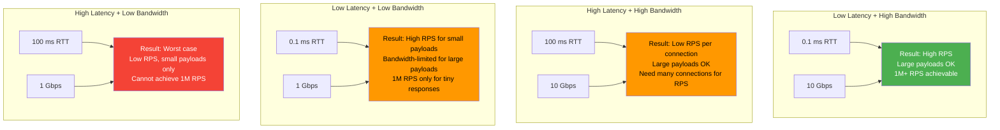

# Network Latency and Bandwidth

#networking/performance #fundamentals/latency #scaling/bottleneck

## The Three Dimensions of Network Performance

Network performance is described by three related but distinct metrics. Confusing them leads to incorrect system design decisions. Let us define each precisely:

### Latency

**Latency** is the time required for a single packet (or a small amount of data) to travel from source to destination. It is measured in **milliseconds (ms)** or **microseconds (μs)** and represents the **time-in-flight** of data.

Latency has two components:
1. **Propagation delay**: The time for a signal to travel through the physical medium. This is governed by the speed of light: ~200,000 km/s in fiber optic cable, ~300,000 km/s in vacuum. New York to London (~5,500 km) adds a minimum ~27.5 ms one-way propagation delay.
2. **Processing delay**: Time spent in routers, switches, NICs, and operating system kernels. Each network hop adds 0.1-10 μs of processing delay, and the OS TCP/IP stack adds 5-50 μs per packet.

Latency is like the **speed limit on a road**: it determines how quickly a single car can get from point A to point B.

### Bandwidth

**Bandwidth** is the maximum rate at which data can be transferred over the network link, measured in **bits per second (bps)** or **bytes per second (B/s)**. It is a **capacity** metric, not a speed metric.

A 10 Gbps link can transfer 10 billion bits per second. This is the width of the "pipe"—how much data can flow through simultaneously. See [[2.5 Bits, Bytes, and Data Units]] for the bits-to-bytes conversion and [[2.6 Network Cards and Bandwidth]] for hardware details.

Bandwidth is like the **number of lanes on a highway**: it determines how many cars can travel simultaneously.

### Throughput

**Throughput** is the **actual** rate of data transfer achieved, measured in bytes per second. Throughput is always less than or equal to bandwidth (the theoretical maximum). The ratio of throughput to bandwidth is called **goodput** or efficiency.

Throughput is like the **actual number of cars passing a point per hour**: it depends on the road width (bandwidth), speed limit (latency), traffic conditions (congestion), and vehicle size (packet size).

## Why Both Latency and Bandwidth Matter (Differently)

They matter in fundamentally different ways for different workloads:

| Scenario | Primary Constraint | Why |
|----------|-------------------|-----|
| API with small requests/responses (100 bytes) | **Latency** | Data fits in a single packet; the bottleneck is round-trip time |
| Streaming large files (video, backups) | **Bandwidth** | Data volume is large; the bottleneck is transfer rate |
| 1M RPS with 1 KB responses | **Both** | Need low latency for fast turnaround AND high bandwidth for data volume |
| Real-time gaming, video calls | **Latency** (jitter) | Consistent, low latency is essential for user experience |

## Same-Region vs. Cross-Region Latency

Geographic distance is the dominant factor in network latency:

| Path | Distance | Typical RTT | Max Theoretical RPS per Connection |
|------|----------|-------------|-------------------------------------|
| Same rack | ~1 m | 0.05-0.2 ms | 5,000-20,000 |
| Same AZ (data center) | ~1 km | 0.2-0.5 ms | 2,000-5,000 |
| Same region (different AZ) | ~10-100 km | 0.5-2 ms | 500-2,000 |
| Cross-region (US-EU) | ~5,000-8,000 km | 70-100 ms | 10-14 |
| Cross-region (US-Asia) | ~10,000-15,000 km | 120-200 ms | 5-8 |

The "Max Theoretical RPS per Connection" column is calculated as $\frac{1000}{\text{RTT (ms)}}$, representing how many round-trips can complete per second on a single TCP connection with no pipelining or multiplexing. This illustrates why **geographic distribution** is mandatory for global services: a single TCP connection from Tokyo to Virginia can only complete ~5-8 requests per second.

## Why Private Networks Matter for Benchmarks

When benchmarking a system's maximum RPS, **public internet measurements are useless**. The internet introduces unpredictable latency variations (jitter), packet loss, route changes, and congestion that make results non-reproducible.

For accurate, reproducible benchmarks:
- Use **dedicated, private network connections** between client and server
- Place client and server in the **same availability zone** (or same rack)
- Use **direct network connections** (not through load balancers or firewalls) when measuring raw application performance
- Run multiple iterations and report **percentiles** (p50, p95, p99), not just averages

AWS provides "placement groups" that co-locate instances in the same rack, providing the lowest possible latency (~0.1 ms RTT) for benchmarking.

## How Latency Compounds at 1M RPS

This is perhaps the most important insight about latency at extreme scale. Consider a server processing requests on a single TCP connection with 1 ms round-trip latency:

$$\text{In-flight requests} = \text{RPS} \times \text{RTT}$$
$$\text{In-flight requests} = 1,000,000 \times 0.001\text{s} = 1,000$$

At 1M RPS with 1 ms RTT, there are **1,000 requests concurrently in flight** on each connection. Each of these requests occupies:
- A buffer in the OS's TCP send/receive queues
- Memory in the application's request processing pipeline
- Potentially a thread or coroutine in the application

If the server has 10,000 concurrent connections, that is **10 million in-flight requests**—each consuming memory and requiring tracking. This is why:
- Memory consumption grows linearly with latency × RPS
- Connection pooling and multiplexing (HTTP/2) are essential
- Reducing latency directly reduces memory requirements

## Latency and the Bandwidth-Delay Product

The **Bandwidth-Delay Product (BDP)** is a fundamental concept in networking:

$$\text{BDP} = \text{Bandwidth} \times \text{RTT}$$

BDP represents the **maximum amount of unacknowledged data that can be in flight** on a network link. It determines the minimum TCP buffer size needed to fully utilize the link.

Example for a 10 Gbps link with 1 ms RTT:
$$\text{BDP} = 1.25 \text{ GB/s} \times 0.001\text{s} = 1.25 \text{ MB}$$

If the TCP send buffer is smaller than 1.25 MB, the sender cannot keep the pipe full, and throughput will be below the link capacity. The TCP window scaling option (enabled by default in modern OSes) allows windows up to 1 GB, enabling full utilization of high-bandwidth, high-latency links.

For cross-region links (100 ms RTT, 10 Gbps):
$$\text{BDP} = 1.25 \text{ GB/s} \times 0.1\text{s} = 125 \text{ MB}$$

This means each TCP connection needs 125 MB of buffer space to fully utilize a 10 Gbps cross-region link. At 1M RPS, the aggregate buffer requirements become enormous.

## Practical Implications for 1M RPS

1. **Minimize latency everywhere.** Every millisecond of latency per request at 1M RPS adds 1,000 in-flight requests, increasing memory pressure and queue depths.
2. **Co-locate services.** Place your application servers and databases in the same data center. Cross-AZ database queries add 0.5-2 ms per query—at 1M RPS, that is catastrophic.
3. **Use connection multiplexing.** HTTP/2 and gRPC allow multiple requests per connection, reducing the number of concurrent connections needed.
4. **Monitor latency percentiles, not averages.** An average latency of 1 ms could hide a p99 latency of 50 ms, meaning 1% of your requests (10,000 per second) are experiencing severe delays.
5. **Account for latency in capacity planning.** A system designed for 1M RPS at 0.1 ms RTT will only achieve 100K RPS at 1 ms RTT on the same hardware and connection count.

## Diagram: Latency vs. Bandwidth Impact

## Further Reading

- [[2.5 Bits, Bytes, and Data Units]] — the data sizes flowing through the network
- [[2.6 Network Cards and Bandwidth]] — the hardware that determines bandwidth
- [[3.1 TCP Connections]] — how TCP manages latency and bandwidth
- [[3.2 HTTP Protocol]] — HTTP-level optimizations for latency
- [[15.3 Network Bottlenecks]] — diagnosing network performance issues (future note)