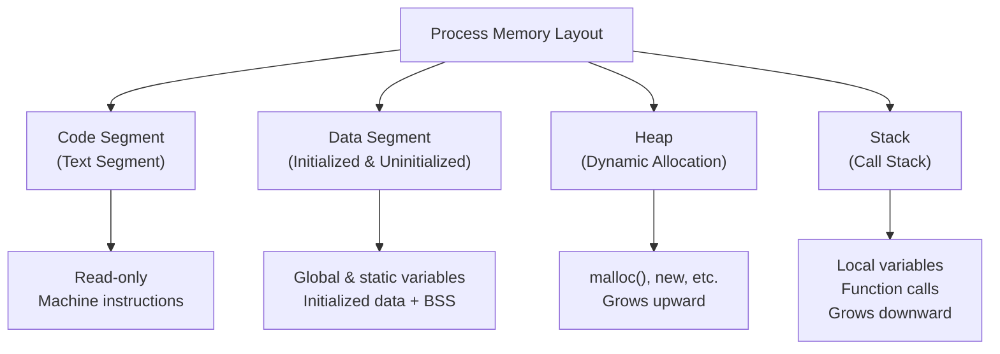
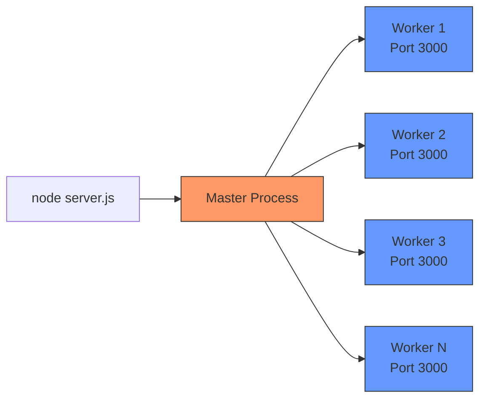

# 4.1 Processes and Threads

#os/processes #os/threads #fundamentals

## Overview

Understanding the difference between processes and threads is foundational to building systems that handle extreme throughput. Every request your server processes, every database query it executes, and every background job it runs exists within the context of a process and its threads. At 1 million requests per second, the way you manage these abstractions directly determines whether your system thrives or collapses.

---

## What Is a Process?

A **process** is an instance of a running program. When you execute `node server.js`, the operating system creates a new process for you. This process is far more than just your code — it is a complete, isolated execution environment maintained by the kernel.

### Process Characteristics

- **Isolated Memory Space**: Each process has its own virtual address space. One process cannot directly read or write another process's memory. This isolation is enforced by the CPU's memory management unit (MMU) and the operating system's page tables.
- **Own Set of Resources**: A process owns file descriptors, network sockets, environment variables, and scheduling priority.
- **Independent Lifecycle**: A process can crash without affecting other processes (unless they share resources explicitly).
- **Process ID (PID)**: Every process is assigned a unique identifier by the OS, stored in the **process table**.

### The Process Table

The operating system maintains a **process table** (or process control block array) that tracks every running process. Each entry contains:

| Field | Description |
|---|---|
| **PID** | Unique process identifier |
| **State** | Running, ready, blocked, terminated |
| **Program Counter** | Address of next instruction to execute |
| **Registers** | CPU register contents |
| **Memory Limits** | Base and limit registers for address space |
| **Open Files** | List of open file descriptors |
| **Scheduling Info** | Priority, scheduling queue, CPU time used |

---

## What Is a Thread?

A **thread** is the smallest unit of execution that the operating system can schedule. Every process has at least one thread — the **main thread**. A process can spawn additional threads that all share the same memory space.

### Thread Characteristics

- **Shared Memory**: All threads within a process share the same heap, global variables, and file descriptors.
- **Private Stack**: Each thread has its own call stack and register set.
- **Lightweight**: Creating a thread is significantly cheaper than creating a process.
- **Thread ID (TID)**: The OS tracks threads in a **thread table**, assigning each a unique TID within the process.

### The Thread Table

Each OS maintains a thread table analogous to the process table:

| Field | Description |
|---|---|
| **TID** | Thread identifier (unique within process) |
| **Thread State** | Running, ready, blocked |
| **Stack Pointer** | Address of thread's private stack |
| **Program Counter** | Next instruction for this thread |
| **Registers** | Thread-specific register contents |
| **Process Pointer** | Back-reference to the owning process |

---

## Memory Layout of a Process

Every process has a well-defined memory layout organized into segments:

- **Code Segment**: Contains the compiled machine instructions. Typically read-only and shareable across multiple instances of the same program.
- **Data Segment**: Divided into initialized data (explicitly set values) and BSS (uninitialized, zero-filled).
- **Heap**: Used for dynamic memory allocation. Grows upward as programs request more memory. This is shared across all threads.
- **Stack**: Used for function call frames, local variables, and return addresses. Each thread gets its own stack. Grows downward.

---

## Process vs. Thread: Key Differences

| Aspect | Process | Thread |
|---|---|---|
| **Memory** | Isolated address space | Shared address space |
| **Creation Cost** | High (MMU setup, page tables) | Low (allocate stack, register state) |
| **Communication** | IPC (pipes, sockets, shared memory) | Direct (shared variables) |
| **Crash Impact** | Isolated — one crash doesn't affect others | Fatal — a thread crash kills the entire process |
| **Context Switch** | Expensive (flush TLB, swap page tables) | Faster (same address space) |
| **Scheduling** | Kernel schedules processes | Kernel (or runtime) schedules threads |

---

## Node.js and the Single-Threaded Model

Node.js famously runs on a **single thread** — the main event loop thread. This design choice was deliberate: it avoids the complexity of locks and synchronization while leveraging asynchronous I/O through [[2.1 CPU Cores and Threads]] and the libuv library.

However, Node.js is not truly limited to one thread. Through the `worker_threads` module, Node.js can spawn additional threads for CPU-bound work. More importantly, [[12.1 Process Clustering]] uses the `cluster` module to fork multiple processes — each with its own event loop — to utilize all available CPU cores.

The master process listens on the port and distributes incoming connections to workers using a round-robin algorithm. This is the foundation for scaling Node.js applications to handle hundreds of thousands of requests per second.

---

## Why This Matters at Scale

At 1M RPS, understanding processes and threads is not academic — it is survival. Your choice of concurrency model determines:

1. **CPU Utilization**: Without [[12.1 Process Clustering]], a single-threaded Node.js server will max out one core and leave the rest idle.
2. **Memory Efficiency**: Each process incurs overhead. Spawning too many wastes memory; too few wastes CPU.
3. **Fault Isolation**: If one worker crashes, the cluster module can restart it without affecting other workers.
4. **Scheduling Overhead**: Too many threads causes excessive context switching, destroying throughput.

---

## Further Reading

- [[4.2 Multi-Threading]] — deeper dive into thread creation and management
- [[12.1 Process Clustering]] — how Node.js uses multiple processes
- [[2.1 CPU Cores and Threads]] — hardware fundamentals
- Operating Systems: Three Easy Pieces (book)
