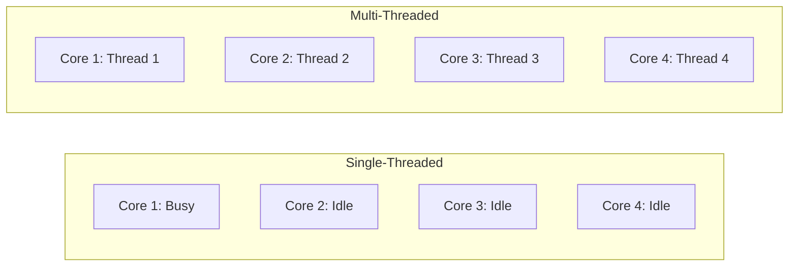
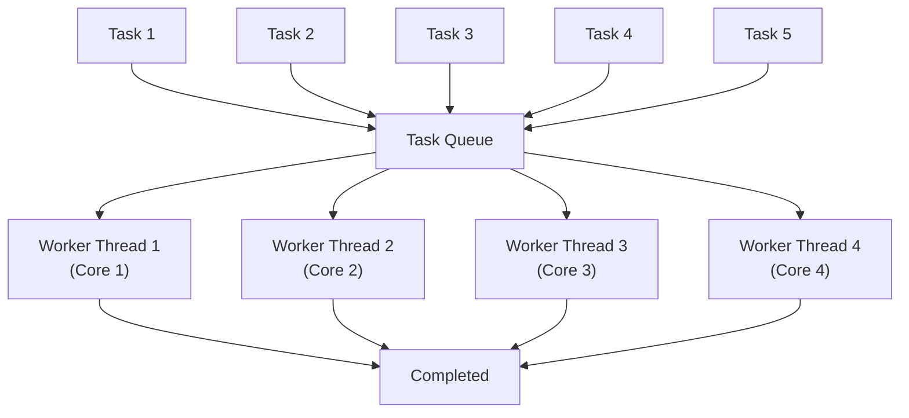

# 4.2 Multi-Threading

#os/multithreading #os/threads #concurrency #performance

## Overview

Multi-threading is the technique of running multiple threads concurrently within a single process to utilize multiple CPU cores. It is the mechanism by which modern servers extract parallelism from hardware. Without multi-threading (or its process-level equivalent), your server applications would leave most of your CPU's capabilities unused. At extreme throughput targets like 1 million requests per second, multi-threading is not optional — it is the architecture itself.

---

## Why Multi-Threading Exists

Modern CPUs have multiple cores, and each core can execute instructions independently. A single-threaded application can only run on one core at a time, leaving the remaining cores idle. Multi-threading allows an application to distribute work across all available cores, achieving true parallelism.



The key insight: **parallelism** (doing multiple things at once on multiple cores) is different from **concurrency** (managing multiple tasks on a single core via interleaving). Multi-threading enables both.

---

## Thread Creation: OS-Level vs User-Level

### OS-Level Threads (Kernel Threads)

- Managed by the operating system kernel
- The kernel scheduler decides which thread runs on which core
- True parallelism: threads can run simultaneously on different cores
- Creation involves a system call (`pthread_create`, `clone()` in Linux)
- Context switching requires kernel intervention (expensive but correct)
- Blocking I/O in one thread does NOT block other threads

### User-Level Threads (Green Threads)

- Managed by a runtime library or language VM, not the OS
- The OS sees the process as single-threaded
- The runtime scheduler switches between green threads within the process
- Lightweight: no kernel involvement, very fast switching
- **Cannot achieve true parallelism** on multi-core systems (all green threads map to one kernel thread)
- If one green thread blocks on I/O, ALL green threads block

| Aspect | Kernel Threads | Green Threads |
|---|---|---|
| **Scheduler** | OS Kernel | Runtime Library |
| **Parallelism** | True (multi-core) | No (single core) |
| **Creation Cost** | Higher (system call) | Very Low |
| **Blocking I/O** | Non-blocking to others | Blocks all threads |
| **Examples** | Java native threads, POSIX threads | Go goroutines (multiplexed onto kernel threads), Python greenlets |

---

## Thread Pools

A **thread pool** is a collection of pre-created threads that wait for work items to be assigned to them. Instead of creating a new thread for every task (expensive), you reuse existing threads.

### Why Thread Pools Matter

1. **Eliminate Creation Overhead**: Thread creation involves system calls, memory allocation, and kernel data structure updates. A thread pool amortizes this cost.
2. **Bound Concurrency**: You control exactly how many threads run simultaneously, preventing resource exhaustion.
3. **Queue Management**: Tasks that arrive when all threads are busy are queued, preventing the system from being overwhelmed.



---

## Context Switching

When the CPU switches from executing one thread to another, a **context switch** occurs. This involves:

1. **Saving State**: The current thread's CPU registers, program counter, and stack pointer are saved to its Thread Control Block (TCB).
2. **Scheduling Decision**: The kernel's scheduler selects the next thread to run.
3. **Restoring State**: The new thread's saved state is loaded into CPU registers.
4. **TLB Flush**: For inter-process switches, the Translation Lookaside Buffer may be flushed (expensive). For intra-process thread switches, the TLB is shared and preserved.

### Context Switch Cost

- A typical context switch takes **1-10 microseconds** on modern hardware.
- At 1M RPS, if each request requires a context switch, that's 1-10 seconds of CPU time per second — impossible on a single core.
- This is why event-driven architectures (like Node.js) minimize context switches for I/O-bound workloads.

---

## Thread Safety

When multiple threads access shared data concurrently, the results become unpredictable without synchronization. This is the core problem explored in [[4.3 Race Conditions]].

### Rules for Thread Safety

1. **Immutable data** is always safe to share.
2. **Thread-local data** (each thread's own stack) is always safe.
3. **Shared mutable data** requires synchronization (locks, atomic operations, or message passing).

---

## Node.js `worker_threads` Module

Node.js 10.5+ introduced the `worker_threads` module, allowing true parallel CPU-bound work:

```javascript
const { Worker, isMainThread, parentPort, workerData } = require('worker_threads');

if (isMainThread) {
  // Spawn 12 workers (one per logical core, for example)
  for (let i = 0; i < 12; i++) {
    new Worker(__filename, { workerData: i });
  }
} else {
  // Worker thread: perform CPU-intensive computation
  const result = heavyComputation(workerData);
  parentPort.postMessage(result);
}
```

### Key Points About `worker_threads`

- Each worker gets its own V8 isolate (separate memory) — no shared state, no [[4.3 Race Conditions]].
- Communication happens via `postMessage()` (structured clone, serialized) — slower than shared memory but safe.
- SharedArrayBuffer can be used for true shared memory, but requires explicit synchronization.
- Workers are useful for CPU-bound tasks (encryption, image processing, data compression).

---

## How to Spawn 12 Threads in Node.js

As demonstrated in the video, spawning threads that match your CPU's logical core count maximizes hardware utilization:

```javascript
const os = require('os');
const { Worker } = require('worker_threads');

const numCPUs = os.cpus().length; // Typically 12 on a 6-core / 12-thread machine
const workers = [];

for (let i = 0; i < numCPUs; i++) {
  workers.push(new Worker('./worker-script.js'));
}
```

This pattern — creating one thread per CPU — is the starting point for scaling any compute-bound application.

---

## Common Mistakes

- **Too many threads**: Creating 10,000 threads on a 4-core machine leads to massive context switching overhead, destroying performance. More threads ≠ more throughput.
- **Too few threads**: Using 1 thread on a 128-core machine wastes 127 cores.
- **Thread-per-request**: Creating a new thread for every HTTP request is an anti-pattern — use thread pools instead.
- **Shared mutable state without locks**: Causes [[4.3 Race Conditions]] and data corruption.

---

## Further Reading

- [[4.1 Processes and Threads]] — foundational concepts
- [[4.3 Race Conditions]] — what happens when threads share mutable data
- [[12.1 Process Clustering]] — process-level parallelism in Node.js
- [[2.1 CPU Cores and Threads]] — hardware parallelism
