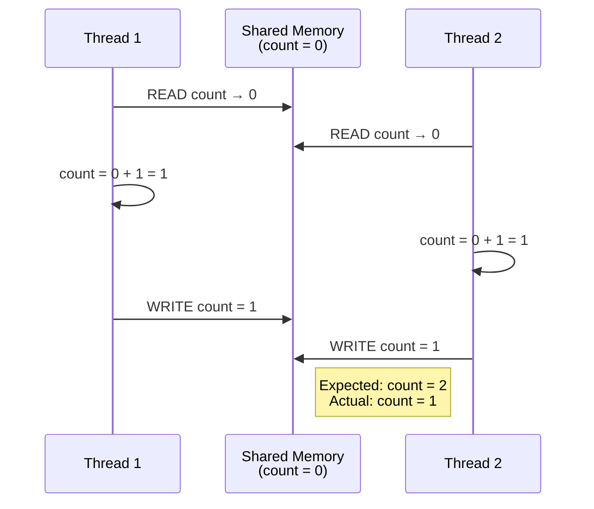
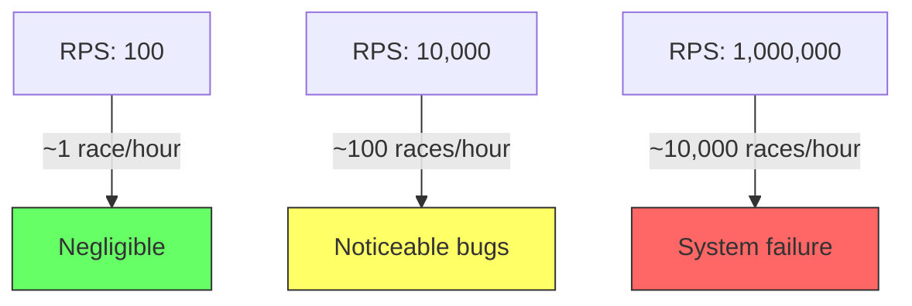

# 4.3 Race Conditions

#os/race-conditions #concurrency #bugs #debugging

## Overview

A **race condition** is one of the most insidious bugs in concurrent programming. It occurs when the correctness of a program's output depends on the timing or interleaving of uncontrollable events — specifically, the order in which threads execute. Race conditions are notoriously difficult to reproduce, debug, and fix because they are inherently non-deterministic. At 1 million requests per second, where thousands of threads and processes operate simultaneously, race conditions are not rare anomalies — they are statistical certainties.

---

## What Is a Race Condition?

A race condition arises when two or more threads access shared data concurrently, and at least one access is a write. The final result depends on which thread "wins" the race to modify the data first. The critical window between reading and writing is the vulnerability.

### Formal Definition

A race condition exists when:
1. Two or more threads access a shared variable
2. At least one thread performs a write
3. No synchronization mechanism enforces a consistent ordering

---

## Classic Example: Two Threads Incrementing a Counter

Consider a shared counter variable `count = 0`. Two threads each want to increment it by 1.



What happened? Both threads **read** the value 0 before either **wrote** back. The "increment" operation is not atomic — it consists of three steps: read, compute, write. When these steps are interleaved, the result is wrong.

### The Core Problem

The `count++` operation that looks like one instruction in your source code compiles to **multiple machine instructions**:

```
MOV EAX, [count]    ; read count into register
ADD EAX, 1          ; increment
MOV [count], EAX    ; write back
```

Between any two of these instructions, the OS scheduler can pause this thread and let another run.

---

## Why Race Conditions Are Hard to Reproduce

1. **Non-Deterministic**: The OS scheduler decides when to switch threads. This depends on system load, interrupt timing, and scheduler policy — all unpredictable.
2. **Timing Dependent**: A race condition may manifest once in 10,000 runs, or never during testing but constantly in production.
3. **Heisenbugs**: Adding debug logging or a breakpoint often changes timing enough to make the bug disappear, hence the term "Heisenbug" (observing it changes it).
4. **Load Dependent**: Race conditions become more frequent under high load (more threads, more contention) — exactly the conditions that are hard to replicate in a test environment.

---

## Types of Race Conditions

### Data Race

The most common type. Occurs when two threads access the same memory location concurrently, at least one is a write, and there is no happens-before relationship ensuring ordering.

```
Thread A: x = x + 1
Thread B: x = x * 2
// Result depends on execution order
```

### Time-of-Check to Time-of-Use (TOCTOU)

A race condition between checking a condition and acting on it. The condition may change between the check and the use.

```javascript
// TOCTOU vulnerability
if (file_exists("config.json")) {
    // Between these two lines, another thread deletes config.json
    read_file("config.json");  // CRASH: file no longer exists
}
```

TOCTOU bugs are common in file system operations, authentication checks, and configuration management.

### ABA Problem

A thread reads value A, another thread changes it to B then back to A. The first thread thinks nothing changed, but intermediate state was lost. Critical in lock-free algorithms.

---

## Probability at Scale

This is where race conditions become catastrophic. Consider a counter shared across 12 worker processes, each handling ~83,000 requests per second (total 1M RPS).

- Each request might increment a shared counter
- The probability of a race on any single increment is low (~0.001%)
- At 1M RPS, **10 race conditions happen every second**
- Over an hour: **36,000 corrupted increments**
- Over a day: **864,000 silently corrupted data points**

This is the connection to [[1.3 The Engineering Mindset at Scale]]: problems that are negligible at 100 RPS become system-breaking at 1M RPS. Probability amplifies every flaw.



---

## Mitigation Strategies

### 1. Atomic Operations
Use hardware-provided atomic instructions (e.g., `AtomicInteger` in Java, `Atomics` in Node.js worker threads) that guarantee read-modify-write is indivisible.

### 2. Mutexes and Locks
Wrap shared data access in mutual exclusion locks. See [[4.4 Semaphores and Synchronization]].

### 3. Message Passing
Eliminate shared state entirely. Send data between threads via message queues. This is the approach used by the Actor model (Erlang, Akka) and Node.js `worker_threads`.

### 4. Immutability
Make shared data immutable. If data cannot change, it cannot have races.

### 5. Thread-Local Storage
Give each thread its own copy of the data. Aggregate results later if needed.

---

## Detection Tools

| Tool | Language | Method |
|---|---|---|
| ThreadSanitizer (TSan) | C/C++/Go | Dynamic analysis at compile time |
| Helgrind | C/C++ (Valgrind) | Detects lock ordering errors |
| JavaScript | Node.js | No built-in race detector; use structured concurrency |
| Java | VisualVM, FindSecBugs | Deadlock detection |

---

## Common Mistakes

- **"It works on my machine"**: Testing with a single thread masks race conditions. Always test under concurrent load.
- **Adding delays to "fix" races**: `Thread.sleep(100)` is not a solution — it reduces probability but never eliminates it.
- **Ignoring "occasional" wrong results**: If a counter is sometimes off by 1, that IS a race condition.
- **Testing only happy paths**: Race conditions often appear in error handling and edge cases.

---

## Further Reading

- [[4.4 Semaphores and Synchronization]] — locks, mutexes, and solutions
- [[4.2 Multi-Threading]] — thread creation and management
- [[1.3 The Engineering Mindset at Scale]] — why small bugs become catastrophic
- "The Art of Multiprocessor Programming" by Herlihy & Shavit
