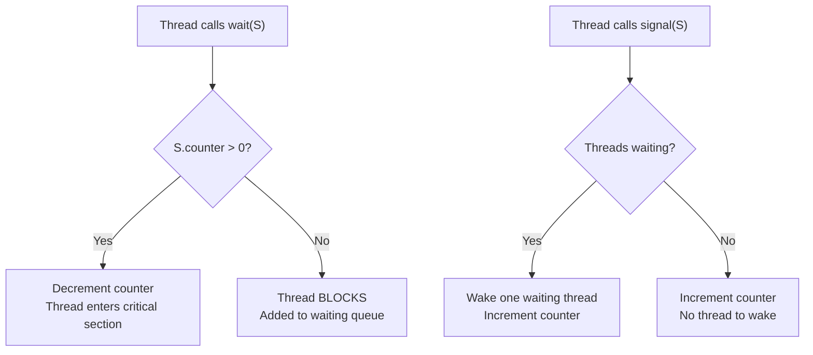
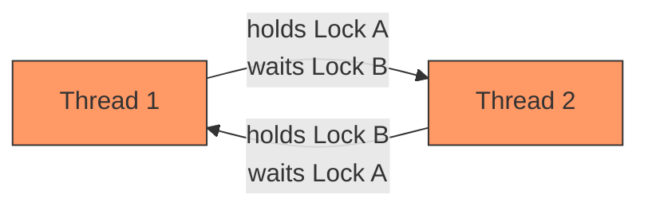
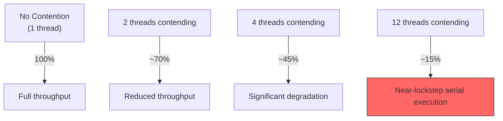

# 4.4 Semaphores and Synchronization

#os/synchronization #os/semaphores #concurrency #deadlock #performance

## Overview

Semaphores and synchronization primitives are the building blocks of safe concurrent programming. They provide mechanisms to coordinate access to shared resources, preventing the [[4.3 Race Conditions]] that plague multi-threaded systems. However, synchronization itself introduces overhead — and at extreme scale, the cost of locks can become as damaging as the races they prevent. The highest-performance systems are often those designed to **avoid locks entirely** rather than to add more of them.

---

## What Is a Semaphore?

A **semaphore** is an abstract data type maintained by the operating system that controls access to a shared resource through an internal counter. Invented by Edsger Dijkstra in 1965, the semaphore is one of the oldest and most fundamental synchronization primitives in computer science.

### Operations

A semaphore supports two atomic operations:

- **`wait(S)`** (also called `P(S)` or `acquire`): Decrements the counter. If the counter is already 0, the calling thread **blocks** until another thread increments it.
- **`signal(S)`** (also called `V(S)` or `release`): Increments the counter. If any threads are blocked waiting, one is woken up.



---

## Types of Semaphores

### Binary Semaphore (Mutex)

A binary semaphore has a counter that can only be 0 or 1:

- **1**: Resource is available (unlocked)
- **0**: Resource is in use (locked)

This is the simplest form of mutual exclusion. A mutex (mutual exclusion lock) is essentially a binary semaphore with ownership semantics — the thread that locks the mutex should be the one to unlock it.

```javascript
// Conceptual mutex usage
mutex.acquire();    // Counter: 1 → 0. If already 0, BLOCK.
// Critical section — only one thread here at a time
sharedCounter++;
mutex.release();    // Counter: 0 → 1. Wakes a waiting thread if any.
```

### Counting Semaphore

A counting semaphore has a counter that can range from 0 to N, where N is the number of available resources:

```javascript
// A pool of 5 database connections
const dbPool = new Semaphore(5);

function queryDatabase() {
  dbPool.acquire();   // Decrements from 5 toward 0
  // Use a database connection
  // When 6th thread calls acquire(), it BLOCKS until a connection is freed
  dbPool.release();   // Increments toward 5
}
```

Counting semaphores are ideal for managing bounded resource pools: database connections, file handles, network sockets, thread-safe memory buffers.

---

## Other Synchronization Primitives

| Primitive | Purpose | Key Feature |
|---|---|---|
| **Mutex** | Mutual exclusion for one resource | Ownership: only locker can unlock |
| **Semaphore** | Controlled access to N resources | No ownership: any thread can signal |
| **Read-Write Lock** | Multiple readers OR one writer | Improves concurrency for read-heavy workloads |
| **Condition Variable** | Wait for a condition to become true | Always used with a mutex |
| **Spinlock** | Busy-wait instead of blocking | Low overhead for very short critical sections |
| **Barrier** | Synchronize threads at a checkpoint | All threads must arrive before any proceed |

### Read-Write Locks in Detail

For workloads where data is read far more often than written (common in web servers serving cached content), read-write locks offer superior concurrency:

- **Read Lock**: Multiple readers can hold the lock simultaneously.
- **Write Lock**: Exclusive — only one writer, and no readers.

This means 100 threads can read concurrently (no contention), but writing still requires exclusive access.

---

## Deadlock

A **deadlock** occurs when two or more threads are blocked forever, each waiting for a resource held by another. The four necessary conditions (Coffman conditions) must ALL hold simultaneously:

1. **Mutual Exclusion**: At least one resource is held exclusively.
2. **Hold and Wait**: A thread holds a resource while waiting for another.
3. **No Preemption**: Resources cannot be forcibly taken from threads.
4. **Circular Wait**: Thread A waits for Thread B, which waits for Thread A (or a longer cycle).



### Deadlock Prevention Strategies

- **Lock Ordering**: Always acquire locks in a fixed global order (e.g., always Lock A before Lock B).
- **Lock Timeout**: If a lock cannot be acquired within a timeout, release all held locks and retry.
- **Avoid Nested Locks**: Design code so threads never hold more than one lock at a time.

---

## Lock Contention

**Lock contention** occurs when multiple threads frequently attempt to acquire the same lock simultaneously. Only one thread can hold the lock at a time, so other threads are forced to wait (block or spin).

### The Cost of Contention

At 1M RPS with 12 threads sharing a mutex:

- If the critical section takes 1μs, and all 12 threads constantly contend for the lock
- Throughput drops to approximately 1 lock acquisition per microsecond = 1M/sec theoretical max
- Add context switch overhead, cache line bouncing, and memory barriers
- **Actual throughput can drop by 50-90% under heavy contention**



---

## Designing to AVOID Locks at Scale

The most performant systems at extreme scale do not simply add better locks — they **eliminate the need for locks entirely**. This is a fundamental insight from [[1.3 The Engineering Mindset at Scale]].

### Strategies for Lock-Free Design

1. **Thread-Local Data**: Each thread works on its own data. No sharing = no locking. Results are aggregated later.

2. **Message Passing (Actor Model)**: Instead of sharing memory with locks, threads communicate by sending messages. Each actor processes one message at a time — implicit synchronization. Erlang/Elixir and Akka use this model.

3. **Immutable Data Structures**: If data never changes after creation, it is inherently thread-safe. Clojure and Haskell build entire ecosystems on this principle.

4. **Lock-Free Data Structures**: Use atomic operations (CAS — Compare-And-Swap) instead of locks. Examples: concurrent queues, lock-free hash tables.

5. **Sharding by Thread**: Partition data so each piece is "owned" by exactly one thread. Cross-thread coordination happens only at boundaries.

### The Node.js Approach

Node.js avoids locks entirely by design. The single-threaded event loop means no threads share JavaScript objects. When parallelism is needed, [[4.2 Multi-Threading]] uses `worker_threads` with isolated V8 instances and message passing. There are no locks in JavaScript land — only in native C++ addons.

---

## Real-World Example: Connection Pool at 1M RPS

A database connection pool with a semaphore protecting 100 connections would experience catastrophic contention at 1M RPS:

- 1M threads trying to acquire one of 100 connections
- Contention ratio: 10,000:1
- **Solution**: Use connection-per-thread (each worker keeps its own connections) or async I/O (non-blocking connection acquisition, which is what Node.js does).

---

## Common Mistakes

- **Locking too broadly**: Wrapping entire functions in locks instead of minimal critical sections.
- **Locking too granularly**: So many fine-grained locks that the code becomes unmaintainable and deadlock-prone.
- **Forgetting to unlock**: A missing `finally { lock.release() }` causes all other threads to deadlock.
- **Using locks for performance**: Locks are for correctness, not performance. If you need performance, redesign to avoid sharing.

---

## Further Reading

- [[4.2 Multi-Threading]] — thread creation and management
- [[4.3 Race Conditions]] — the problem that synchronization solves
- [[1.3 The Engineering Mindset at Scale]] — the philosophy of designing for extreme throughput
- "The Art of Multiprocessor Programming" by Herlihy & Shavit
