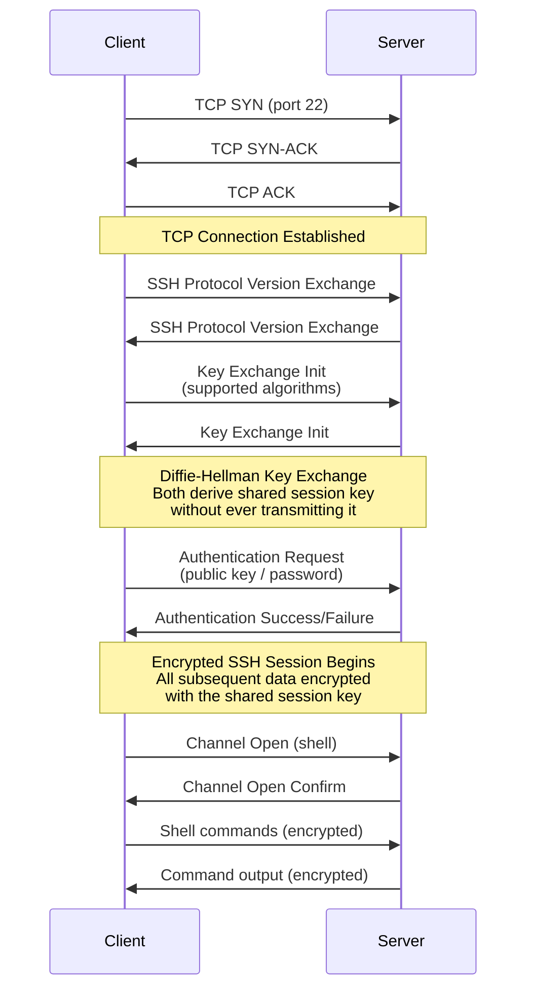
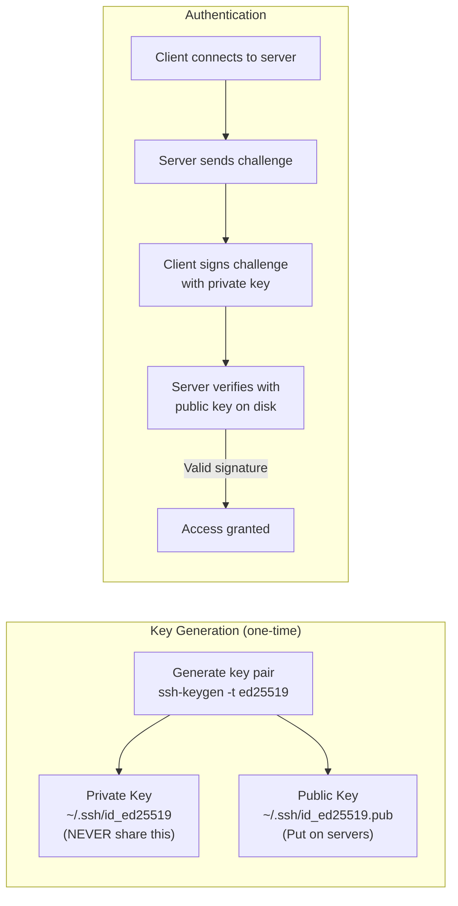

# 4.5 SSH (Secure Shell)

#os/ssh #networking/security #cloud #administration

## Overview

SSH (Secure Shell) is the cryptographic network protocol that underpins virtually all remote server administration. Whether you are deploying code to a single VPS or managing a fleet of 128-core machines across three continents, SSH is the tool you use to access, configure, and monitor your servers. Understanding how SSH works is essential for anyone operating systems at scale, because every cloud-based high-performance system requires remote access for deployment, debugging, and maintenance.

---

## What Is SSH?

SSH is a network protocol that provides encrypted, authenticated communication between two computers over an unsecured network. It replaces older, insecure protocols like Telnet (which transmitted everything, including passwords, in plaintext) and FTP.

### The SSH Protocol Suite

SSH is actually a family of protocols operating at different layers:

| Layer | Protocol | Function |
|---|---|---|
| Transport | SSH-TRANS | Server authentication, encryption, integrity |
| Authentication | SSH-AUTH | User authentication (password, key, etc.) |
| Connection | SSH-CONN | Multiplexing channels (shell, SFTP, port forwarding) |

---

## How SSH Works: The Connection Lifecycle

When you type `ssh user@server.example.com`, a sequence of cryptographic operations occurs:



### Step 1: TCP Connection

SSH operates over TCP port 22 by default. The client initiates a standard TCP three-way handshake to establish a reliable connection. See [[3.1 TCP Connections]] for the details of TCP's connection mechanism.

### Step 2: Protocol Version Exchange

Both sides exchange their supported SSH protocol versions. Modern implementations use SSH-2.0 (SSH-1 has known vulnerabilities and should never be used).

### Step 3: Key Exchange (Diffie-Hellman)

This is the cryptographic magic of SSH. The client and server perform a **Diffie-Hellman (DH) key exchange**:

- Both parties generate private-public key pairs
- They exchange public keys over the network
- Using DH mathematics, both derive the **same shared secret** without ever transmitting it
- An eavesdropper who captures all network traffic cannot compute the shared secret

The session key derived from this exchange is used for symmetric encryption (AES-256-GCM or ChaCha20-Poly1305 in modern SSH).

### Step 4: Authentication

After the encrypted channel is established, the client proves its identity:

- **Password**: Sent encrypted over the established channel (not plaintext).
- **Public Key**: The client proves ownership of a private key by signing a challenge from the server.
- **Multi-Factor**: Often combined with one-time passwords (TOTP), security keys, etc.

### Step 5: Session

Once authenticated, the server opens a shell session or a specific channel (SFTP, port forward, etc.). All data flowing in both directions is encrypted and integrity-checked.

---

## SSH Keys: Public/Private Key Pairs

SSH key-based authentication is the standard for server access. It is more secure and convenient than passwords.

### How SSH Keys Work



### Key Types (Recommended)

| Key Type | Strength | Recommendation |
|---|---|---|
| **Ed25519** | ~128-bit security | **Preferred** — fast, compact, modern |
| RSA 4096 | ~112-bit security | Widely compatible but slower |
| ECDSA P-256 | ~128-bit security | Good but concerns about NIST curves |
| DSA | Broken | Never use |

### Key Management Best Practices

1. **Use a passphrase**: Protect your private key with a passphrase so a stolen key file alone is useless.
2. **Use SSH agent**: `ssh-agent` caches your decrypted key in memory so you only type the passphrase once per session.
3. **Never commit private keys**: Add `~/.ssh/` to `.gitignore` without exception.
4. **Rotate keys regularly**: Regenerate keys annually and update authorized_keys on all servers.

---

## SSH Into a Machine in Another Country: The Network Path

When you SSH from your laptop in New York to a server in Singapore, the packets traverse:

```mermaid
graph LR
    A["Your Laptop<br/>(New York)"] -->|"Local WiFi"| B["Home Router"]
    B -->|"ISP"| C["Local ISP<br/>(Cable/Fiber)"]
    C -->|"Backbone"| D["Tier 1 Provider<br/>(e.g., NTT, Cogent)"]
    D -->|"Submarine Cable<br/>(~150ms latency)"| E["Singapore ISP"]
    E -->|"Data Center Network"| F["Cloud Provider<br/>(AWS, GCP, DigitalOcean)"]
    F -->|"VPC Network"| G["Target Server<br/>(port 22)"]
    
    style D fill:#ff9,stroke:#333
```



The total round-trip time (RTT) is typically **200-300ms** for New York → Singapore. SSH adds minimal latency overhead on top of this, but the distance itself means every command has a noticeable delay.

---

## Port Forwarding and Tunneling

SSH can forward arbitrary TCP ports through the encrypted tunnel, enabling secure access to services that would otherwise be unreachable.

### Local Port Forwarding

Makes a remote service available on your local machine:

```bash
ssh -L 5432:localhost:5432 user@db-server
# Now localhost:5432 on YOUR machine connects to port 5432 on db-server
```

### Remote Port Forwarding

Makes a local service available on the remote machine (useful for callbacks):

```bash
ssh -R 8080:localhost:3000 user@remote-server
# Now port 8080 on remote-server connects to port 3000 on YOUR machine
```

### SSH Config File (`~/.ssh/config`)

For frequent connections, configure shortcuts:

```ssh-config
Host prod-server
    HostName 192.168.1.100
    User deploy
    Port 22
    IdentityFile ~/.ssh/prod-key
    ForwardAgent yes
```

Now `ssh prod-server` connects with all settings preconfigured.

---

## Why SSH Is Essential for Cloud Server Management

At scale, every server you operate — from database instances to load balancers to worker nodes — is accessed via SSH for:

- **Deployment**: Pushing code, running migrations, restarting services.
- **Debugging**: Inspecting logs, checking process status, tracing network issues.
- **Emergency Response**: When a server is unresponsive over HTTP, SSH is often the last resort.
- **Configuration**: Editing config files, managing firewall rules, setting up monitoring agents.

---

## Security Best Practices

1. **Disable password authentication**: Use only key-based auth. Set `PasswordAuthentication no` in `sshd_config`.
2. **Disable root login**: Use `PermitRootLogin no` and SSH in as a normal user, then `sudo`.
3. **Change default port**: Move from 22 to a non-standard port to reduce automated scanning noise.
4. **Use fail2ban**: Automatically ban IPs after repeated failed login attempts.
5. **Limit access with firewalls**: Only allow SSH from known IP ranges (e.g., your office VPN).
6. **Use jump hosts / bastions**: Never expose internal servers directly. SSH through a hardened bastion server.
7. **Keep SSH software updated**: Apply security patches promptly.

---

## Common Mistakes

- **Leaving password authentication enabled**: The #1 cause of server compromise.
- **Using the same SSH key everywhere**: If one server is compromised, all are compromised.
- **Not using a bastion host**: Direct SSH to production servers from arbitrary IPs is a security risk.
- **Ignoring SSH config**: Manually typing long commands with flags instead of using `~/.ssh/config`.

---

## Further Reading

- [[4.6 Unix and Linux Terminal Commands]] — what to do once you're connected
- [[3.1 TCP Connections]] — the transport layer under SSH
- SSH, The Secure Shell: The Definitive Guide (O'Reilly)
