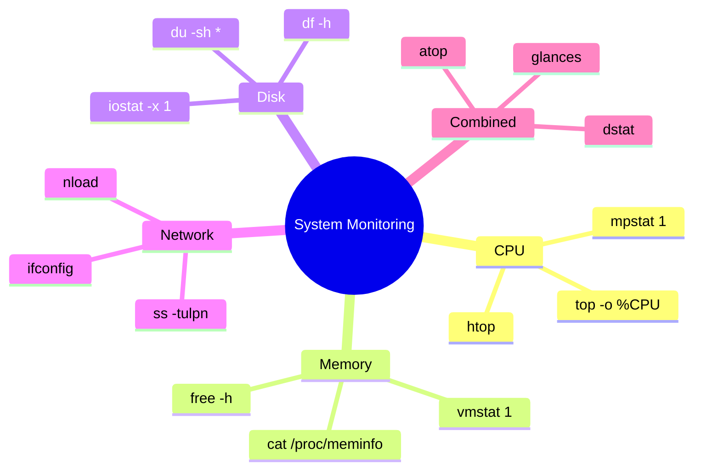

# 4.6 Unix and Linux Terminal Commands

#os/linux #terminal #shell #cloud-administration #productivity

## Overview

The command line is the primary interface for interacting with cloud servers, and fluency in Unix/Linux commands is a non-negotiable skill for anyone building high-throughput systems. When you [[4.5 SSH (Secure Shell)]] into a remote server, there is no GUI — only the terminal. Every deployment, every debugging session, every performance investigation begins and ends with terminal commands. This note covers the essential commands organized by category, with explanations of why each matters at scale.

---

## Basic Navigation

These are the commands you use to move around and organize the filesystem.

| Command | Purpose | Example |
|---|---|---|
| `pwd` | Print working directory | `pwd` → `/home/deploy/app` |
| `ls` | List directory contents | `ls -la` (long format, hidden files) |
| `cd` | Change directory | `cd /var/log` |
| `mkdir` | Create directory | `mkdir -p logs/2024` (`-p` creates parents) |
| `rm` | Remove files/directories | `rm -rf old-deploy/` (**DANGER**: `-rf` removes everything) |
| `cp` | Copy files | `cp config.json config.backup.json` |
| `mv` | Move/rename files | `mv app.js.bak app.js` |

### Why This Matters

When you SSH into a server to investigate a performance issue, you need to navigate quickly. The `-la` flag on `ls` is invaluable — it shows file permissions (read/write/execute for owner/group/others), file sizes, and modification timestamps, all of which help diagnose issues like permission denied errors or stale files.

---

## File Operations

| Command | Purpose | Key Flags |
|---|---|---|
| `cat` | Display entire file | `cat /etc/os-release` |
| `head` | Show first N lines | `head -100 error.log` |
| `tail` | Show last N lines | `tail -f app.log` (`-f` follows in real-time) |
| `touch` | Create empty file / update timestamp | `touch healthcheck` |
| `less` | Paginated file viewer | `less huge-logfile.log` |
| `nano` | Simple terminal editor | `nano config.json` |
| `vim` | Advanced terminal editor | `vim server.js` |
| `chmod` | Change file permissions | `chmod +x deploy.sh` |
| `chown` | Change file ownership | `chown deploy:deploy app/` |
| `grep` | Search for patterns in text | `grep "ERROR" app.log` |
| `wc` | Count lines/words/characters | `wc -l access.log` |
| `find` | Find files by name/pattern | `find / -name "config.json" 2>/dev/null` |

### The Power of `tail -f`

`tail -f` is perhaps the most-used debugging command. It streams log output in real-time:

```bash
tail -f /var/log/app/error.log | grep "timeout"
```

This lets you watch for specific errors as they occur — essential for diagnosing intermittent issues at 1M RPS.

### Piping and Redirection

Unix's greatest strength is composability — combining small, single-purpose tools:

```bash
# Count errors in the last hour
grep "ERROR" app.log | wc -l

# Find the 10 most common error types
grep "ERROR" app.log | awk '{print $5}' | sort | uniq -c | sort -rn | head -10

# Save benchmark results to a file
autocannon -c 10 -d 10 http://localhost:3000 > results.txt

# Append server load to a monitoring log
echo "$(date): $(mpstat 1 1 | tail -1)" >> load-monitor.log
```

- `|` (pipe): Sends output of one command as input to the next.
- `>` (redirect): Overwrites file with command output.
- `>>` (append): Appends command output to file.
- `2>`: Redirects stderr (errors).

---

## Process Management

At scale, you must monitor and manage running processes constantly.

| Command | Purpose | Example |
|---|---|---|
| `ps` | List running processes | `ps aux` (all users, detailed) |
| `top` | Interactive process viewer | `top -o %CPU` (sort by CPU) |
| `htop` | Enhanced interactive viewer | `htop` (color-coded, mouse support) |
| `kill` | Send signal to process | `kill -9 1234` (SIGKILL, force terminate) |
| `pkill` | Kill by name/pattern | `pkill -f "node server.js"` |
| `pgrep` | Find process IDs by name | `pgrep node` |
| `lsof` | List open files/ports | `lsof -i :3000` (what's using port 3000?) |
| `systemctl` | Manage systemd services | `systemctl restart myapp` |

### Understanding Process Signals

| Signal | Number | Meaning |
|---|---|---|
| `SIGHUP` | 1 | Reload configuration |
| `SIGINT` | 2 | Interrupt (Ctrl+C) |
| `SIGTERM` | 15 | Graceful termination |
| `SIGKILL` | 9 | Force kill (cannot be caught) |

Always try `SIGTERM` before `SIGKILL`. `SIGKILL` gives the process no chance to clean up — open files won't be flushed, temporary files won't be deleted, database connections won't be closed gracefully.

---

## System Monitoring

These commands are essential for [[15.1 Identifying Bottlenecks]] and understanding why your server is slow.

### CPU Monitoring

```bash
# CPU utilization per core, updated every 1 second
mpstat 1

# CPU utilization summary
mpstat -P ALL 1

# Interactive CPU + process viewer
htop
```

### Memory Monitoring

```bash
# Memory usage summary
free -h

# Detailed memory + swap + IO
vmstat 1
```

### Disk I/O Monitoring

```bash
# Disk read/write statistics per device
iostat -x 1

# Which processes are doing the most I/O
iotop
```

### Network Monitoring

```bash
# Active network connections
ss -tulpn

# Network interface statistics
ifconfig
ip addr show

# Network bandwidth in real-time
nload
```



---

## Network Tools

| Command | Purpose | Example |
|---|---|---|
| `ping` | Test network reachability | `ping -c 4 google.com` |
| `curl` | HTTP client | `curl -I https://api.example.com/health` |
| `wget` | File download | `wget https://example.com/data.csv` |
| `nc` (netcat) | Network Swiss army knife | `nc -lvnp 8080` (listen on 8080) |
| `dig` | DNS lookup | `dig api.example.com` |
| `traceroute` | Trace network path | `traceroute api.example.com` |
| `ssh` | Secure remote access | `ssh user@server` (see [[4.5 SSH (Secure Shell)]]) |

### `curl` Is Your API Testing Tool

```bash
# Basic GET request
curl http://localhost:3000/api/health

# POST with JSON body
curl -X POST -H "Content-Type: application/json" \
  -d '{"name":"test"}' http://localhost:3000/api/users

# Measure timing of each phase
curl -w "DNS: %{time_namelookup}s\nConnect: %{time_connect}s\nTTFB: %{time_starttransfer}s\nTotal: %{time_total}s\n" \
  -o /dev/null -s http://localhost:3000/api/data
```

---

## Package Management

### APT (Debian/Ubuntu)

```bash
apt update              # Refresh package list
apt install nginx       # Install package
apt upgrade             # Upgrade all packages
apt remove package      # Remove package
```

### YUM/DNF (RHEL/CentOS)

```bash
yum install nginx       # Install
yum update              # Upgrade all
```

### NPM (Node.js)

```bash
npm install -g autocannon   # Install globally
npm init -y                  # Initialize project
npm run start                # Run script from package.json
```

---

## Why Terminal Mastery Is Essential for Cloud Servers

1. **No GUI**: Cloud servers (EC2, DigitalOcean Droplets, GCP VMs) provide terminal access by default. Some offer a web console, but it is a terminal emulator — not a desktop.

2. **Scripting and Automation**: Everything you do in the terminal can be scripted. Deployment scripts, monitoring scripts, and diagnostic commands all live in shell scripts.

3. **Speed**: An experienced terminal user can diagnose and fix issues faster than anyone clicking through a GUI.

4. **Remote Troubleshooting**: When a server in Singapore has issues at 3 AM your time, you SSH in, run `htop`, `tail -f` the logs, diagnose, and fix — all from your laptop via terminal.

5. **Pipeline Integration**: CI/CD pipelines, Dockerfiles, and Kubernetes manifests all use terminal commands. You cannot operate modern infrastructure without terminal fluency.

---

## Custom Aliases for Monitoring

Productivity tip: create shell aliases for frequently used monitoring commands:

```bash
# Add to ~/.bashrc or ~/.zshrc
alias cpu='mpstat 1'
alias mem='free -h'
alias disk='iostat -x 1'
alias net='ss -tulpn'
alias logs='tail -f /var/log/app/error.log'
alias ports='lsof -i -P -n | grep LISTEN'
```

---

## Common Mistakes

- **Using `rm -rf` without checking**: Always `ls` first. Consider using `rm -ri` (interactive) for critical operations.
- **Not using `tmux` or `screen`**: SSH sessions disconnect. `tmux` keeps your terminal session alive even if you disconnect.
- **Ignoring man pages**: Every command has a manual. Type `man <command>` or `<command> --help`.
- **Not backing up before editing config files**: `cp config.json config.json.bak` takes one second and can save hours.

---

## Further Reading

- [[4.5 SSH (Secure Shell)]] — how to connect to remote servers
- [[15.1 Identifying Bottlenecks]] — using these commands to find performance issues
- [[5.6 Resource Monitoring]] — monitoring during benchmarking
- "The Linux Command Line" by William Shotts (free online)
