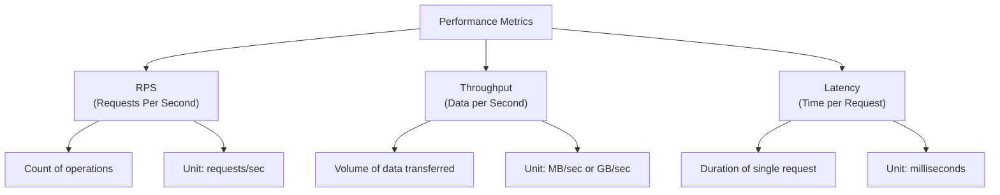
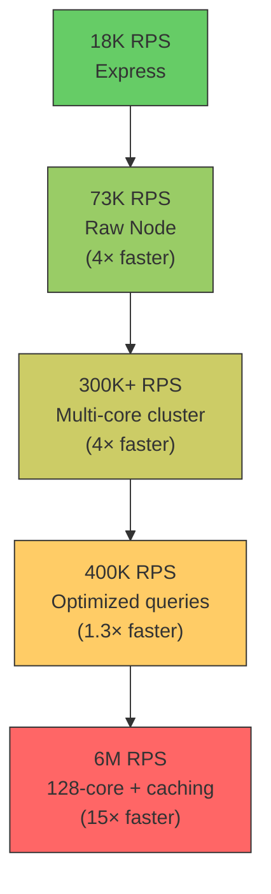

# 5.1 Requests Per Second (RPS)

#benchmarking/rps #performance/metrics #fundamentals #scalability

## Overview

Requests Per Second (RPS) is the primary metric by which API and web server capacity is measured. It quantifies the number of complete HTTP request-response cycles a server can handle in one second. Understanding RPS — how it is defined, measured, and affected by various system components — is foundational to everything discussed in this vault. The entire goal of [[1.3 The Engineering Mindset at Scale]] is to push RPS from thousands to millions.

---

## Definition

**RPS** = Total number of completed request-response cycles ÷ Elapsed time in seconds

A "completed" cycle means the server received the request, processed it, and the client received the full response. If the client sends a request but never receives a response (timeout, error), it does NOT count toward RPS.

### Measurement Methodology

```
1. Start a precise timer
2. Send N HTTP requests to the target server
3. Count how many complete responses are received
4. Stop the timer when all N requests complete (or after fixed duration)
5. RPS = N / elapsed_time_seconds
```

This sounds simple, but achieving accurate measurement requires careful methodology (covered in [[5.3 Benchmarking Methodology]]).

---

## RPS vs. Throughput vs. Latency

These three metrics are related but measure different things:



| Metric | Measures | Unit | What It Tells You |
|---|---|---|---|
| **RPS** | How many requests the server handles | req/s | Server capacity |
| **Throughput** | How much data flows through the system | MB/s | Bandwidth utilization |
| **Latency** | How long a single request takes to complete | ms | User-perceived speed |

### The Fundamental Relationship

Using **Little's Law** from queueing theory:

> **RPS = Concurrency ÷ Average Latency**

If you have 10 concurrent requests and average latency is 10ms (0.01s):

$$\text{RPS} = \frac{10}{0.01} = 1{,}000 \text{ RPS}$$

This means to double your RPS, you can either:
1. **Double concurrency** (more connections/workers)
2. **Halve latency** (faster processing)
3. **Both**

---

## Why RPS Is the Primary Metric for API Capacity

1. **Directly measures what matters**: How many users can you serve? RPS translates directly to concurrent user capacity.
2. **Comparable across implementations**: RPS provides a common yardstick — you can compare Node.js vs Go vs Java by running the same benchmark.
3. **Maps to business requirements**: "We need to handle 10,000 concurrent users" translates to "we need X RPS."
4. **Reveals the ceiling**: When RPS plateaus, you've found your bottleneck.

---

## Factors Affecting RPS

RPS is determined by the slowest component in the request processing pipeline:

```mermaid
flowchart LR
    A["Client sends<br/>HTTP request"] --> B["TCP Connection<br/>Establishment"]
    B --> C["TLS Handshake<br/>(if HTTPS)"]
    C --> D["Server receives<br/>and parses request"]
    D --> E["Business Logic<br/>(CPU-bound)"]
    E --> F["Database Query<br/>(I/O-bound)"]
    F --> G["Serialization<br/>(JSON response)"]
    G --> H["Server sends<br/>response"]
    H --> I["Client receives<br/>response"]
    
    style E fill:#f96,stroke:#333
    style F fill:#f96,stroke:#333
```



| Factor | Impact | Example |
|---|---|---|
| **CPU Speed** | Determines computation rate | Faster CPU → higher RPS for compute-heavy endpoints |
| **CPU Cores** | Determines parallelism | 128 cores can handle 128× more concurrent work than 1 |
| **Memory** | Affects caching, buffer sizes | Insufficient RAM → swapping → catastrophic RPS drop |
| **Network Bandwidth** | Limits data transfer rate | 10 Gbps network saturates before CPU |
| **Disk I/O** | Limits database/filesystem operations | Slow SSD → slow queries → low RPS |
| **Code Complexity** | Algorithm efficiency | O(n) vs O(1) query: 1000× RPS difference |
| **Framework Overhead** | Middleware, routing, parsing | Express vs raw Node: 4× RPS difference |
| **Connection Management** | Keep-alive, connection pooling | Reusing connections saves TCP handshake time |
| **GC Pauses** | Garbage collection in Node.js/V8 | Long GC pauses cause RPS drops |

---

## Real-World RPS Numbers from the Video

These benchmarks demonstrate the dramatic impact of architecture and algorithms on RPS:

| Configuration | RPS Achieved | Notes |
|---|---|---|
| Express.js (simple endpoint) | ~18,000 | Framework overhead |
| Raw Node.js (http module) | ~73,000 | No framework overhead |
| Node.js cluster (multi-core) | ~300,000+ | Utilizing all CPU cores |
| 128-core cluster + optimized queries | ~6,000,000 | Full optimization: clustering + caching + efficient algorithms |
| ORDER BY RANDOM() endpoint | Crashed | [[6.2 O(n) Linear Time]] query destroyed performance |
| MAX(ID) + random offset | ~200,000 | Better but still suboptimal |
| ID lookup (indexed) | ~400,000 | Efficient [[6.3 O(log n) Logarithmic Time]] query |



---

## RPS Targets at Scale

| Application Type | Typical RPS Target |
|---|---|
| Personal blog | 10-100 RPS |
| Small SaaS | 1,000-10,000 RPS |
| Mid-size API | 10,000-100,000 RPS |
| Large-scale service | 100,000-1,000,000 RPS |
| Hyperscale (Google, Netflix) | 1,000,000+ RPS per server |

The jump from 100K to 1M RPS is not just "10× more" — it requires fundamentally different approaches: [[12.1 Process Clustering]], [[9.4 Redis]] caching, [[11.5 Caching with Redis]], connection pooling, and lock-free data structures.

---

## Common Mistakes

- **Measuring RPS without warm-up**: The first few seconds are always slower due to JIT compilation and connection establishment.
- **Conflating RPS with concurrent users**: 1M RPS ≠ 1M concurrent users. A user making one request every 10 seconds at 1M RPS means 10M users.
- **Optimizing RPS at the expense of latency**: You can inflate RPS by sending tiny, fast requests that don't represent real workloads.
- **Ignoring error rates**: High RPS with 5% error rate is worse than lower RPS with 0% error rate.

---

## Further Reading

- [[5.2 Autocannon]] — the tool used to measure RPS
- [[5.4 Connections, Pipelining, and Workers]] — tuning parameters that affect RPS
- [[5.5 Percentiles in Benchmarking]] — understanding RPS variability
- [[6.6 Why Algorithms Matter at Scale]] — how algorithm choice impacts RPS
