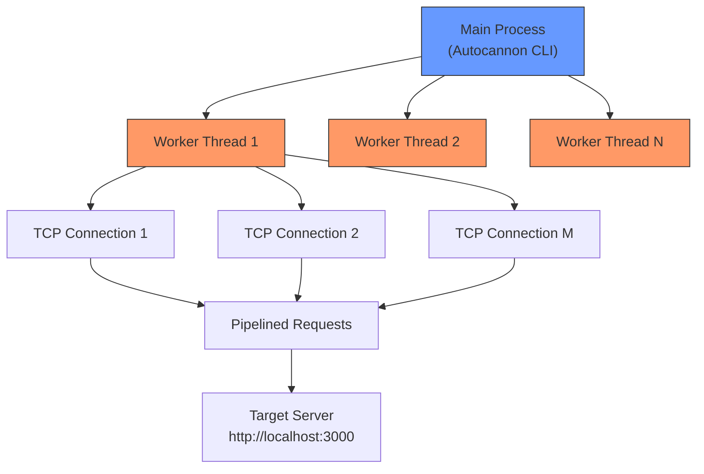
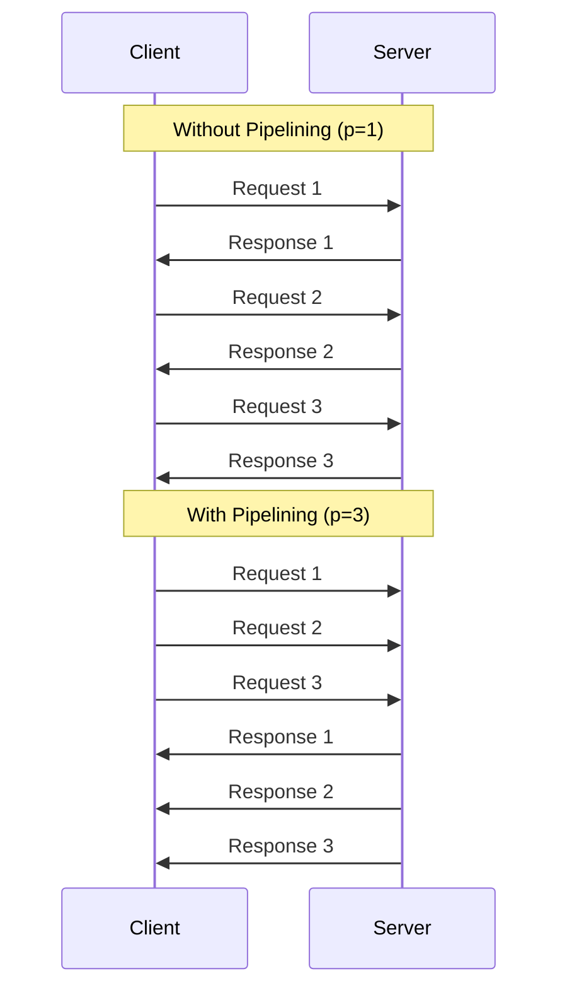

# 5.2 Autocannon

#benchmarking/autocannon #tools/performance #nodejs #testing

## Overview

Autocannon is the HTTP benchmarking tool used throughout the "Handling 1 Million Requests Per Second" series. It is a Node.js-based, highly configurable load testing tool that can generate enormous HTTP traffic from a single machine. Understanding Autocannon's options, output format, and best practices is essential for measuring and comparing [[5.1 Requests Per Second (RPS)]] accurately.

---

## What Is Autocannon?

Autocannon is an open-source HTTP/1.1 benchmarking tool written in Node.js by Matteo Collina (a core Node.js contributor). It is designed for:

- **Maximum throughput**: Uses HTTP pipelining and multiple workers to saturate servers.
- **Statistical rigor**: Runs multiple samples and reports percentiles.
- **Node.js native**: Written in the same ecosystem as the servers being benchmarked, reducing external variability.

### Installation

```bash
npm install -g autocannon
```

### Quick Start

```bash
autocannon -c 10 -d 10 http://localhost:3000/api/health
```

This sends traffic with 10 concurrent connections for 10 seconds.

---

## Key Options and Flags

| Flag | Full Name | Default | Description |
|---|---|---|---|
| `-c` | `--connections` | 10 | Number of TCP connections to open |
| `-d` | `--duration` | 10 | Duration of the test in seconds |
| `-p` | `--pipelining` | 1 | Number of pipelined requests per connection |
| `-w` | `--workers` | `# of CPU cores` | Number of worker threads for generating traffic |
| `-a` | `--amount` | — | Total number of requests (alternative to `-d`) |
| `-m` | `--method` | GET | HTTP method (GET, POST, PUT, DELETE) |
| `-b` | `--body` | — | Request body (for POST/PUT) |
| `-H` | `--header` | — | Custom headers (`-H "Content-Type: application/json"`) |
| `-i` | `--idReplacement` | — | Replace `[{{id}}]` in URL with random numbers |
| `-S` | `--statusCodes` | — | Print status code distribution |

---

## How Autocannon Works Internally

Autocannon generates traffic using a multi-threaded architecture:



Each worker thread manages a subset of TCP connections. Each connection sends pipelined requests (multiple requests before waiting for responses). This architecture allows Autocannon to generate traffic limited only by the client machine's CPU and network capacity, not by single-thread bottlenecks.

---

## Reading Autocannon Output

A typical Autocannon run produces:

```
Running 10s test @ http://localhost:3000/api
10 connections

┌─────────┬────────┬────────┬────────┬────────┬──────────┬───────────┬─────────────┐
│ Stat    │ 1%     │ 2.5%   │ 50%    │ 97.5%  │ Avg      │ Stdev     │ Max         │
├─────────┼────────┼────────┼────────┼────────┼──────────┼───────────┼─────────────┤
│ Latency │ 0.2 ms │ 0.3 ms │ 0.5 ms │ 1.2 ms │ 0.6 ms   │ 0.4 ms    │ 12.5 ms     │
└─────────┴────────┴────────┴────────┴────────┴──────────┴───────────┴─────────────┘
┌──────────┬────────┬─────────────┬──────────┬─────────────┬───────────────┬──────────┐
│ Stat     │ 1%     │ 2.5%        │ 50%      │ 97.5%       │ Avg           │ Stdev    │
├──────────┼────────┼─────────────┼──────────┼─────────────┼───────────────┼──────────┤
│ Req/Sec  │ 16784  │ 16784       │ 18000   │ 18000       │ 17856         │ 342      │
└──────────┴────────┴─────────────┴──────────┴─────────────┴───────────────┴──────────┘
Bytes/Sec: 2.84 MB

Req/Bytes counts sampled once per second.
20 requests in 10.01s, 17.85 k req/sec avg

0 2xx responses, 0 3xx responses, 0 4xx responses, 0 5xx responses
0 total responses

Errors: 0 (timeout), 0 (connection reset)
```

### Key Metrics Explained

| Metric | Meaning |
|---|---|
| **Latency (Avg)** | Average time from request sent to response received |
| **Latency (50%/97.5%)** | [[5.5 Percentiles in Benchmarking]] — half the requests are faster than 50% value |
| **Req/Sec (Avg)** | Average RPS across all 1-second samples |
| **Req/Sec (Stdev)** | Standard deviation — how much RPS varies between samples |
| **Bytes/Sec** | Throughput — data volume transferred per second |
| **Errors** | Timeouts and connection resets — critical for validity |

---

## Why Autocannon Was Chosen Over Alternatives

| Tool | Language | Pipelining | Multi-thread | Why Not Chosen |
|---|---|---|---|---|
| **Autocannon** | Node.js | ✅ | ✅ | **Chosen** — same ecosystem, excellent stats |
| **wrk** | C | ✅ | ❌ (multi-thread via Lua) | Written in C, different ecosystem |
| **wrk2** | C | ✅ | ❌ | Adds precise latency measurement, but C-based |
| **ab (Apache Bench)** | C | ❌ | ❌ | Single-threaded, no pipelining, limited |
| **hey** | Go | ❌ | ✅ | No pipelining support |
| **k6** | Go | ✅ | ✅ | More complex, designed for load testing not pure benchmarking |

Autocannon's HTTP pipelining support is the killer feature. Pipelining allows multiple requests to be sent on a single TCP connection without waiting for individual responses, dramatically increasing throughput — see [[5.4 Connections, Pipelining, and Workers]].

---

## Example Commands from the Video

### Basic Benchmark

```bash
# 10 connections, 10 seconds duration
autocannon -c 10 -d 10 http://localhost:3000/api
```

### Maximum Throughput Test

```bash
# 100 connections, 10 pipelined requests each, 4 workers, 30 seconds
autocannon -c 100 -p 10 -w 4 -d 30 http://localhost:3000/api
```

### POST Request with Body

```bash
# POST JSON data to an endpoint
autocannon -c 10 -d 10 -m POST -H "Content-Type: application/json" \
  -b '{"username":"test","password":"test"}' \
  http://localhost:3000/api/login
```

### Random ID Substitution

```bash
# Replace {{id}} with random numbers (useful for testing per-user endpoints)
autocannon -c 10 -d 10 http://localhost:3000/api/users/{{id}}
```

### Complete Benchmark Script (20 Samples)

```bash
# Run 20 iterations of 10-second tests for statistical significance
for i in {1..20}; do
  autocannon -c 10 -d 10 http://localhost:3000/api | grep "Req/Sec"
done
```

---

## Autocannon and HTTP Pipelining

HTTP pipelining is a feature of HTTP/1.1 where multiple requests can be sent on a single connection without waiting for each response:



Pipelining reduces the impact of network latency because requests are already "in flight" when previous responses arrive. This is especially important for [[3.1 TCP Connections]] where handshake overhead is amortized.

---

## Common Mistakes

- **Benchmarking localhost**: Always benchmark over the network loopback (still localhost) but beware that loopback has near-zero latency, which is unrealistic.
- **Running client and server on the same machine**: They compete for CPU, disk, and network. For accurate results, use separate machines.
- **Not specifying -w**: Autocannon defaults to your CPU core count, which may overwhelm a single-core server.
- **Ignoring error rates**: If you see timeouts or connection resets, your RPS numbers are invalid.
- **Single run**: One run is not statistically valid. Run 20 iterations per [[5.3 Benchmarking Methodology]].

---

## Further Reading

- [[5.1 Requests Per Second (RPS)]] — the metric Autocannon measures
- [[5.4 Connections, Pipelining, and Workers]] — tuning the `-c`, `-p`, `-w` flags
- [[5.3 Benchmarking Methodology]] — proper benchmarking technique
- [Autocannon GitHub Repository](https://github.com/mcollina/autocannon)
