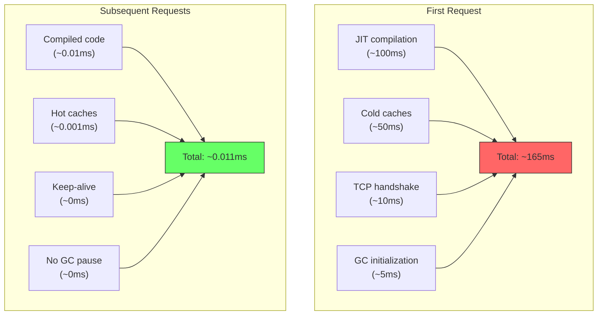
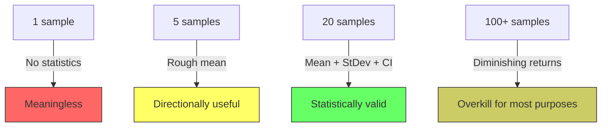
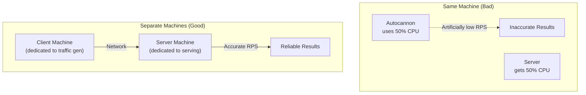

# 5.3 Benchmarking Methodology

#benchmarking/methodology #performance/testing #statistics #best-practices

## Overview

Benchmarking — the practice of measuring system performance under controlled conditions — is deceptively difficult. A naive benchmark produces numbers that are unreliable, unreproducible, and misleading. Professional benchmarking requires understanding sources of variability, controlling for confounding factors, and applying statistical rigor. This note covers the methodology used in the "Handling 1M RPS" video series and the principles behind why each step matters.

---

## Why Benchmarking Is Hard

A benchmark measures performance at a specific moment under specific conditions. The real world is noisy:

1. **CPU Frequency Scaling**: Modern CPUs adjust clock speed based on temperature and load (Turbo Boost, Speed Step). The first run may run at base frequency; subsequent runs may boost higher.
2. **JIT Compilation**: JavaScript V8 engine compiles code lazily. The first requests trigger compilation, which is slow. Later requests use optimized machine code.
3. **Garbage Collection**: V8's garbage collector runs periodically, pausing execution. A GC pause during your 10-second benchmark can dramatically affect results.
4. **OS Page Caches**: The first file read goes to disk; subsequent reads come from the OS page cache (RAM). This difference is orders of magnitude.
5. **TCP Connection Establishment**: First requests incur TCP handshake overhead; with keep-alive connections, this cost is amortized.
6. **Network Variability**: Even on localhost, OS scheduling, interrupt handling, and kernel buffer management introduce jitter.
7. **Thermal Throttling**: Sustained load causes CPUs to heat up and throttle down, reducing performance over time.

---

## The Warm-Up Phase

The warm-up phase is a preliminary run (or the first portion of a benchmark) that is discarded from results.

### Why the First Run Is Always Slower

### Best Practice

- **Discard the first run** entirely, or run a 5-10 second warm-up before collecting data.
- Autocannon's 20-sample mode naturally handles this: the first few samples are warm-up, and the statistical analysis averages across all samples.

---

## Multiple Samples: Why You Run 20 Iterations

A single benchmark run is a single data point. It tells you nothing about variability.

### The Problem with Single Samples

Imagine two endpoints benchmarked once each:
- Endpoint A: 18,000 RPS
- Endpoint B: 16,000 RPS

You might conclude A is 12.5% faster. But what if:
- Endpoint A ranges from 16,000 to 18,000 RPS (high variance)
- Endpoint B ranges from 15,900 to 16,100 RPS (low variance)

Endpoint B is actually more **predictable and reliable**, even though its single-sample number is lower.

### Why 20 Iterations

Running 20 samples provides:
- **Mean**: Central tendency of RPS
- **Standard deviation**: How much RPS varies
- **Confidence interval**: Statistical range within which true performance likely falls
- **Outlier detection**: Spot anomalies (a GC pause that tanked one sample)

---

## Controlling Variables

For a benchmark to be meaningful, you must control as many variables as possible:

### Same Machine

- Run both versions of the code on the exact same hardware.
- Don't compare "my laptop" vs "cloud server" — different CPU, RAM, disk, network.

### Same Network

- If comparing server A and server B, the benchmarking client must have the same network path to both.
- Test on localhost first, then test over the actual network.

### Same Data

- Don't benchmark with 100 rows in the database, then deploy to production with 10 million rows.
- Use production-like data volumes.

### Same Configuration

- Same Node.js version, same flags, same environment variables.
- Disable CPU frequency scaling for reproducibility: `cpupower frequency-set -g performance` (Linux).

### Same Load

- Use the same [[5.2 Autocannon]] parameters: `-c`, `-d`, `-p`, `-w`.
- Don't compare a benchmark with `-c 10` to one with `-c 100`.

---

## Server vs. Client Separation

Running the benchmarking tool and the server on the same machine introduces confounding variables:

**Why separation matters**:
1. **CPU contention**: Autocannon uses CPU for HTTP parsing, timing, and statistics. The server also needs CPU for request processing. On the same machine, they compete.
2. **Memory contention**: Both processes allocate memory, potentially triggering GC or swapping.
3. **Network loopback**: `localhost` bypasses the network stack partially, giving unrealistically low latency.
4. **Saturation detection**: On the same machine, you can't tell whether the server is saturated or the client is just slow.

### Ideal Setup

- **Client machine**: Dedicated to running Autocannon, nothing else.
- **Server machine**: Running only the application being tested.
- **Network**: Same data center (minimal latency) but separate machines.
- **Same hardware specs**: So you can isolate the software variable.

---

## Statistical Significance: Why Averages Can Lie

The average (mean) is the most commonly reported benchmark statistic, but it can be deeply misleading.

### The Average Trap

Consider two servers over 10 samples:

| Server | Sample RPS Values | Average |
|---|---|---|
| A | 17000, 17000, 17000, 17000, 17000, 17000, 17000, 17000, 17000, 17000 | 17,000 |
| B | 18000, 18000, 18000, 18000, 18000, 18000, 18000, 18000, 18000, 2000 | 16,200 |

Server A appears faster (17K vs 16.2K), but Server B consistently delivers 18K RPS — except for one catastrophic sample (perhaps a GC pause). If you care about **worst-case user experience**, Server A is better. If you care about **typical performance**, Server B is better.

This is why [[5.5 Percentiles in Benchmarking]] matter more than averages.

---

## Common Benchmarking Mistakes

| Mistake | Why It's Wrong | Fix |
|---|---|---|
| Running only 1 iteration | No statistical validity | Run 20+ iterations |
| No warm-up | First run is slow (JIT, cold cache) | Discard first 1-2 runs |
| Client and server on same machine | CPU contention | Use separate machines |
| Changing code between runs | Can't compare | Keep all variables constant |
| Reporting only average | Masks variability | Report percentiles and standard deviation |
| Not checking error rates | High RPS with errors = useless | Ensure 0% error rate |
| Running benchmarks while other processes are active | Noise | Close unnecessary applications |
| Trusting results without reproduction | One-off anomalies | Verify with multiple runs on different days |

---

## Further Reading

- [[5.2 Autocannon]] — the benchmarking tool
- [[5.5 Percentiles in Benchmarking]] — statistics for interpreting results
- [[5.6 Resource Monitoring]] — watching the system during benchmarks
- [[5.4 Connections, Pipelining, and Workers]] — tuning benchmark parameters
