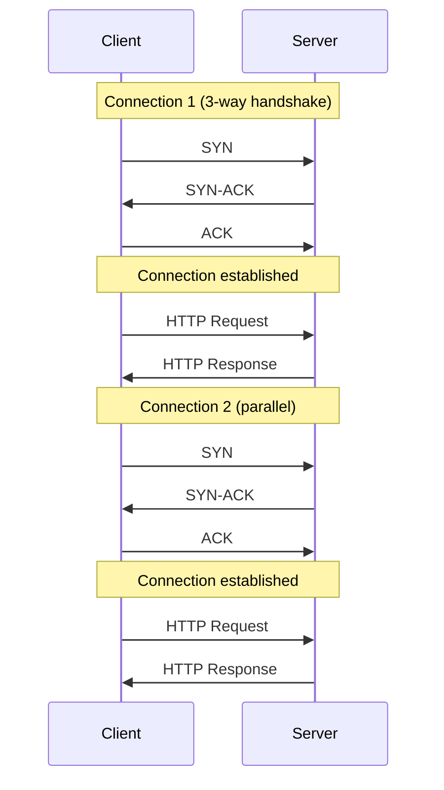
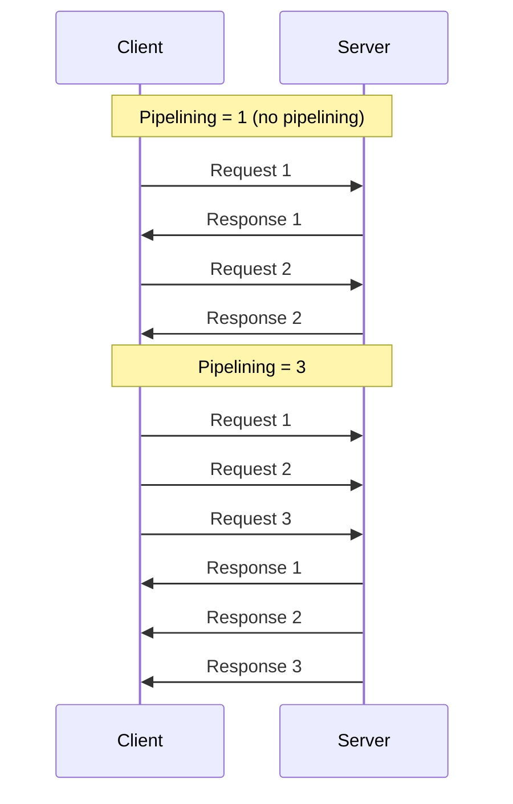
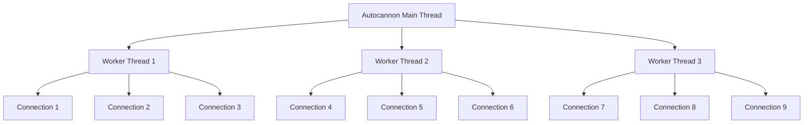
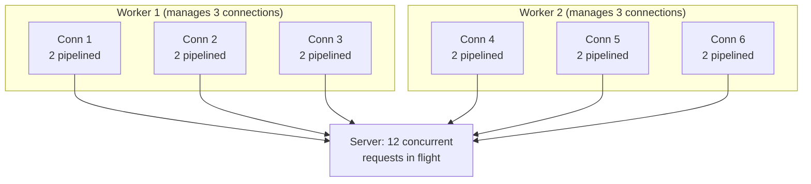

# 5.4 Connections, Pipelining, and Workers

#benchmarking/parameters #performance/tuning #networking/tcp #autocannon

## Overview

The three primary tuning parameters in any HTTP benchmark — connections, pipelining, and workers — determine how much traffic the client can generate and how the server is stressed. Understanding these parameters deeply is essential because the values you choose directly affect measured RPS and whether the benchmark represents realistic load. These are the `-c`, `-p`, and `-w` flags in [[5.2 Autocannon]].

---

## Connections (`-c`)

### Definition

Connections (`-c`) specifies the number of **TCP connections** the benchmarking client opens to the server. Each connection is a persistent TCP connection that can carry multiple requests (see pipelining).

### How It Works

### Why More Connections Increase Throughput

More connections mean:
1. **More parallelism**: The server can process requests from different connections simultaneously.
2. **Reduced serial latency**: If one connection is waiting for a slow response, other connections can still send requests.
3. **Better TCP utilization**: TCP's congestion control operates per-connection. More connections = more aggregate bandwidth.

### The Connection Cost

Each TCP connection requires:
- Memory for send/receive buffers (default ~4KB-16KB per connection)
- Kernel socket data structures
- File descriptor allocation
- The three-way handshake overhead (see [[3.1 TCP Connections]])

At extreme connection counts (100,000+), the server may run out of file descriptors or memory before running out of CPU.

### Too Many Connections

- **Connection timeouts**: The server may reject new connections if its accept queue is full (`ECONNREFUSED`).
- **Memory exhaustion**: Each connection consumes kernel memory.
- **File descriptor limits**: Linux defaults to `ulimit -n 1024`. High-traffic servers need `ulimit -n 65535` or higher.

---

## Pipelining (`-p`)

### Definition

Pipelining (`-p`) specifies how many HTTP requests are sent on a single connection **before waiting for any response**. This is HTTP/1.1 pipelining.

### How It Works

### Why Pipelining Increases Throughput

Without pipelining, the client sends one request, waits for the response, then sends the next. The **network round-trip time (RTT)** is wasted between each request-response pair.

With pipelining, the client sends N requests back-to-back without waiting. The server processes and responds to them in order. This:
- **Eliminates RTT waiting**: Requests are already in flight while previous responses arrive.
- **Increases TCP utilization**: More data is in the TCP send buffer, improving bandwidth utilization.
- **Reduces effective latency**: Each request's latency is amortized.

### Important Note

HTTP/1.1 pipelining has known limitations: responses must arrive in order (head-of-line blocking). HTTP/2 solves this with multiplexed streams, but Autocannon primarily uses HTTP/1.1 pipelining.

---

## Workers (`-w`)

### Definition

Workers (`-w`) specifies the number of **threads** the benchmarking client uses to generate traffic. Each worker manages a subset of connections and independently sends requests.

### How It Works

### Why Workers Matter on the Client

- **Client CPU bottleneck**: Generating HTTP traffic requires CPU (socket operations, HTTP parsing, timing).
- **Single-thread limit**: A single-threaded client can only generate so many requests per second.
- **Multi-core utilization**: `-w 4` uses 4 CPU cores on the client, potentially 4× more traffic generation.

### Default Behavior

Autocannon defaults `-w` to the number of detected CPU cores. This means on a 4-core laptop, it spawns 4 workers automatically. On a 128-core server, it would spawn 128 workers — which would overwhelm most target servers.

---

## The Magic Formula: Concurrent Requests

The number of **concurrent requests in flight at any moment** is:

$$\text{Concurrent Requests} = \text{Connections} \times \text{Pipelining}$$

Workers only affect the client's ability to generate traffic, not the concurrency formula.

### Worked Example from the Video

**`autocannon -c 6 -p 2 -w 2 http://localhost:3000`**

- **Workers**: 2 (two threads generating traffic)
- **Connections per worker**: 6 ÷ 2 = 3
- **Pipelining**: 2 requests per connection before waiting
- **Concurrent requests per worker**: 3 connections × 2 pipelined = 6
- **Total concurrent requests**: 2 workers × 6 = **12 concurrent requests at any moment**

---

## How to Choose These Values

### Match Server Capacity

- Start with low values and increase until RPS plateaus or errors appear.
- The "sweet spot" is where the server is fully utilized without being overwhelmed.

### Recommended Starting Points

| Scenario | `-c` | `-p` | `-w` |
|---|---|---|---|
| Quick sanity check | 10 | 1 | 1 |
| Standard benchmark | 50-100 | 4-10 | 2-4 |
| Maximum throughput | 200-500 | 20-50 | 4-8 |
| Stress test | 1000+ | 10 | 4 |

### Signs You've Gone Too Far

- **Connection timeouts**: `-c` is too high; server's accept queue overflows.
- **Increasing latency, decreasing RPS**: Overloading the server; it's spending more time managing connections than processing requests.
- **High error rate**: Server or network can't keep up.
- **Client CPU saturation**: `-w` is too high on a weak client machine.

---

## Connection to [[3.1 TCP Connections]]

Every connection (`-c`) is a [[3.1 TCP Connections]] with its own:
- Three-way handshake (SYN, SYN-ACK, ACK)
- Keep-alive management
- Congestion window and flow control
- File descriptor on both client and server

Understanding TCP helps you understand why too many connections degrade performance.

---

## Common Mistakes

- **Using -w equal to server cores**: `-w` should match the **client's** CPU capacity, not the server's.
- **Setting -c too high without pipelining**: This creates many connections with low utilization.
- **Setting -p too high with stateful endpoints**: If requests have side effects (INSERT, UPDATE), pipelining may cause unexpected behavior.
- **Not accounting for connection overhead**: On slow networks, each new connection costs significant latency.
- **Forgetting that workers divide connections**: With `-c 6 -w 3`, each worker has 2 connections, not 6.

---

## Further Reading

- [[5.2 Autocannon]] — the tool that uses these parameters
- [[3.1 TCP Connections]] — the transport layer behind connections
- [[5.1 Requests Per Second (RPS)]] — the metric affected by these parameters
