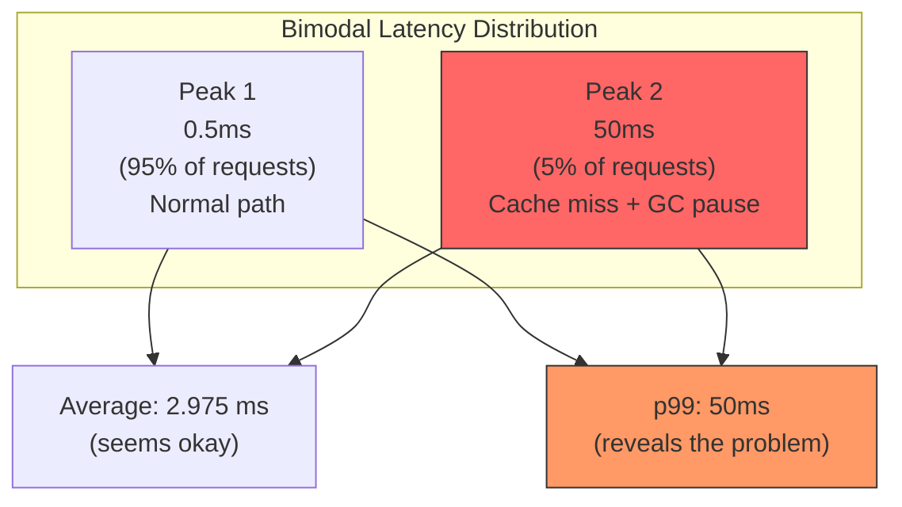
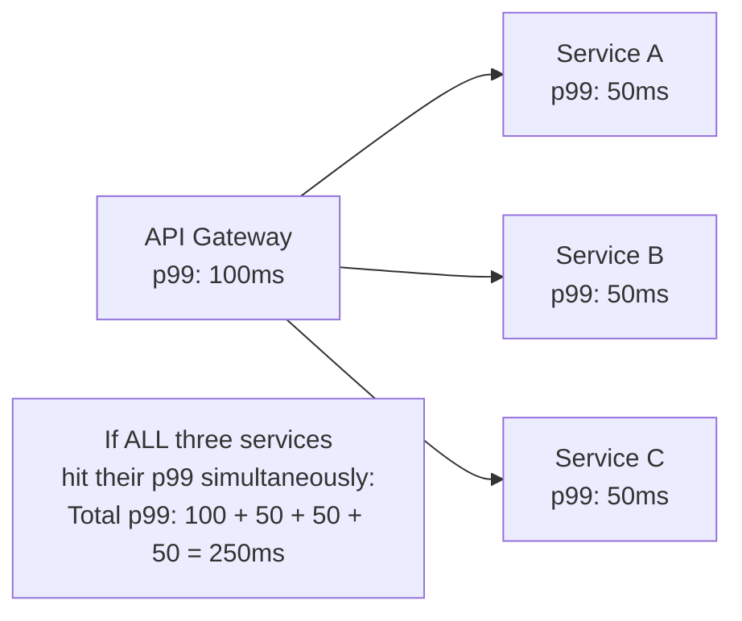

# 5.5 Percentiles in Benchmarking

#benchmarking/statistics #performance/latency #data-analysis #metrics

## Overview

Percentiles are the most important statistical tool for interpreting benchmark results. While averages provide a single summary number, they hide the distribution of performance — the best cases, the worst cases, and everything in between. At 1 million requests per second, the difference between average and percentile-based analysis is the difference between thinking your system is healthy and knowing it is dropping requests for 1% of your users.

---

## What Are Percentiles?

A percentile tells you what percentage of observations fall below a given value. In the context of benchmarking:

> **pX latency**: X% of all requests completed in less than this time.

### Common Percentiles

| Percentile | Name | Meaning |
|---|---|---|
| **p50** | Median | 50% of requests are faster than this value |
| **p90** | 90th percentile | 90% of requests are faster than this value |
| **p95** | 95th percentile | 95% of requests are faster than this value |
| **p99** | 99th percentile | 99% of requests are faster than this value |
| **p99.9** | "Three nines" | 99.9% of requests are faster than this value |

### Concrete Example

If your API's latency distribution is:

```
p1:    0.2 ms
p2.5:  0.3 ms
p50:   0.5 ms    ← Half of all requests are faster than 0.5ms
p97.5: 1.2 ms
p99:   2.5 ms    ← 99% of requests are faster than 2.5ms
Max:   12.5 ms   ← The absolute slowest request
```

This means:
- **The "typical" user** experiences ~0.5ms latency (p50).
- **1 out of 100 users** experiences >2.5ms latency (p99).
- **1 out of 1,000 users** experiences >12.5ms latency (worst case).

---

## Why Average RPS Can Be Misleading

Averages are sensitive to outliers and can mask bimodal distributions — where the system has two distinct performance modes.

### The Bimodal Distribution Problem



The average of 2.975ms looks acceptable. But 5% of users are experiencing 50ms latency — a 100× degradation. The average completely hides this problem.

### When Averages Lie

Averages are misleading when:
- **The distribution is skewed**: Most requests are fast, but a few are catastrophically slow.
- **There are multiple modes**: The system behaves differently depending on code path, cache state, or GC phase.
- **Outliers exist**: A single 500ms request in a batch of 10ms requests barely moves the average.

---

## Why p99 Matters More Than Average for User Experience

### At Scale, the Tail Is Everything

At 1M RPS:

| Percentile | Requests Affected (per second) | Per Hour | Per Day |
|---|---|---|---|
| p50 exceeded | 500,000 | 1.8 billion | 43.2 billion |
| p10 exceeded | 900,000 | 3.24 billion | 77.76 billion |
| p1 exceeded | 990,000 | 3.564 billion | 85.54 billion |
| p0.1 exceeded | 999,000 | 3.596 billion | 86.31 billion |

**At 1M RPS, even the 0.1% tail = 1,000 requests per second experiencing degraded performance.**

If your p99 latency is 100ms but your p50 is 1ms:
- **500,000 users per second** experience worse than 100ms.
- If you serve users globally, that's 500,000 frustrated users every second.
- Over a day: 43.2 billion user-experiences of degraded service.

This is why Google, Amazon, and Netflix obsess over tail latency optimization.

---

## Autocannon's 20-Sample Output: Understanding the Spread

When Autocannon runs 20 iterations (each 10 seconds), it reports per-second statistics:

```
Req/Sec: 16784, 16784, 18000, 18000, 17856, 18000, 17000, 18000, 
         18000, 17856, 18000, 18000, 16784, 18000, 18000, 17000, 
         18000, 17856, 18000, 18000

Min: 16784  Max: 18000  Avg: 17856  Stdev: 342
```

### What This Tells Us

1. **Min (16,784)**: The slowest sample — possibly during a GC pause or cold cache event.
2. **Max (18,000)**: The best sample — optimal conditions.
3. **Avg (17,856)**: Central tendency — most samples cluster near this.
4. **Stdev (342)**: Variability — how much the samples differ from the average. Low Stdev = consistent performance.

### Interpreting the Spread

| Spread Pattern | Meaning |
|---|---|
| Low Stdev (< 2% of avg) | Very consistent, predictable performance |
| Medium Stdev (2-10% of avg) | Normal variability, GC pauses may occur |
| High Stdev (> 10% of avg) | Unstable — investigate GC, network, or resource contention |
| Bimodal (two distinct clusters) | System alternates between two modes (cache hit vs miss) |

---

## Tail Latency: Why the Slowest 1% Matters at Scale

Tail latency refers to the latency experienced by the slowest requests — typically measured at p99, p99.9, or p99.99.

### Causes of Tail Latency

1. **Garbage Collection Pauses**: V8's stop-the-world GC can pause the entire event loop for 10-100ms.
2. **Cache Misses**: A cold cache forces the server to compute from scratch or query the database.
3. **OS Scheduling**: The kernel may deschedule your process in favor of another.
4. **TCP Retransmission**: A lost packet causes a ~200ms retransmission delay.
5. **Queueing**: Under load, requests queue up, and the last request in the queue waits longest.
6. **Connection Timeout**: A stale connection attempt adds seconds of latency.

### Tail Latency Amplification

In distributed systems, tail latency **amplifies** across service calls:



When a request depends on multiple downstream services, the probability that ALL of them are fast decreases exponentially. If each service has p99 of 50ms, and the request calls 3 services:

$$P(\text{all 3 fast}) = 0.99 \times 0.99 \times 0.99 = 0.9703$$

That means **2.97% of requests** (not 1%) experience at least one slow service. With 10 downstream calls:

$$P(\text{all 10 fast}) = 0.99^{10} = 0.9044$$

Now **9.56% of requests** hit tail latency somewhere. The tail grows with system complexity.

---

## Practical Recommendations

1. **Report p50, p95, and p99** for every benchmark. Don't rely on averages.
2. **Watch the spread** in Autocannon's multi-sample output. High Stdev = instability.
3. **Investigate the tail** before celebrating high average RPS. What does the worst 1% experience?
4. **Use percentiles for SLAs**: "Our API responds in <100ms for 99% of requests" is meaningful. "Our average response time is 10ms" is not.
5. **Monitor p99 in production**, not just averages. This catches degradation that averages hide.

---

## Common Mistakes

- **Reporting only average RPS**: Incomplete picture. Always include min, max, and percentiles.
- **Ignoring the min**: The minimum sample reveals what's possible under ideal conditions.
- **Not tracking Stdev**: A high average with low StDev is better than a higher average with high StDev.
- **Confusing p99 with "worst case"**: p99 means 1% is worse — not that 99% is exactly at this value.
- **Benchmarking for too short**: 10 seconds may not capture rare events (GC pauses happen every 30-60 seconds).

---

## Further Reading

- [[5.3 Benchmarking Methodology]] — controlling variables for reliable results
- [[5.2 Autocannon]] — the tool that generates percentile data
- [[5.1 Requests Per Second (RPS)]] — the metric being analyzed
- "The Tail at Scale" (Dean & Barroso, 2013) — Google's seminal paper on tail latency
