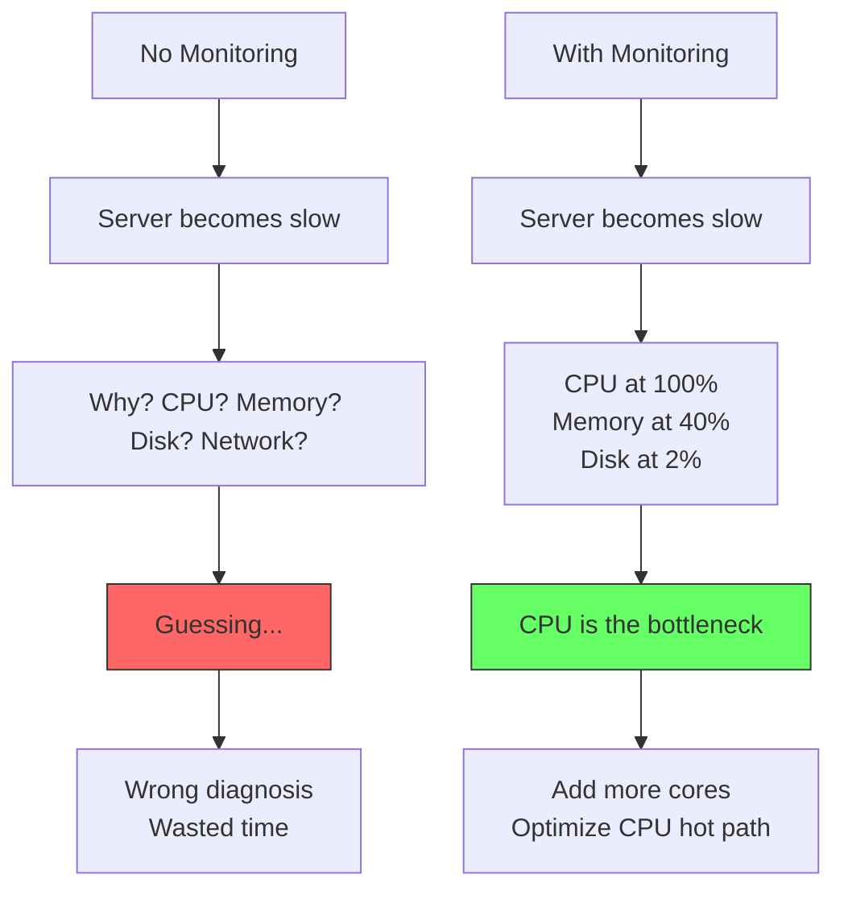
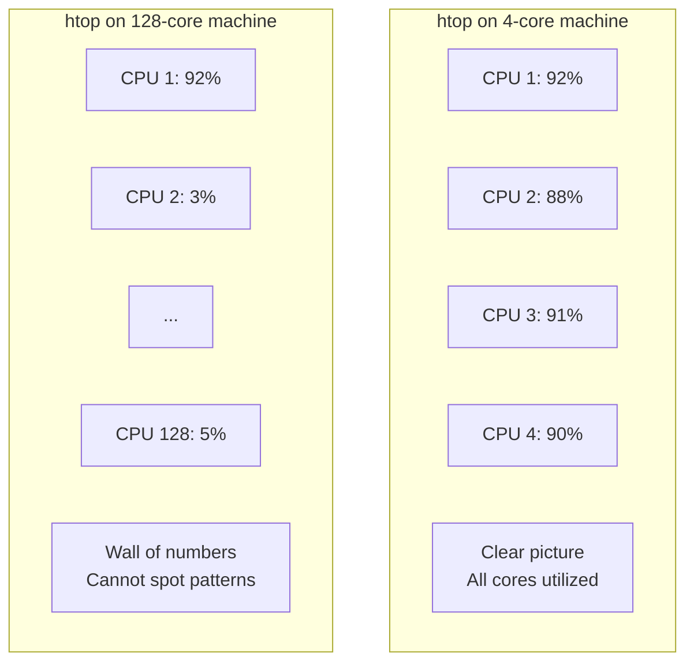
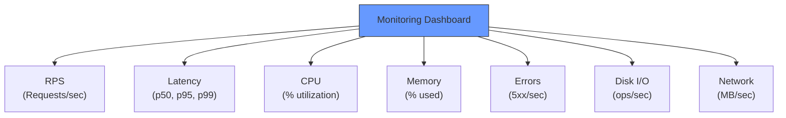

# 5.6 Resource Monitoring

#monitoring/resource #performance/observability #system-administration #benchmarking

## Overview

Resource monitoring is the practice of continuously tracking CPU, memory, disk, and network utilization during both normal operation and benchmarking. Without monitoring, you are flying blind — you cannot know whether your server is CPU-bound, memory-bound, I/O-bound, or network-bound. Monitoring is not a post-optimization activity; it is the **first step** in [[15.1 Identifying Bottlenecks]] and the continuous companion to every benchmark run.

---

## Why Monitoring Is Non-Negotiable at Scale

At 1 million requests per second, resource exhaustion happens fast and catastrophically:



Monitoring transforms debugging from guesswork into data-driven engineering.

---

## CPU Monitoring

### `mpstat` (Multiprocessor Statistics)

```bash
# CPU utilization per core, updated every 1 second
mpstat 1

# All cores individually, every 1 second
mpstat -P ALL 1
```

Sample output:
```
CPU    %usr   %nice    %sys   %iowait    %irq   %soft  %steal  %guest  %gnice   %idle
all   45.20    0.00    8.30     2.10    0.00    1.50    0.00    0.00    0.00   42.90
0     92.10    0.00    5.20     1.80    0.00    0.90    0.00    0.00    0.00    0.00
1     78.50    0.00    6.10     2.30    0.00    1.20    0.00    0.00    0.00   11.90
2      5.00    0.00    3.10     1.50    0.00    1.80    0.00    0.00    0.00   88.60
```

**Key columns**:
- `%usr`: User-space CPU (your application code)
- `%sys`: Kernel-space CPU (system calls, I/O)
- `%iowait**: CPU waiting for I/O (disk or network). High = I/O-bound bottleneck.
- `%idle`: Unused CPU. High = server has capacity.

### `top` and `htop`

```bash
# Interactive process viewer
top

# Enhanced version with color, mouse support
htop
```

**Why `top` and `htop` Are Impractical on 128-Core Machines**

On a machine with 128 CPU cores, `top` displays all 128 cores — a wall of numbers. At a glance, you cannot tell:
- Which cores are busy
- Whether the load is balanced
- Which processes are consuming the most resources



**Solution**: Use targeted monitoring instead:
```bash
# Average CPU across all cores
mpstat 1 1 | tail -1

# Or create a custom script that summarizes
```

---

## Memory Monitoring

### `free` (Memory Usage Summary)

```bash
free -h
```

```
              total        used        free      shared  buff/cache   available
Mem:           62Gi        28Gi        12Gi       1.2Gi        22Gi        31Gi
Swap:         4.0Gi       256Mi       3.7Gi
```

**Key columns**:
- **total**: Physical RAM installed
- **used**: Actively used by processes
- **buff/cache**: Used by the OS for file system cache (reclaimable)
- **available**: Memory available for applications without swapping

### `vmstat` (Virtual Memory Statistics)

```bash
# Update every 1 second
vmstat 1
```

```
procs -----------memory---------- ---swap-- -----io---- -system-- ------cpu-----
 r  b   swpd   free   buff  cache   si   so    bi    bo   in   cs us sy id wa st
 4  0      0 12585608 286736 23085184    0    0    12    16  102  185 45  8 46  1  0
```

**Key columns**:
- **r**: Runnable processes (waiting for CPU). High = CPU bottleneck.
- **b**: Blocked processes (waiting for I/O). High = I/O bottleneck.
- **si/so**: Swap in/swap out. Non-zero = memory pressure (bad).
- **wa**: I/O wait (percentage). High = I/O bottleneck.
- **us/sy/id**: User/system/idle CPU time.

---

## Disk Monitoring

### `iostat` (I/O Statistics)

```bash
# Extended stats, per device, every 1 second
iostat -x 1
```

```
Device         rrqm/s   wrqm/s     r/s     w/s    rkB/s    wkB/s avgrq-sz avgqu-sz await r_await w_await  svctm  %util
nvme0n1          0.00     0.00   120.00    40.00  4800.00   1600.00    41.14      0.05   0.30    0.25    0.40   0.12   1.92
```

**Key columns**:
- **r/s, w/s**: Read/write operations per second.
- **rkB/s, wkB/s**: Read/write throughput in KB/s.
- **await**: Average time for I/O requests (ms). High = slow disk.
- **%util**: Percentage of time the device was busy. Near 100% = disk saturated.

### `df` and `du`

```bash
# Disk space usage per filesystem
df -h

# Directory size
du -sh /var/log
```

---

## Network Monitoring

### `ss` (Socket Statistics)

```bash
# All listening TCP ports
ss -tulpn

# Count of established connections
ss -s
```

### `ifconfig` / `ip`

```bash
# Network interface configuration and statistics
ifconfig
ip addr show
```

### `nload` (Real-Time Bandwidth)

```bash
nload
```

Shows incoming and outgoing bandwidth in real-time — essential for determining whether your network is saturated during benchmarks.

### `ethtool` (Network Interface Details)

```bash
ethtool eth0
```

Shows link speed (1Gbps, 10Gbps), duplex mode, and driver information. If your link speed is 1Gbps and you're trying to push 1Gbps of HTTP traffic, the network itself becomes the bottleneck.

---

## Custom Aliases for Monitoring

For rapid monitoring during benchmarks, create shell aliases in `~/.bashrc`:

```bash
alias cpu='mpstat 1 1 | tail -1'
alias mem='free -h | grep Mem'
alias disk='iostat -x 1 2 | tail -2'
alias net='ss -s'
alias cpu-usage='mpstat -P ALL 1 1'
alias quick-stats='echo "=== CPU ===" && mpstat 1 1 | tail -1 && echo "=== MEM ===" && free -h | grep Mem && echo "=== DISK ===" && df -h / && echo "=== NET ===" && ss -s'
```

Now you can type `quick-stats` during a benchmark and get an instant system overview.

---

## Monitoring on Cloud: CloudWatch and Dashboards

### AWS CloudWatch

- **EC2 Metrics**: CPUUtilization, NetworkIn, NetworkOut, DiskReadOps, DiskWriteOps.
- **Custom Metrics**: Push application-specific metrics (RPS, error rate, p99 latency) via the CloudWatch agent.
- **Alarms**: Set thresholds that trigger scaling or alerts.

### Building a Dashboard

A proper monitoring dashboard should show:
1. **RPS over time** — is throughput steady, growing, or declining?
2. **CPU utilization per core** — are all cores utilized?
3. **Memory usage** — is memory growing (leak?) or stable?
4. **Error rate** — 4xx/5xx responses per second
5. **p50/p95/p99 latency** — is tail latency acceptable?



---

## Common Mistakes

- **Monitoring only during benchmarks**: Production monitoring should be continuous. A problem may only appear under specific load patterns.
- **Only watching CPU**: A server can be slow because of memory pressure, disk I/O, or network — not just CPU.
- **Using `top` on many-core machines**: Use `mpstat` or custom scripts for clarity.
- **Not setting up alerts**: You should know about resource exhaustion before your users do.
- **Ignoring %iowait**: If `%iowait` is high, optimizing CPU won't help — you need faster storage or better queries.

---

## Further Reading

- [[15.1 Identifying Bottlenecks]] — using monitoring data to find performance limits
- [[5.3 Benchmarking Methodology]] — monitoring during benchmarks
- [[4.6 Unix and Linux Terminal Commands]] — terminal commands reference
- [[5.2 Autocannon]] — monitoring the client side during benchmarks
