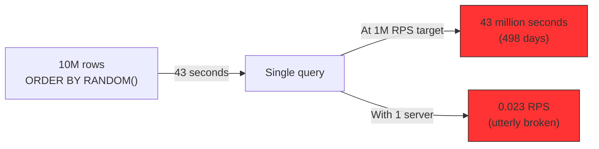
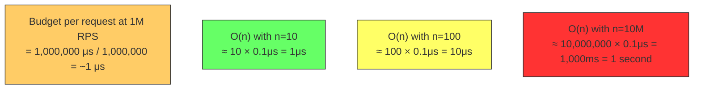

# 6.2 O(n) Linear Time

#algorithms/linear #algorithms/complexity #database/queries #performance

## Overview

O(n) — linear time complexity — means that an algorithm's runtime grows **directly in proportion** to the input size. Double the input, double the time. At 10 million records, O(n) means examining all 10 million records — one by one. This is the most common complexity class in everyday programming, and also the most dangerous at scale, because linear scans over large datasets can bring even the most powerful servers to their knees.

---

## Definition

An algorithm is O(n) if the number of operations it performs is directly proportional to n, the input size:

$$T(n) = c \cdot n + k$$

Where c is the constant factor (per-element processing cost) and k is a fixed overhead. As n → ∞, T(n) grows linearly.

### Intuition

Imagine searching for a specific book in an unsorted pile of 100 books. In the worst case, you must check every book — 100 checks. If the pile grows to 1,000 books, you need 1,000 checks. The search time grows linearly with the pile size.

---

## Examples of O(n) Operations

### Linear Search

```javascript
function linearSearch(array, target) {
  for (let i = 0; i < array.length; i++) {
    if (array[i] === target) return i;
  }
  return -1;
}
```

### COUNT(*) in SQL

```sql
SELECT COUNT(*) FROM users;
```

The database **must scan every row** in the `users` table to count them. There is no shortcut — every row must be examined. See [[10.4 COUNT Performance]].

### SELECT with ORDER BY RANDOM()

```sql
SELECT * FROM users ORDER BY RANDOM() LIMIT 1;
```

This is the canonical example from the video. See [[10.3 SELECT with ORDER BY RANDOM]].

**Why it is O(n):**
1. PostgreSQL must **read every row** in the table (scan all n rows).
2. For each row, it **assigns a random value** (O(n) random number generations).
3. It **sorts all rows by the random value** — O(n log n) for the sort.
4. It returns the first row (O(1)).

Total complexity: **O(n log n)** — even worse than linear. The scan itself is O(n), but the sort dominates.

### Common O(n) Operations in Web Development

| Operation | Complexity | Why |
|---|---|---|
| `Array.find()` | O(n) | Scans array elements |
| `Array.filter()` | O(n) | Checks every element |
| `Array.forEach()` | O(n) | Visits every element |
| `String.indexOf()` | O(n × m) | Compares at each position |
| Full table scan (no index) | O(n) | Reads every database row |
| `Array.includes()` | O(n) | Linear search |
| Serialization of n records | O(n) | Processes each record |

---

## The Real Cost: At 10 Million Records

The video demonstrated this dramatically:

```sql
SELECT * FROM users ORDER BY RANDOM() LIMIT 1;
-- Table: 10,000,000 rows
-- Result: 43 seconds for a SINGLE query
```



### Breaking Down the 43 Seconds

| Phase | Time (approx) | Operation |
|---|---|---|
| Sequential scan | ~15s | Read 10M rows from disk to memory |
| Random value assignment | ~5s | Generate 10M random numbers |
| Sorting | ~20s | Sort 10M rows by random value (O(n log n)) |
| Return | ~0.001s | Return first row |

The dominant cost is the sort (O(n log n)), but even without it, the scan alone (O(n)) would take ~15 seconds — still catastrophic.

---

## The Scaling Problem

O(n) becomes unacceptable at specific thresholds depending on your RPS target:

| RPS Target | Acceptable n for O(n) (assuming 0.1ms per element) |
|---|---|
| 100 RPS | ~1,000 (0.1s) |
| 1,000 RPS | ~100 (0.1s) |
| 10,000 RPS | ~10 (0.1s) |
| 1,000,000 RPS | n < 1 — O(n) is fundamentally incompatible |

At 1M RPS, each request must complete in under 1 microsecond on average. An O(n) scan of even 10 records (assuming 0.01ms per record) takes 0.1ms — 100× too slow.



---

## When O(n) Is Acceptable

Despite the warnings, O(n) is perfectly fine when n is small:

1. **Small datasets**: Scanning 100 records at 0.01ms each = 1ms total. Acceptable.
2. **Batch processing**: If you process data once (not per-request), O(n) is fine. An overnight batch job can scan billions of rows.
3. **Caching**: An O(n) operation whose result is cached becomes O(1) for all subsequent requests.
4. **Unavoidable**: Some operations are inherently O(n). `SELECT COUNT(*)` has no shortcut (unless materialized).

---

## Mitigating O(n) in Practice

### 1. Indexing

Add database indexes to avoid full table scans. See [[10.2 Database Indexing]] and [[6.3 O(log n) Logarithmic Time]].

### 2. Caching

Store the result of an O(n) operation. A cached `COUNT(*)` becomes O(1) on subsequent requests. See [[11.5 Caching with Redis]].

### 3. Limiting Dataset Size

Filter data with WHERE clauses to reduce n before scanning:

```sql
-- Bad: O(n) over 10M rows
SELECT * FROM users ORDER BY RANDOM() LIMIT 1;

-- Better: O(n) over 1,000 rows (with WHERE filter)
SELECT * FROM users WHERE status = 'active' ORDER BY RANDOM() LIMIT 1;
```

### 4. Replacing O(n) Algorithms

Replace linear scans with indexed lookups:

```sql
-- O(n log n): ORDER BY RANDOM()
SELECT * FROM users ORDER BY RANDOM() LIMIT 1;

-- O(1): Random ID lookup (with generated random ID)
SELECT * FROM users WHERE id = <random_id>;

-- O(log n): MAX ID + random offset
SELECT * FROM users WHERE id > (SELECT MAX(id) FROM users) * random() LIMIT 1;
```

---

## Connection to Other Notes

- [[10.3 SELECT with ORDER BY RANDOM]] — the detailed analysis of why this query is catastrophic
- [[10.4 COUNT Performance]] — why COUNT(*) is O(n) and how to mitigate it
- [[6.5 Database Query Complexity]] — comprehensive complexity analysis of SQL queries
- [[6.6 Why Algorithms Matter at Scale]] — the philosophical argument for choosing better algorithms
- [[6.3 O(log n) Logarithmic Time]] — the alternative complexity class that databases exploit

---

## Common Mistakes

- **Assuming O(n) is "fast enough"**: At small n, yes. At production n (millions), no.
- **Using ORDER BY RANDOM() on large tables**: This is the canonical "algorithm that kills performance at scale."
- **Not adding indexes**: Every unindexed query is O(n). Add indexes for every column used in WHERE clauses.
- **Counting rows with SELECT COUNT(*) in a loop**: Running COUNT(*) per request on a large table is O(n) per request — catastrophic at high RPS.

---

## Further Reading

- [[6.1 Big O Notation]] — the broader framework
- [[6.3 O(log n) Logarithmic Time]] — the better alternative for lookups
- [[6.5 Database Query Complexity]] — SQL-specific complexity analysis
- [[10.3 SELECT with ORDER BY RANDOM]] — the video's case study
