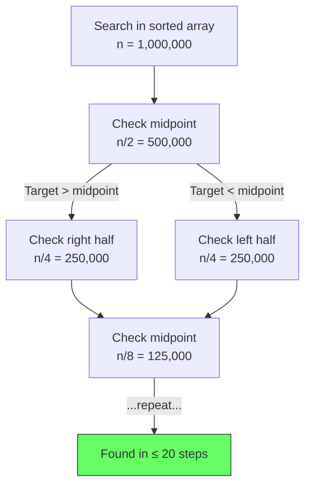
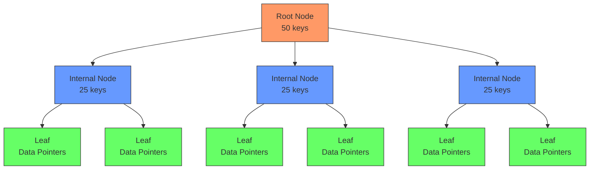
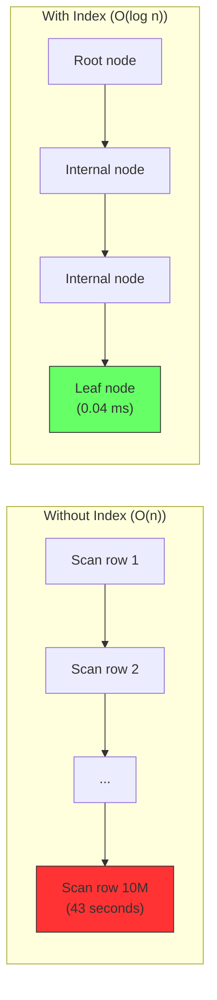

# 6.3 O(log n) Logarithmic Time

#algorithms/logarithmic #algorithms/complexity #database/indexing #data-structures

## Overview

O(log n) — logarithmic time complexity — means that an algorithm's runtime grows very slowly as input size increases. While O(n) requires scanning every element, O(log n) can find a specific element among 10 million items in just 23 steps. This is the complexity class that makes modern databases fast, and it is the foundation of nearly every high-performance data access pattern. Understanding O(log n) is understanding how [[10.2 Database Indexing]] works at the algorithmic level.

---

## Definition

An algorithm is O(log n) if the number of operations it performs grows logarithmically with n:

$$T(n) = c \cdot \log_2(n) + k$$

The base of the logarithm (2, 10, e) doesn't matter in Big O notation because changing the base is just multiplying by a constant:

$$\log_b(n) = \frac{\log_a(n)}{\log_a(b)}$$

So O(log₂ n) = O(log₁₀ n) = O(log n).

### Intuition

Think of the "guess my number" game: I'm thinking of a number between 1 and 1,000,000. You can ask "is it higher or lower than X?" With binary search (always guessing the midpoint), you find the number in at most 20 guesses. Not 1,000,000 guesses — **20**. That is the power of logarithmic growth.

---

## Binary Search: The Classic Example

Binary search is the canonical O(log n) algorithm. Given a **sorted** array:

```javascript
function binarySearch(sortedArray, target) {
  let left = 0;
  let right = sortedArray.length - 1;
  
  while (left <= right) {
    const mid = Math.floor((left + right) / 2);
    if (sortedArray[mid] === target) return mid;
    if (sortedArray[mid] < target) left = mid + 1;
    else right = mid - 1;
  }
  return -1;
}
```

### How It Works



At each step, the algorithm eliminates **half** of the remaining elements. This halving process is why the number of steps is log₂(n):

| n (array size) | log₂(n) = Maximum Steps |
|---|---|
| 10 | 4 |
| 100 | 7 |
| 1,000 | 10 |
| 10,000 | 14 |
| 100,000 | 17 |
| 1,000,000 | 20 |
| 10,000,000 | 23 |
| 1,000,000,000 | 30 |

**10 million records? 23 steps. 1 billion records? 30 steps.** This is why O(log n) is considered excellent.

---

## B-Tree Indexes: How Databases Achieve O(log n)

Databases use a data structure called a **B-tree** (or its variant, B+ tree) to organize indexes for O(log n) lookups.

### B-Tree Structure



A B-tree is a self-balancing tree where:
- Each node contains multiple keys (not just one, like a binary tree)
- All leaves are at the same depth
- The tree stays balanced automatically during insertions and deletions

### Lookup Complexity

To find a record by its indexed column (e.g., `WHERE id = 42`):

1. Start at the root node — compare 42 with keys in the root
2. Follow the appropriate child pointer — eliminates ~2/3 of the tree
3. Repeat at each level until reaching a leaf node
4. Follow the leaf's pointer to the actual data row

With a B-tree of order 100 (100 keys per node):
- **Height 1** (root only): up to 100 records
- **Height 2**: up to 10,000 records
- **Height 3**: up to 1,000,000 records
- **Height 4**: up to 100,000,000 records

**A 10-million-row table has a B-tree index of height 3-4.** Lookup requires traversing 3-4 nodes. That is O(log n) in action.

### Index Lookup vs. Full Table Scan



---

## Hash Tables: O(1) Average, O(n) Worst Case

Hash tables deserve mention here because they are often compared to B-trees:

| Aspect | Hash Table (Hash Index) | B-Tree (B-Tree Index) |
|---|---|---|
| **Lookup** | O(1) average, O(n) worst | O(log n) always |
| **Range queries** | ❌ Not supported | ✅ Efficient |
| **Ordering** | ❌ No natural order | ✅ Sorted |
| **Worst case** | O(n) (hash collisions) | O(log n) guaranteed |
| **PostgreSQL** | HASH index type | Default BTREE index type |

Hash indexes are O(1) on average (see [[6.4 O(1) Constant Time]]), but B-trees are preferred for database indexes because they support range queries (`WHERE id BETWEEN 100 AND 200`) and ordering (`ORDER BY id`).

---

## Real-World Impact on RPS

The video demonstrated the dramatic RPS difference between indexed and unindexed queries:

| Query Type | Complexity | Time per Query | Effective RPS |
|---|---|---|---|
| ORDER BY RANDOM() (no index) | O(n log n) | 43 seconds | 0.023 RPS |
| ID lookup (with index) | O(log n) | 0.04 ms | 25,000 RPS (single thread) |
| ID lookup (clustered, cached) | O(1) | 0.002 ms | 500,000 RPS (cluster) |

The difference between O(n log n) and O(log n) is **1,000,000×**. This is not a marginal improvement — it is the difference between a feature that works and a feature that is impossible.

---

## When to Use O(log n) Data Structures

1. **Database lookups by key**: Always use indexed columns (primary keys, unique constraints, explicitly created indexes).
2. **Sorted data access**: When you need range queries or ordered results.
3. **Balanced operations**: When you need fast insertion, deletion, AND lookup.
4. **Distributed systems**: Consistent hashing uses O(log n) lookups for routing.

---

## Connection to Other Notes

- [[10.2 Database Indexing]] — how databases implement O(log n) with B-trees
- [[6.1 Big O Notation]] — the mathematical framework
- [[6.4 O(1) Constant Time]] — even faster, but with trade-offs
- [[6.5 Database Query Complexity]] — comprehensive SQL complexity reference
- [[10.3 SELECT with ORDER BY RANDOM]] — what happens without an index (O(n log n))

---

## Common Mistakes

- **Querying without an index**: Every unindexed WHERE clause triggers a full table scan (O(n)).
- **Indexing every column**: Excessive indexes slow down INSERT/UPDATE/DELETE (each index must be updated — O(log n) per index per write).
- **Using LIKE '%term%'**: Wildcard-at-the-start queries cannot use B-tree indexes, falling back to O(n) scans.
- **Assuming log n is "fast enough"**: At 1M RPS with tight latency budgets, even O(log n) may need to be cached to O(1).

---

## Further Reading

- [[10.2 Database Indexing]] — practical database indexing
- [[6.5 Database Query Complexity]] — SQL complexity analysis
- [[6.4 O(1) Constant Time]] — the complexity that beats even logarithmic
- "Database Internals" by Alex Petrov — deep dive into B-trees and storage engines
