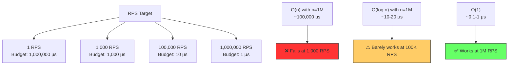
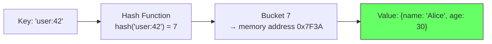
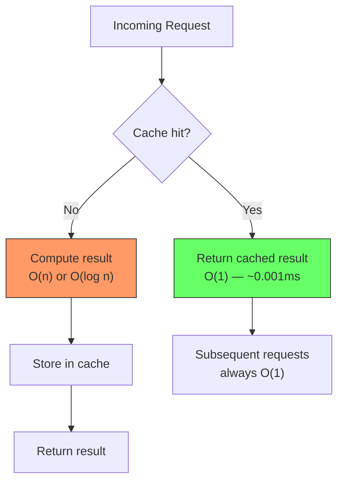

# 6.4 O(1) Constant Time

#algorithms/constant #algorithms/complexity #caching #performance #redis

## Overview

O(1) — constant time complexity — is the gold standard for operations at scale. An O(1) algorithm completes in the same amount of time regardless of whether the dataset has 10 elements or 10 billion. This is the complexity class that makes [[9.4 Redis]] key lookups fast, that makes [[11.5 Caching with Redis]] possible, and that transforms slow systems into blazing-fast ones. At 1 million requests per second, O(1) isn't a luxury — it's a requirement.

---

## Definition

An algorithm is O(1) if the number of operations it performs does not depend on the input size n:

$$T(n) = c \text{ (a constant)}$$

No matter how large n grows, the runtime is bounded by a fixed constant c. Whether you have 100 records or 100 million records, an O(1) operation takes the same time.

### Intuition

Imagine a bookshelf where every book has a unique number, and you keep an index card mapping book titles to their exact shelf position. To find any book, you:
1. Look up the title in the index card — O(1) (assuming the index is organized for constant-time lookup)
2. Go directly to the shelf — O(1)

You never scan the entire bookshelf. The time to find a book is the same whether the shelf holds 10 books or 10,000.

---

## Examples of O(1) Operations

### Array Access by Index

```javascript
const arr = [10, 20, 30, 40, 50];
arr[2];        // O(1) — directly computes memory address: base + 2 × element_size
arr[9999999];  // O(1) — same time complexity, just a larger address offset
```

### Hash Table Lookup

```javascript
const map = new Map();
map.set('user:42', { name: 'Alice' });
map.get('user:42');  // O(1) average — hash the key, find the bucket, return the value
```

### Checking a Flag

```javascript
if (config.cachingEnabled) {  // O(1) — single boolean check
  return cachedResult;
}
```

### Redis Key Lookup

```bash
GET user:42
# O(1) — Redis hashes the key, finds the value in its hash table
```

### Stack Push/Pop

```javascript
stack.push(42);  // O(1) — append to end of array
stack.pop();     // O(1) — remove from end of array
```

---

## Why O(1) Is the Gold Standard at Scale

Consider the time budget per request at various RPS targets:



At 1M RPS, you have approximately **1 microsecond per request** for the total processing time (including network overhead, parsing, business logic, serialization, and response). Only O(1) operations reliably fit within this budget.

---

## Redis: The O(1) Powerhouse

Redis is fast precisely because every core operation is O(1):

| Redis Command | Complexity | What It Does |
|---|---|---|
| `GET key` | O(1) | Retrieve a value by key |
| `SET key value` | O(1) | Store a value by key |
| `DEL key` | O(1) | Delete a key |
| `EXISTS key` | O(1) | Check if key exists |
| `INCR key` | O(1) | Atomic increment |
| `HGET hash field` | O(1) | Hash field lookup |
| `LPUSH list value` | O(1) | Push to list head |
| `SADD set member` | O(1) | Add to set |
| `SRANDMEMBER key` | O(1) | Random member from set |

### Why Redis Achieves O(1)

Redis stores all data in **in-memory hash tables** (dictionaries). A hash table maps keys to memory addresses via a hash function:



No scanning, no tree traversal, no disk I/O. Just hash → bucket → value. This is why Redis can handle 100,000+ operations per second on modest hardware, and millions per second on powerful machines.

---

## Memcached: O(1) Cache Lookups

Like Redis, Memcached uses an in-memory hash table for O(1) key-value lookups. The key difference is that Memcached is simpler (no data structures beyond key-value), which makes it marginally faster for pure GET/SET workloads but less feature-rich.

| Feature | Redis | Memcached |
|---|---|---|
| Data structures | Strings, lists, sets, hashes, sorted sets | Key-value only |
| Persistence | Optional (RDB, AOF) | None (pure cache) |
| Complexity | O(1) for all operations | O(1) for GET/SET |
| Max value size | 512 MB | 1 MB |
| Best for | General-purpose caching, pub/sub, rate limiting | Simple object caching |

---

## The Importance of Caching: Turning O(n) into O(1)

Caching is the single most impactful optimization technique at scale. It works by storing the result of an expensive operation (O(n) or O(log n)) and returning the cached result on subsequent requests (O(1)).



### The Cache Economics

| Scenario | First Request | Subsequent Requests | RPS After Warm Cache |
|---|---|---|---|
| No cache, O(n) | 43,000 ms | 43,000 ms each | 0.023 RPS |
| With cache, first is O(n) | 43,000 ms | 0.001 ms each | 1,000,000 RPS |

The **first request** still takes 43 seconds (cold cache), but all subsequent requests are O(1). This is the magic of caching — see [[11.5 Caching with Redis]].

---

## O(1) vs. O(log n) in Practice

You might wonder: if O(log n) is already fast (23 steps for 10M records), why bother with O(1)?

| n | O(log n) steps | O(1) steps | Difference |
|---|---|---|---|
| 10,000 | 14 | 1 | 13 steps |
| 1,000,000 | 20 | 1 | 19 steps |
| 10,000,000 | 23 | 1 | 22 steps |
| 1,000,000,000 | 30 | 1 | 29 steps |

At 1M RPS, 23 steps × 1M RPS = 23 million operations per second on the database's B-tree. While each step is fast (memory access), the aggregate load is significant. O(1) eliminates this entirely.

However, O(1) has trade-offs:
- **Memory**: Hash tables require more memory than B-trees.
- **No ordering**: You cannot do range queries on a hash table.
- **Worst case**: Hash collisions can degrade to O(n) (though rare with good hash functions).

---

## Connection to Other Notes

- [[9.4 Redis]] — the O(1) in-memory data store
- [[11.5 Caching with Redis]] — using Redis to cache expensive operations
- [[6.2 O(n) Linear Time]] — what caching eliminates
- [[6.3 O(log n) Logarithmic Time]] — the alternative to O(1) for indexed lookups
- [[6.5 Database Query Complexity]] — when O(1) is and isn't possible in SQL

---

## Common Mistakes

- **Assuming all hash operations are O(1)**: Hash collisions degrade to O(n). Use good hash functions and monitor load factor.
- **Using O(1) data structures when O(n) would suffice**: A simple array scan of 10 elements is faster than a hash table lookup due to cache locality.
- **Caching everything**: Not all data benefits from caching. Cache data that is read frequently and computed slowly.
- **Ignoring cache invalidation**: Stale cache data can cause incorrect behavior. Always have an invalidation strategy.

---

## Further Reading

- [[9.4 Redis]] — deep dive into Redis
- [[11.5 Caching with Redis]] — practical caching strategies
- [[6.1 Big O Notation]] — the mathematical framework
- [[6.6 Why Algorithms Matter at Scale]] — the big picture
