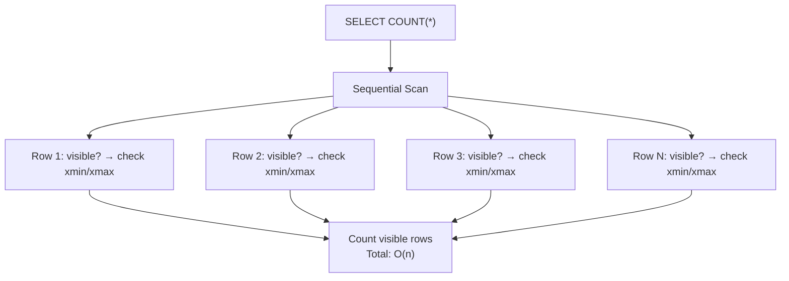
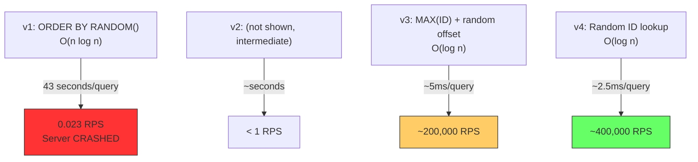

# 6.5 Database Query Complexity

#algorithms/database #algorithms/complexity #sql/performance #database/indexing

## Overview

Understanding the time complexity of SQL queries is essential for writing performant APIs. A single poorly written query can reduce your server from 400,000 RPS to 0.023 RPS — as dramatically demonstrated in the video. This note provides a comprehensive reference for the complexity of common SQL operations, explaining WHY each query has the complexity it does and how to optimize them. This is the practical application of [[6.1 Big O Notation]] to the database layer.

---

## SELECT by Primary Key: O(log n)

```sql
SELECT * FROM users WHERE id = 42;
```

**Complexity: O(log n)** with a B-tree index on `id` (which is the default for primary keys).

**How it works**:
1. PostgreSQL looks up the B-tree index for the `id` column
2. Traverses from root → internal nodes → leaf node (3-4 levels for millions of rows)
3. The leaf contains a pointer (CTID) to the actual row on disk
4. Fetches the row

Without the index (unlikely for a primary key, but possible if dropped):
**Complexity: O(n)** — sequential scan of every row.

---

## SELECT COUNT(*): O(n)

```sql
SELECT COUNT(*) FROM users;
```

**Complexity: O(n)** — PostgreSQL must count every row in the table. There is NO shortcut, because PostgreSQL follows the MVCC (Multi-Version Concurrency Control) model where each transaction may see a different set of visible rows.

### Why COUNT(*) Can't Use an Index

Many people assume COUNT(*) uses the primary key index. In most databases, it doesn't because:
- PostgreSQL's MVCC means the index alone cannot determine row visibility
- Each row's visibility depends on transaction timestamps (xmin/xmax)
- The index may contain pointers to rows that have been deleted or updated



### Mitigations

See [[10.4 COUNT Performance]] for detailed mitigation strategies:
- **Materialized views**: Pre-computed count, updated periodically
- **Trigger-based counters**: Maintain a count table updated on INSERT/DELETE
- **Approximate counts**: `SELECT reltuples FROM pg_class WHERE relname = 'users'` (estimated)
- **Caching in Redis**: Store the count externally — see [[11.5 Caching with Redis]]

---

## SELECT with WHERE on Indexed Column: O(log n)

```sql
SELECT * FROM users WHERE email = 'alice@example.com';
```

**Complexity: O(log n)** if there is a B-tree index on the `email` column.

**Complexity: O(n)** if there is NO index on `email` (full table scan).

### Creating an Index

```sql
CREATE INDEX idx_users_email ON users(email);
```

After creating the index, the same query drops from O(n) to O(log n) — potentially a 1,000× improvement for large tables.

---

## SELECT with ORDER BY: O(n log n)

```sql
SELECT * FROM users ORDER BY created_at DESC;
```

**Complexity: O(n log n)** for the sorting phase.

The database must:
1. **Fetch** all matching rows: O(n) for the scan (or O(m) if filtered by WHERE)
2. **Sort** the result set: O(n log n) using a comparison-based sort
3. **Return** the sorted results: O(n)

The sort dominates — O(n log n).

### With an Index

If there's an index on `created_at`, the results come pre-sorted:
```sql
CREATE INDEX idx_users_created ON users(created_at DESC);
```

Now the query can read the index in order (O(n) for the scan, but no separate sort step). The index acts as a pre-sorted structure.

---

## SELECT with ORDER BY RANDOM(): O(n log n)

```sql
SELECT * FROM users ORDER BY RANDOM() LIMIT 1;
```

**Complexity: O(n log n)** — this is the most expensive query pattern discussed in the video. See [[10.3 SELECT with ORDER BY RANDOM]].

| Phase | Complexity | What Happens |
|---|---|---|
| Sequential scan | O(n) | Read every row |
| Random assignment | O(n) | Generate random() for each row |
| Sorting | O(n log n) | Sort all rows by random value |
| Limit | O(1) | Return first row |

**Video result**: 43 seconds for 10 million rows. The server becomes unusable.

### Better Alternatives

```sql
-- v3: MAX(ID) + random offset — O(log n)
SELECT * FROM users 
WHERE id > (SELECT MAX(id) FROM users) * random() 
LIMIT 1;

-- v4: Generate random ID client-side — O(log n)  
SELECT * FROM users WHERE id = <random_id>;
```

---

## INSERT: O(log n)

```sql
INSERT INTO users (name, email) VALUES ('Bob', 'bob@example.com');
```

**Complexity: O(log n)** per index that must be updated.

**How it works**:
1. Find the correct position in each B-tree index: O(log n) per index
2. Insert the new entry: O(1) (append to leaf)
3. Write the row data to the heap: O(1)

If the table has 3 indexes (primary key + 2 secondary), INSERT is 3 × O(log n) + O(1) = O(log n).

This is why too many indexes slow down writes. See [[10.2 Database Indexing]].

---

## Summary: SQL Query Complexity Reference

| Query Pattern | With Index | Without Index | Notes |
|---|---|---|---|
| `WHERE id = 42` | O(log n) | O(n) | Primary key always indexed |
| `WHERE email = 'x'` | O(log n) | O(n) | Index needed on email |
| `WHERE id IN (1,2,3)` | O(k × log n) | O(n) | k = number of values |
| `WHERE id BETWEEN 1 AND 100` | O(log n + m) | O(n) | m = matching rows |
| `COUNT(*)` | O(n) | O(n) | Always scans |
| `ORDER BY col LIMIT k` | O(n) (index scan) | O(n log n) | Index = pre-sorted |
| `ORDER BY RANDOM()` | O(n log n) | O(n log n) | Catastrophic at scale |
| `JOIN on indexed columns` | O(m × log n) | O(m × n) | m, n = table sizes |
| `INSERT` | O(log n) per index | O(1) | More indexes = slower writes |
| `UPDATE WHERE id = x` | O(log n) | O(n) | + O(log n) per index on updated column |
| `DELETE WHERE id = x` | O(log n) | O(n) | + O(log n) per index |

---

## Real Examples from the Video

The video benchmarked four versions of a "get random user" endpoint:



The progression from v1 to v4 demonstrates the direct relationship between query complexity and achievable RPS:
- **v1 → v3**: From O(n log n) to O(log n) = **8.6 million × faster**
- **v3 → v4**: Both O(log n), but v4 avoids the subquery = **2× faster**

---

## Connection to Other Notes

- [[10.2 Database Indexing]] — how to create indexes that achieve O(log n)
- [[10.3 SELECT with ORDER BY RANDOM]] — detailed analysis of the worst query
- [[10.4 COUNT Performance]] — why COUNT(*) is O(n) and how to mitigate
- [[6.2 O(n) Linear Time]] — the theory behind full scans
- [[6.3 O(log n) Logarithmic Time]] — the theory behind indexed lookups

---

## Common Mistakes

- **Using ORDER BY RANDOM() on large tables**: Always the wrong choice at scale. Use random ID generation instead.
- **Querying without WHERE on indexed columns**: Every unindexed WHERE clause causes a full scan.
- **Too many indexes on write-heavy tables**: Each index adds O(log n) to every INSERT/UPDATE/DELETE.
- **Using COUNT(*) in API endpoints**: Counting millions of rows per request is O(n) — cache the result.
- **Using LIKE with leading wildcard**: `WHERE name LIKE '%john%'` cannot use B-tree indexes → O(n) scan.

---

## Further Reading

- [[6.1 Big O Notation]] — the mathematical framework
- [[6.2 O(n) Linear Time]] — why O(n) queries are problematic
- [[6.3 O(log n) Logarithmic Time]] — the complexity that databases exploit
- [[10.2 Database Indexing]] — practical guide to database indexes
- PostgreSQL EXPLAIN ANALYZE documentation
