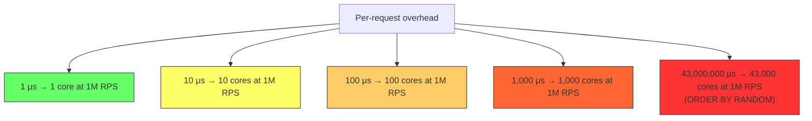

# 6.6 Why Algorithms Matter at Scale

#algorithms/impact #engineering/mindset #scalability #performance #architecture

## Overview

This note ties together everything from [[6.1 Big O Notation]] through [[6.5 Database Query Complexity]] with the central thesis of this entire knowledge vault: **at extreme scale, the choice of algorithm is not an optimization — it is the difference between a working system and a failed one**. The famous adage "premature optimization is the root of all evil" (Donald Knuth) is often misquoted and misunderstood. At 1 million requests per second, algorithmic efficiency is not premature — it is the engineering prerequisite.

---

## At Small Scale, Everything Works

With 100 users and 100 requests per minute (~1.7 RPS), almost any implementation works:

| Algorithm | Time per Request (n=100) | Acceptable at 1.7 RPS? |
|---|---|---|
| O(n) | ~0.01 ms | ✅ Yes — 60,000× faster than needed |
| O(n²) | ~0.01 ms (tiny n) | ✅ Yes — still fast at small n |
| O(2ⁿ) | ~0.1 ms | ✅ Yes — barely noticeable |

At small scale, you can afford to use `ORDER BY RANDOM()`, skip indexes, and ignore algorithmic complexity. The system responds in milliseconds regardless.

**But this creates a false sense of security.** The code that works at 100 users may be fundamentally broken at 100,000 users.

---

## At 1M RPS, Every Microsecond Matters

Let's do the math:

- **1 extra microsecond per request** × 1,000,000 requests/second = **1 extra second of CPU time per second** = one entire CPU core consumed
- **10 extra microseconds** = **10 CPU cores** consumed by wasted time
- **100 extra microseconds** = **100 CPU cores** — you'd need a 128-core machine just for the overhead

This is why [[6.1 Big O Notation]] constants matter at scale. Even if two algorithms have the same Big O class, the constant factor (actual operations per step) determines how many servers you need.



---

## The Video's Example: ORDER BY RANDOM() vs ID Lookup

This is the most dramatic demonstration in the video series:

| Implementation | Algorithm | Time per Request | RPS | CPU Cores Needed for 1M RPS |
|---|---|---|---|---|
| ORDER BY RANDOM() | O(n log n) | 43,000,000 μs (43s) | 0.023 | **43,000,000** (impossible) |
| MAX(ID) + offset | O(log n) | ~5,000 μs (5ms) | ~200,000 | **5** (manageable) |
| Random ID lookup | O(log n) | ~2,500 μs (2.5ms) | ~400,000 | **2-3** (efficient) |
| Cached ID lookup | O(1) | ~2 μs | ~500,000 | **0.002** (trivial) |

The difference between O(n log n) and O(log n) is **17,200×**. Between O(n log n) and O(1), it's **21,500,000×**.

### What This Means in Dollars

If each server costs $200/month:
- ORDER BY RANDOM() approach: Would need millions of servers = **billions of dollars** (literally impossible)
- Random ID lookup: Needs 3-4 servers = **$800/month**
- Cached approach: Needs 1-2 servers = **$200-400/month**

**The algorithm choice alone determines whether your business model is viable.**

---

## Probability at Scale: The Multiplication Effect

At low traffic, a slow query affects few users:

| RPS | Probability of hitting slow query (per second) | Users affected per day |
|---|---|---|
| 1 | 1 | 86,400 |
| 100 | 100 | 8,640,000 |
| 10,000 | 10,000 | 864,000,000 |
| 1,000,000 | 1,000,000 | 86,400,000,000 |

An O(n²) algorithm that crashes one request in every 1,000:
- At 10 RPS: 1 crash every 100 seconds — barely noticeable
- At 1M RPS: 1,000 crashes every second — **system failure**

The probability of hitting edge cases, race conditions, and worst-case algorithmic behavior scales linearly with RPS. What is "rare" at 100 RPS is "constant" at 1M RPS.

---

## Why "Premature Optimization" DOESN'T Apply at Extreme Scale

Donald Knuth's famous quote (from "Structured Programming with go to Statements", 1974):

> "We should forget about small efficiencies, say about 97% of the time: **premature optimization is the root of all evil**."

### What Knuth Actually Meant

The full context makes clear he was warning against:
1. Micro-optimizing code before it's needed
2. Sacrificing code clarity for tiny speedups
3. Optimizing the wrong parts of the code

He was NOT saying:
1. "Don't think about algorithm complexity" — he explicitly says to choose the right algorithms
2. "O(n²) is fine" — no reasonable interpretation supports this
3. "Performance doesn't matter until you have problems" — he assumed you'd choose reasonable algorithms

### What DOES Apply at Scale

At 1M RPS, the following are NOT premature optimizations — they are **architectural prerequisites**:

1. **Choosing O(log n) over O(n) algorithms** — this is algorithm selection, not micro-optimization
2. **Adding database indexes** — fundamental data structure choice
3. **Caching frequently accessed data** — turning O(n) into O(1) is a design decision
4. **Using efficient data structures** — hash tables instead of linear scans
5. **Avoiding unnecessary serialization** — parsing JSON 1M times/second has a cost
6. **Connection pooling** — establishing TCP connections has O(1) cost per connection but the multiplicative effect at scale is enormous

---

## Engineering Decisions: Choosing Data Structures, Algorithms, and Architectures

At scale, every engineering decision should be evaluated through the lens of complexity:

```mermaid
mindmap
  root((Algorithmic<br/>Decisions at Scale))
    Data Structures
      Hash tables O(1)
      B-trees O(log n)
      Arrays O(n) access
      Linked lists O(n) access
    Database
      Indexed queries O(log n)
      Avoid full scans O(n)
      Avoid ORDER BY RANDOM O(n log n)
      Cache results O(1)
    Architecture
      Process clustering
      Connection pooling
      Load balancing
      Caching layers
    Code
      Avoid nested loops O(n²)
      Use efficient parsing
      Minimize allocations
      Pre-compute where possible
```

---

## The Cost of a Bad Algorithm

The cost of choosing the wrong algorithm is not just slowness — it cascades:

1. **More servers needed**: O(n) instead of O(log n) means 10-1000× more hardware.
2. **More engineers needed**: More servers to manage, more incidents to respond to.
3. **More complexity**: Workarounds (caching, sharding, batching) add system complexity.
4. **Worse user experience**: Higher latency, more timeouts, more errors.
5. **Higher cloud bills**: More compute, more storage, more data transfer.
6. **Shorter runway**: Startups burning cash on infrastructure instead of product development.

The [[1.3 The Engineering Mindset at Scale]] is about preventing these cascading costs through upfront algorithmic awareness.

---

## Real-World Examples

### Google Search

Google processes ~8.5 billion searches per day (~100,000 RPS average, peaks much higher). Every search involves:
- Index lookup: O(log n) — inverted index
- PageRank computation: O(1) — pre-computed and cached
- Result ranking: O(k log k) where k = top candidates (small k)

If Google used O(n) full-text search (scanning the entire web for each query), it would need billions of servers.

### Netflix Streaming

Netflix serves ~1 billion hours of content per week. Video delivery uses:
- CDN edge caching: O(1) lookups
- Content routing: O(log n) geographic routing
- Recommendation engine: Pre-computed O(1) lookups from offline O(n) computation

### Your API Server

The video demonstrated that a single API endpoint with ORDER BY RANDOM() could reduce a 400,000 RPS server to 0.023 RPS. One query. One bad algorithm. Total system failure.

---

## Connection to Other Notes

- [[1.3 The Engineering Mindset at Scale]] — the philosophy behind this analysis
- [[6.1 Big O Notation]] — the mathematical foundation
- [[6.5 Database Query Complexity]] — real-world SQL complexity examples
- [[10.3 SELECT with ORDER BY RANDOM]] — the case study of algorithmic failure
- [[12.1 Process Clustering]] — the architecture that complements good algorithms

---

## Common Mistakes

- **"We'll optimize later"**: At scale, "later" means "after we've spent $100K on servers we didn't need."
- **Choosing the simplest implementation regardless of complexity**: Simple ≠ efficient. A one-line `ORDER BY RANDOM()` is simpler than a random ID generator, but 1,000,000× slower.
- **Not profiling before AND after**: You can't improve what you can't measure.
- **Blaming hardware for software problems**: "We need more CPU" is often a symptom of choosing the wrong algorithm.
- **Ignoring algorithmic complexity in code review**: Every PR that touches a hot path should include complexity analysis.

---

## Further Reading

- [[1.3 The Engineering Mindset at Scale]] — the engineering philosophy
- [[6.1 Big O Notation]] — mathematical foundations
- [[6.2 O(n) Linear Time]] through [[6.4 O(1) Constant Time]] — complexity class details
- "Introduction to Algorithms" (CLRS) — the definitive reference
- "Algorithm Design Manual" by Steven Skiena — practical algorithm selection
