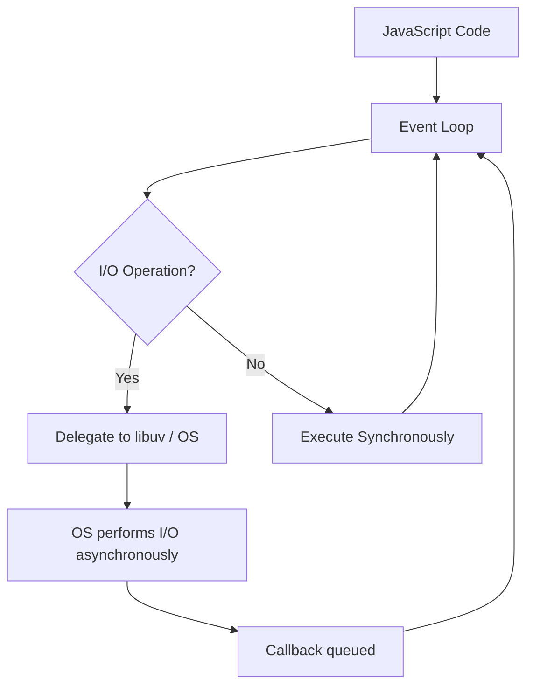

# What is Node.js

#nodejs/fundamentals #nodejs/architecture #backend/runtimes

## Definition

Node.js is a **JavaScript runtime environment** built on Google Chrome's V8 JavaScript engine. It allows developers to execute JavaScript code outside of a web browser, enabling server-side programming in a language that was historically confined to client-side scripting. Node.js was created by Ryan Dahl in 2009, motivated by the desire to push the event-driven, non-blocking I/O model that browsers used for UI responsiveness into the server domain.

## Why Node.js Exists

Before Node.js, JavaScript was exclusively a browser language. You could animate DOM elements, validate forms, and make AJAX calls — but you couldn't read a file from disk, open a TCP socket, or spawn a child process. Node.js shattered that boundary by embedding the V8 engine (the same one that powers Chrome's JavaScript execution) into a C++ program and exposing operating system capabilities through a JavaScript API. This means a single language — JavaScript — can now be used to write both the frontend and backend of an application, a concept sometimes called "full-stack JavaScript."

Node.js exists because Ryan Dahl recognized that most server-side workloads are **I/O-bound**, not CPU-bound. Traditional servers like Apache used a thread-per-request model, where each incoming connection consumed an entire OS thread. With 10,000 concurrent connections, you'd need 10,000 threads — each consuming ~1–2 MB of stack memory — and the CPU would spend most of its time context-switching between them. Node.js's answer: use a **single thread with an event loop**, letting the operating system handle I/O asynchronously while the JavaScript thread only processes logic when data is actually ready.

## Single-Threaded Event Loop Architecture

The single-threaded event loop is the **most important concept** in Node.js. Rather than spawning threads to handle concurrent operations, Node.js runs all your JavaScript code on one thread. When you perform an I/O operation (reading a file, querying a database, making an HTTP request), Node.js doesn't block the thread waiting for the result. Instead, it registers a callback with the system and continues executing other code. When the I/O operation completes, the callback is placed in a queue, and the event loop picks it up and executes it.

This architecture means that a single Node.js process can handle tens of thousands of concurrent connections without the overhead of thread management. The thread is never idle — it's always either executing your code or waiting for the event loop to deliver the next callback.

## Non-Blocking I/O

Non-blocking I/O is the reason Node.js excels at I/O-bound tasks. In a blocking (synchronous) model, calling `fs.readFileSync('/large-file.txt')` halts the entire thread until the file is read from disk. In Node.js's non-blocking model, calling `fs.readFile('/large-file.txt', callback)` initiates the read operation and immediately returns control to the event loop. The callback fires only when the data is available in memory.

This pattern scales extraordinarily well for typical web workloads: receiving an HTTP request, querying a database, calling an external API, reading a template file, and sending a response. Each step involves waiting for I/O, and Node.js overlaps these waits efficiently.

## libuv: The Engine Beneath

[[7.2 Event Loop]] is powered by **libuv**, a C library originally developed for Node.js (now a standalone project used by many runtimes). libuv provides:

- **The event loop implementation** — the actual C code that manages the queue of callbacks and drives the loop through its phases.
- **Thread pool** — a pool of 4 (default, configurable via `UV_THREADPOOL_SIZE`) worker threads used for operations that don't have native async support from the OS (e.g., file system operations on Linux, DNS lookups, compression).
- **Cross-platform abstractions** — it wraps `epoll` on Linux, `kqueue` on macOS/BSD, and IOCP on Windows, providing a unified async I/O interface regardless of the operating system.

Without libuv, Node.js would just be V8 without any way to interact with the operating system asynchronously. libuv is the bridge between JavaScript's single-threaded world and the multi-threaded, event-driven capabilities of modern operating systems.

## What Node.js Is NOT

A common mistake is conflating Node.js with frontend frameworks or enterprise platforms:

- **Node.js is NOT React, Vue, or Angular.** Those are frontend UI frameworks. Node.js is a server-side runtime. They serve fundamentally different purposes.
- **Node.js is NOT Java/Spring or C#/.NET.** It lacks the extensive standard library, enterprise tooling, and static typing ecosystem of those platforms. Node.js is deliberately minimal — it provides HTTP, file system, process management, and stream APIs, and leaves everything else to the npm ecosystem.
- **Node.js IS a system-level technology** in the sense that it gives you direct access to operating system primitives: you can read/write files, interact with Unix sockets, spawn child processes, communicate over TCP/UDP, and manage environment variables. You can write a CLI tool, a TCP proxy, a build system, or a real-time chat server — all in JavaScript.

## Capabilities

With Node.js you can:
- **Read and write files** via the `fs` module
- **Interact with Unix systems** via the `os`, `child_process`, and `fs` modules
- **Spawn and manage processes** via `child_process.spawn()` and `child_process.fork()`
- **Communicate over the network** via `net`, `http`, `https`, `dgram` (UDP), and `dns` modules
- **Build TCP servers and clients** using the `net` module directly
- **Stream data** through pipes using the `stream` module, enabling memory-efficient processing of large datasets

## Connection to the 1M RPS Journey

Node.js is where the 1 Million Requests Per Second journey begins. Its simplicity makes it an excellent starting point for understanding web server fundamentals. However, as we'll see in [[7.6 Framework Benchmarking Results]], Node.js — even with the fastest frameworks — cannot reach 1M RPS for complex routes with large JSON payloads. The single-threaded event loop, the overhead of V8's JIT compilation, and JavaScript's dynamic typing impose performance ceilings that require moving to systems languages like C++ (see [[8.1 C++ for High Performance]]) to overcome.

## Further Reading

- Node.js official documentation: https://nodejs.org/docs/
- libuv documentation: http://docs.libuv.org/
- Ryan Dahl's original Node.js talk (2009)
- [[7.2 Event Loop]] — deep dive into the event loop phases
- [[4.1 Processes and Threads]] — how OS threads compare to Node.js's model
- [[4.2 Multi-Threading]] — when and why to use Worker Threads in Node.js