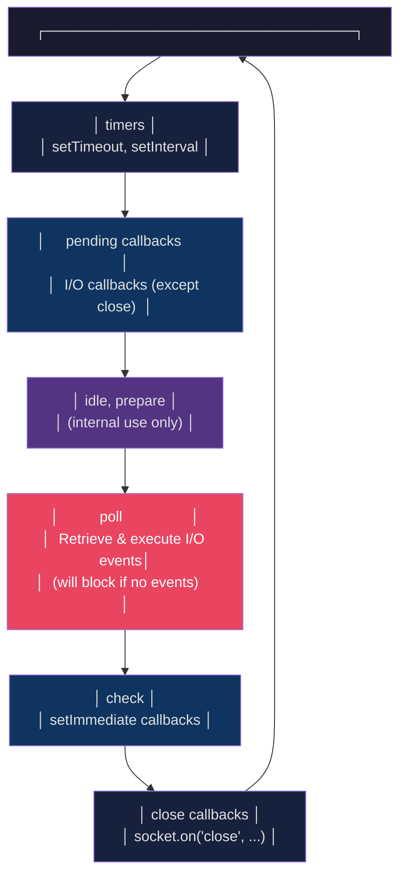

# The Event Loop

#nodejs/event-loop #nodejs/concurrency #performance/bottlenecks

## Definition

The **event loop** is Node.js's mechanism for handling concurrent operations on a single thread. It is the heart of Node.js's asynchronous, non-blocking architecture. Rather than using multiple threads to handle multiple requests simultaneously, the event loop continuously checks for pending I/O operations, timers, and callbacks, executing them one at a time in a deterministic order. Understanding the event loop is essential for writing correct, performant Node.js code — and for understanding why Node.js hits a performance ceiling at extreme throughput targets like 1M RPS.

## How the Event Loop Works

The event loop operates as an infinite loop that processes events from multiple queues. Each iteration of the loop is called a "tick." On each tick, the loop moves through several phases, processing the callbacks queued in each phase before moving to the next.

## The Six Phases

### 1. Timers
Executes callbacks scheduled by `setTimeout()` and `setInterval()`. The loop checks whether any timers have expired (their delay has elapsed). If so, their callbacks are executed. **Important:** a timer's callback will not execute before its scheduled time, but it may execute *later* than scheduled if the event loop is busy processing callbacks in earlier phases.

### 2. Pending Callbacks
Executes I/O-related callbacks that were deferred to the next loop iteration. For example, certain system operations (like some types of TCP errors) may have their callbacks queued here rather than in the poll phase.

### 3. Idle, Prepare
Used internally by libuv. Node.js developers rarely interact with these phases directly. They exist to manage internal bookkeeping operations.

### 4. Poll
The **most critical phase** for I/O-bound applications. The poll phase retrieves new I/O events and executes their callbacks. If there are pending I/O callbacks, they are executed. If there are no pending callbacks, the poll phase may **block** (wait) for new I/O events to arrive — but only if there are no `setImmediate()` callbacks scheduled. This is where the magic of non-blocking I/O happens: the OS notifies libuv when data is ready (via `epoll`, `kqueue`, or IOCP), and the corresponding JavaScript callback is executed here.

### 5. Check
Executes callbacks scheduled by `setImmediate()`. This phase fires immediately after the poll phase completes, making `setImmediate()` callbacks execute before any timers that were set during the poll phase's callback execution.

### 6. Close Callbacks
Executes close event callbacks, such as `socket.on('close', ...)` or `process.on('exit', ...)`.

## How async/await and Promises Work Under the Hood

Promises and `async/await` are syntactic sugar built on top of the microtask queue (also called the "next tick queue" in Node.js terms). When a Promise resolves or rejects, its `.then()`/`.catch()` callbacks (or the code after an `await`) are queued as **microtasks**. Microtasks are processed **after each phase of the event loop completes**, before moving to the next phase. This means microtasks have higher priority than regular (macrotask) callbacks.

The execution order is:
1. Execute all synchronous code in the current call stack
2. Execute all microtasks (Promise callbacks) until the microtask queue is empty
3. Move to the next event loop phase

This is why `Promise.resolve().then(fn)` executes before `setTimeout(fn, 0)` — the Promise microtask runs at the end of the current phase, while the timer callback runs in the next loop iteration's timers phase.

## Why Node.js Doesn't Need Multi-Threading for I/O

The entire point of the event loop is to **avoid the cost of multi-threading for I/O operations**. Thread creation costs ~1–2 MB of memory per thread plus CPU context-switching overhead (~1–10 microseconds per switch). At 1M RPS, if each request required a thread, you'd need 1 million threads — an impossibility on any practical machine.

Instead, Node.js delegates I/O to the operating system (via libuv's use of `epoll`/`kqueue`/IOCP) and uses a single thread to process the results. The OS can track millions of file descriptors simultaneously with minimal overhead. The JavaScript thread only does work when there's actual data to process.

## The Critical Limitation: CPU-Intensive Work BLOCKS the Event Loop

This is the most important caveat of the event loop model. Because there is only **one thread** executing JavaScript, any CPU-intensive operation (heavy computation, large JSON parsing, image processing, cryptography) blocks the entire event loop. While the thread is busy computing, it cannot process incoming requests, handle timers, or execute I/O callbacks. Every other connection **waits**.

Even a 10-millisecond CPU-bound operation means you can process at most 100 requests per second on that thread — and every other request during those 10ms experiences increased latency.

## Why at 1M RPS, the Event Loop Becomes a Bottleneck

At 1 million requests per second, each request has a **budget of 1 microsecond** of processing time (on a single core). The event loop itself has overhead: moving between phases, checking timer heaps, managing queues. Even before your application code runs, the loop infrastructure consumes cycles. Add JavaScript's dynamic typing overhead, V8's garbage collection pauses, and the cost of parsing/serializing large JSON payloads, and the single-threaded model simply cannot keep up.

See [[7.6 Framework Benchmarking Results]] for the empirical evidence: even the fastest Node.js frameworks (Fastify at ~66K RPS, CP at ~73K RPS) fall far short of 1M RPS for complex routes with 30KB JSON responses.

## Worker Threads as a Solution

Node.js 10.5+ introduced the `worker_threads` module, allowing you to spawn separate V8 isolates (each with its own event loop) that run in parallel on different CPU cores. For CPU-bound tasks — JSON parsing, data transformation, cryptographic operations — offloading work to worker threads can prevent event loop blocking. However, worker threads come with communication overhead (data must be serialized to transfer between threads via `postMessage`) and memory overhead (each worker has its own V8 instance, consuming ~30–50MB).

## Comparison with Thread-Per-Request Models

| Aspect | Node.js Event Loop | Java Thread-Per-Request | Go Goroutines |
|--------|-------------------|------------------------|---------------|
| Concurrency model | Single thread, async I/O | OS thread per request | Lightweight goroutines (~2KB) |
| Memory per connection | ~0 (event queue entry) | ~1–2 MB stack | ~2–8 KB stack |
| Context switch cost | Microtask scheduling (~ns) | OS context switch (~μs) | Go scheduler (~ns) |
| CPU-bound work | Blocks entire loop | Only blocks one thread | Only blocks one goroutine |
| Complexity | Callback/Promise management | Synchronous, easier to reason about | Channels, select statements |

## Common Mistakes

1. **Blocking the event loop with synchronous I/O** — using `fs.readFileSync()` instead of `fs.promises.readFile()` blocks the entire server.
2. **Running heavy computation in the main thread** — any `for` loop processing millions of items should be offloaded to a Worker Thread.
3. **Assuming `setTimeout(fn, 0)` is immediate** — it schedules for the *next* loop iteration, not immediately.
4. **Ignoring microtask vs macrotask ordering** — Promises (`then`/`catch`/`await`) always execute before `setTimeout`/`setInterval` callbacks.

## See Also

- [[7.1 What is Node.js]] — the runtime that contains the event loop
- [[4.1 Processes and Threads]] — OS-level concurrency primitives
- [[4.2 Multi-Threading]] — when multi-threading becomes necessary
- [[7.6 Framework Benchmarking Results]] — empirical performance data
- [[8.1 C++ for High Performance]] — what happens when you leave the event loop behind