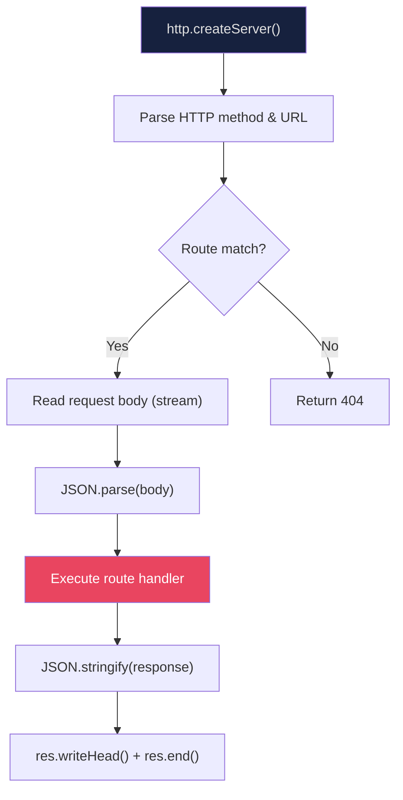

# Custom Framework (CP)

#nodejs/custom-framework #performance/optimization #education/framework-design

## Definition

**CP** (Custom Performance) is a zero-dependency, educational web framework built during the 1M RPS project to understand exactly what frameworks like [[7.3 Express Framework]] and [[7.4 Fastify Framework]] do under the hood. At approximately 500 lines of JavaScript code, CP implements the core features needed for a high-performance HTTP API: route matching, request parsing, and JSON response serialization — nothing more, nothing less.

## Why It Was Built

When benchmarking Express (~20K RPS) and Fastify (~66K RPS), a critical question emerged: **where does the performance go?** Is it the framework? The runtime? The language? To answer this, the only approach is to strip away every abstraction and measure the raw cost of serving HTTP requests in Node.js. CP was the result — a framework so minimal that its overhead is essentially zero, providing a clear baseline for what Node.js's V8 engine and event loop can achieve.

## Features

CP implements a deliberately small feature set:

- **Route matching** — supports `GET`, `POST`, `PUT`, `PATCH`, `DELETE` methods with simple string path matching
- **JSON request body parsing** — reads the incoming request stream and parses it with `JSON.parse()`
- **JSON response serialization** — uses `JSON.stringify()` to send responses
- **Similar API to Express** — `app.get(path, handler)`, `app.post(path, handler)`, making it easy to port routes between Express, Fastify, and CP for fair comparisons
- **Listen on a port** — wraps Node.js's `http.createServer()` and `server.listen()`

What CP does **NOT** have:
- No middleware chain
- No error handling middleware
- No route parameters (`:id`)
- No wildcard routes (`*`)
- No schema validation
- No hook system
- No plugin architecture
- No response decoration

## Performance Results

| Framework | Simple Route RPS | Lines of Code | Dependencies |
|-----------|-----------------|---------------|--------------|
| Express | ~18,000–20,000 | ~15,000+ | ~30 packages |
| Fastify | ~66,000 | ~30,000+ | ~15 packages |
| **CP** | **~73,000** | **~500** | **0** |

CP's 73,000 RPS makes it **slightly faster than Fastify** despite having none of Fastify's sophisticated optimizations (schema-based serialization, radix-tree routing, lifecycle hooks). This is both surprising and illuminating. It demonstrates that much of Fastify's code is dedicated to features (validation, hooks, plugin system) that, while valuable in production, add measurable overhead. CP's simplicity means less code executes per request, less memory is allocated, and V8 can optimize the hot paths more aggressively.

## Why Zero-Dependency Matters

### No Hidden Overhead
Every dependency you add introduces code that executes during request processing — even if you don't directly call it. Dependencies may:
- Patch or extend global objects (monkey-patching)
- Register global error handlers
- Add prototype methods to built-in objects
- Allocate memory at import time

With zero dependencies, you know exactly what code runs for every request. There are no surprises.

### Full Control
When you control every line of code, you can optimize at the most granular level. You know exactly which functions are hot paths, which objects are allocated per request, and where time is being spent. This is impossible to achieve when you're depending on a framework's internal implementation.

### Minimal Attack Surface
Zero dependencies means zero supply-chain attack vectors. There's no `node_modules` directory full of packages maintained by strangers. For security-critical, high-performance systems, this matters.

### Predictable Performance
Framework performance can vary dramatically between versions. A "minor" update to Express or Fastify might introduce a 10–20% performance regression. With CP, performance only changes when you change the code.

## How It Works

CP's architecture is remarkably simple:

1. Create a raw `http.Server` using Node.js's built-in `http` module
2. Store routes in a simple object: `{ 'GET /path': handlerFunction }`
3. On each request, look up the method + path in the routes object (O(1) hash lookup)
4. If found, read the request body stream, parse JSON, call the handler, serialize the response
5. If not found, return a 404

That's it. The entire request lifecycle in ~500 lines. No framework magic, no middleware dispatch, no prototype chain traversal.

## Educational Value

CP's primary purpose is pedagogical. Reading 500 lines of focused, well-commented code teaches you more about web framework internals than reading thousands of lines of production framework code. You learn:

- How HTTP servers work at the protocol level
- How route dispatch can be implemented with a simple hash map
- Where request parsing costs come from (stream reading, buffer allocation, JSON.parse)
- Why `JSON.stringify()` is a major bottleneck
- How much overhead "convenience" features really cost

## The Ceiling: Why CP Still Can't Reach 1M RPS

At 73,000 RPS, CP is fast for JavaScript — but it's still **13.7x slower than the 1M RPS target**. The remaining gap is entirely in the runtime:

- **V8's JIT compilation** adds overhead even for "hot" code paths
- **JavaScript's dynamic typing** means V8 must generate type guards and deoptimization checks
- **Garbage collection** pauses (even minor GC) add latency jitter
- **`JSON.parse()` and `JSON.stringify()`** are inherently slower than C++ equivalents
- **The event loop itself** has per-tick overhead from libuv

To go faster, you must leave JavaScript and V8 behind. This is the transition explored in [[8.1 C++ for High Performance]].

## See Also

- [[7.3 Express Framework]] — the framework CP was built to understand
- [[7.4 Fastify Framework]] — the production-ready high-performance alternative
- [[7.6 Framework Benchmarking Results]] — complete benchmark data with all frameworks
- [[8.1 C++ for High Performance]] — the next step beyond JavaScript