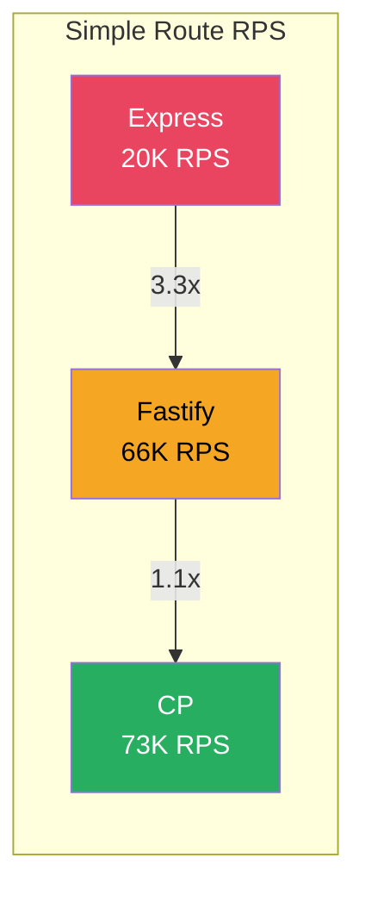

# Framework Benchmarking Results

#performance/benchmarking #nodejs/frameworks #performance/rps

## Purpose of This Benchmark

This document compiles the complete framework benchmark results from the 1M RPS project. These benchmarks were conducted to answer a critical question: **how much does framework choice matter, and what is the absolute performance ceiling of Node.js?** All benchmarks used the same hardware, same load testing tool (wrk/autocannon), and same endpoint logic. The two test routes were:

- **Simple route (`/simple`):** Returns a small static JSON object (`{ message: "hello" }`)
- **Complex route (`/update`):** Receives a ~30KB JSON payload, parses it, performs minor logic, and returns a ~30KB JSON response

## Complete Comparison Table

### Single Instance (1 Node.js process)

| Framework | Simple Route (`/simple`) | Complex Route (`/update`) | Dependencies | LoC |
|-----------|-------------------------|---------------------------|--------------|-----|
| [[7.3 Express Framework]] | ~18,000–20,000 RPS | ~8,000 RPS | ~30 | ~15,000+ |
| [[7.4 Fastify Framework]] | ~66,000 RPS | — | ~15 | ~30,000+ |
| [[7.5 Custom Framework (CP)]] | ~73,000 RPS | — | 0 | ~500 |

### Clustered (12 instances, 12-core machine)

| Framework | Complex Route (`/update`) | Speedup vs 1 instance |
|-----------|---------------------------|----------------------|
| Express | ~42,000 RPS | ~5.25x |
| Fastify | — | — |
| CP | — | — |

## Visualizing the Gap

## Analysis: Where Does the Time Go?

### Express → Fastify: 3.3x Improvement
The 3.3x jump from Express to Fastify comes from:
- **Schema-based serialization** (avoiding `JSON.stringify()` overhead)
- **Radix-tree routing** (O(k) vs O(n) route matching)
- **Lifecycle hooks** (direct function calls vs middleware chain iteration)
- **Reduced object allocation** (less per-request object creation)

### Fastify → CP: 1.1x Improvement
The smaller 1.1x jump from Fastify to CP reveals that Fastify's sophisticated optimizations are nearly as fast as having no framework at all. The remaining overhead in Fastify comes from:
- Plugin system bookkeeping
- Hook dispatch infrastructure
- Schema validation (even when responses match the schema)
- Internal error handling and edge case management

### CP → 1M RPS: 13.7x Gap
The most important number: even with zero framework overhead, Node.js + V8 can only deliver ~73K RPS. The **entire remaining gap** (73K → 1M) is caused by the JavaScript runtime itself. No framework optimization can close this gap — you need a different language.

## Why Framework Overhead Matters at Scale

At low traffic (hundreds of RPS), the difference between Express and CP is irrelevant — both complete requests in well under a millisecond. But at high traffic, framework overhead compounds:

| RPS Target | Budget per request (single core) | Express overhead (~50μs) | CP overhead (~14μs) |
|------------|----------------------------------|--------------------------|---------------------|
| 1,000 | 1,000μs | 5% | 1.4% |
| 10,000 | 100μs | 50% | 14% |
| 100,000 | 10μs | 500% (impossible) | 140% (impossible) |
| 1,000,000 | 1μs | 5,000% (impossible) | 1,400% (impossible) |

At 1M RPS, you have exactly **1 microsecond** per request. Express's ~50μs of per-request overhead means you'd need 50 cores just to handle framework overhead — before any application logic runs. This is why framework selection becomes existential at extreme scale.

## How to Conduct Your Own Framework Benchmarks

To reproduce or extend these results:

1. **Fix the hardware** — use the same machine for all tests, disable turbo boost, set CPU governor to "performance"
2. **Use a proper load generator** — `wrk` (C-based) or `autocannon` (Node-based), NOT `ab` (Apache Bench, single-threaded)
3. **Run the load generator on a separate machine** — otherwise the load generator competes for CPU
4. **Warm up** — run the benchmark for 30+ seconds before measuring; V8 needs time to JIT-compile hot paths
5. **Measure P99 latency, not just RPS** — average RPS can hide tail latency spikes
6. **Test both simple and complex routes** — framework overhead is most visible on simple routes; JSON parsing dominates complex routes
7. **Pin CPU cores** — use `taskset` to pin the server process to specific cores
8. **Increase file descriptor limits** — `ulimit -n 65535` to avoid "too many open files" errors

## Other Node.js Frameworks Worth Testing

The benchmarks above cover Express, Fastify, and CP. Other Node.js frameworks that may perform differently:

- **uWebSockets.js** — a C++ addon with a JavaScript API; claims 10x+ over Express due to C++ HTTP parsing
- **Koa** — created by the same author as Express, uses async/await middleware; similar performance to Express
- **Hapi** — enterprise-focused framework with rich plugin system; generally slower than Express
- **Restify** — designed for REST APIs specifically; performance similar to Express
- **Connect** — Express's predecessor, minimal middleware stack; slightly faster than Express

## The Definitive Takeaway

Framework benchmarks prove that **Node.js's performance ceiling is around 70–80K RPS per core** for simple routes, regardless of framework choice. The choice between Express and Fastify matters 3x at the framework level, but the choice between Node.js and C++ matters 13x+ at the runtime level. For the 1M RPS target, you must change the language — not just the framework.

## See Also

- [[5.1 Requests Per Second (RPS)]] — understanding the RPS metric
- [[12.5 Cluster Mode Scaling]] — using multiple processes to scale Node.js
- [[8.4 Language Performance Comparison]] — what happens when you switch languages
- [[8.1 C++ for High Performance]] — the language that can reach 1M RPS
- [[7.2 The Event Loop]] — why the event loop limits Node.js throughput