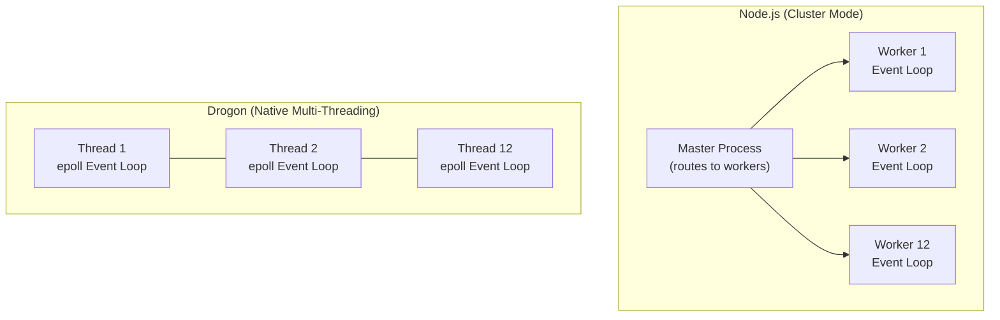

# Drogon Framework

#cpp/drogon #cpp/web-frameworks #performance/frameworks

## Definition

**Drogon** is one of the fastest C++ web application frameworks, designed for high-performance, non-blocking I/O applications. Created by An Tao and actively maintained on GitHub, Drogon provides a full-featured web framework comparable to Spring Boot (Java) or Express (Node.js) — but with C++ performance characteristics. In the 1M RPS project, Drogon was the framework that finally made 1 million requests per second achievable.

## Architecture

Drogon's architecture is built on the same principles that make Node.js fast (non-blocking I/O, event-driven), but implemented in C++ with true multi-threading:

### Non-Blocking I/O with epoll/kqueue
Drogon uses the operating system's native async I/O mechanisms — `epoll` on Linux, `kqueue` on macOS/BSD — through a custom event loop implementation. Unlike Node.js (which runs one event loop on one thread), Drogon creates **one event loop per CPU thread**. Each thread independently handles connections, and the OS distributes incoming connections across threads via `SO_REUSEPORT` or a shared accept mutex.

### Multi-Threaded by Default
While Node.js requires explicit clustering (via `cluster` module or `pm2`) to use multiple cores, Drogon natively uses all available CPU cores. On a 12-core machine, Drogon runs 12 event loops in parallel, each processing connections independently. This eliminates the inter-process communication overhead that Node.js cluster mode requires.



### HTTP Parser
Drogon uses `http-parser` (the same C library that powers Node.js's HTTP module) or its own optimized parser, compiled directly into the binary. There is no JavaScript boundary to cross — the parsed HTTP request becomes a C++ object immediately.

## Features

Despite its performance focus, Drogon provides a surprisingly complete feature set:

| Feature | Description |
|---------|-------------|
| **MVC Architecture** | Controllers, filters, and handlers with clean separation |
| **ORM** | Built-in ORM supporting PostgreSQL, MySQL, SQLite3 |
| **Template Engine** | Server-side HTML templating (like EJS/Jinja for C++) |
| **Built-in Caching** | In-memory and Redis cache integration |
| **WebSocket Support** | Full WebSocket client and server implementation |
| **Cookie/Session** | Built-in session management with multiple backends |
| **OpenAPI/Swagger** | Automatic API documentation generation |
| **JWT/Auth** | Pluggable authentication and authorization |

## Why Drogon Was Chosen for the 1M RPS Challenge

Drogon was selected after evaluating multiple C++ frameworks for several reasons:

1. **Benchmarked performance** — Drogon consistently tops TechEmpower Web Framework Benchmarks for C++ frameworks
2. **Complete feature set** — provides routing, JSON handling, and HTTP parsing out of the box
3. **Modern C++** — uses C++17 features, clean API, smart pointers
4. **Active development** — regular releases, responsive maintainer, growing community
5. **Easy build system** — CMake-based, with packages available for most Linux distributions

## Performance Characteristics

On the same hardware used for the Node.js benchmarks:

| Metric | Node.js (CP, 12 cores) | Drogon (12 threads) | Improvement |
|--------|------------------------|---------------------|-------------|
| Simple route RPS | ~73K × 12 ≈ 876K | ~1M+ | ~1.2x+ |
| Complex route (30KB JSON) | ~8K × 12 ≈ 96K | ~1M+ | ~10x+ |
| Memory usage | ~200–400 MB | ~20–50 MB | ~5–10x less |
| P99 latency | ~5–50ms (GC jitter) | <1ms (consistent) | ~5–50x better |
| Startup time | ~100–500ms | ~10–50ms | ~5–10x faster |

The most dramatic difference is on the **complex route** with 30KB JSON payloads. Here, Drogon's advantage isn't just 1.2x — it's **10x or more**, because JSON parsing and serialization in C++ (using [[8.3 RapidJSON]]) is fundamentally faster than in JavaScript, and Drogon can use all 12 threads without inter-process communication overhead.

## Drogon vs Other C++ Frameworks

| Framework | Approach | Performance | Feature Set | Best For |
|-----------|----------|-------------|-------------|----------|
| **Drogon** | Event-driven, multi-threaded | ★★★★★ | ★★★★★ | Production APIs |
| **Crow** | Flask-like, async | ★★★☆☆ | ★★★☆☆ | Prototyping |
| **Pistache** | Multi-threaded | ★★★★☆ | ★★☆☆☆ | Learning |
| **Oat++** | Zero-dependency, modern | ★★★★☆ | ★★★★☆ | Embedded systems |
| **userver** | Yandex's framework | ★★★★★ | ★★★★★ | Large-scale microservices |

## Building and Deploying Drogon

### Prerequisites
```bash
# Ubuntu/Debian
sudo apt install build-essential cmake libjsoncpp-dev libboost-all-dev libssl-dev zlib1g-dev

# Drogon also needs: uuid-dev, libsqlite3-dev (for ORM)
```

### Building
```bash
git clone https://github.com/drogonframework/drogon.git
cd drogon
mkdir build && cd build
cmake .. -DCMAKE_BUILD_TYPE=Release
make -j$(nproc)
sudo make install
```

### A Minimal Drogon Application
```cpp
#include <drogon/drogon.h>

int main() {
    drogon::app().registerHandler(
        "/api",
        [](const drogon::HttpRequestPtr& req,
           std::function<void(const drogon::HttpResponsePtr&)>&& callback) {
            auto resp = drogon::HttpResponse::newHttpJsonResponse(
                Json::Value{"hello"}
            );
            callback(resp);
        },
        {drogon::Get}
    );
    drogon::app().addListener("0.0.0.0", 8080).run();
}
```

### Deployment Considerations
- Compile with `-O3 -march=native` for maximum optimization
- Pin threads to CPU cores using `taskset` or Drogon's thread affinity settings
- Use `SO_REUSEPORT` (enabled by default) for optimal connection distribution
- Set appropriate `ulimit -n` values (65535+)

## Key Insight

Drogon proves that the performance difference between Node.js and C++ is not about "C++ being faster in general" — it's about **C++ allowing you to control every microsecond of every request**. With Node.js, you're at the mercy of V8's GC, JIT warmup, and dynamic type system. With Drogon + RapidJSON, every CPU cycle is accounted for, every memory allocation is explicit, and performance is deterministic.

## See Also

- [[8.1 C++ for High Performance]] — why C++ was necessary
- [[8.3 RapidJSON]] — the JSON parser that makes Drogon's responses fast
- [[8.4 Language Performance Comparison]] — how C++ compares to other languages
- [[7.6 Framework Benchmarking Results]] — the Node.js benchmarks Drogon surpasses