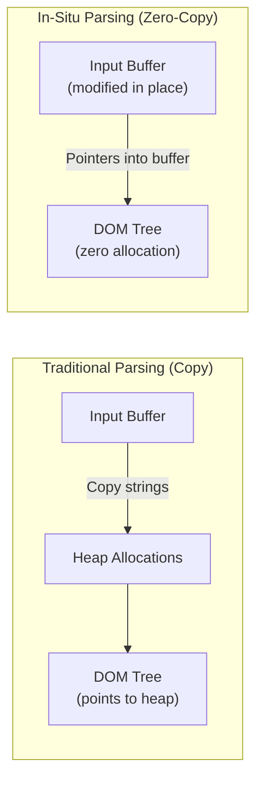

# RapidJSON

#cpp/json #performance/serialization #cpp/libraries

## Definition

**RapidJSON** is a C++ JSON parser and serializer developed by Milo Yip (a Tencent engineer). It is widely regarded as one of the fastest JSON libraries in the world, consistently ranking at or near the top of native JSON parser benchmarks. In the 1M RPS project, RapidJSON is the component that makes parsing and generating 30KB JSON responses fast enough to reach 1 million requests per second.

## Why JSON Parsing Matters at Scale

In a typical API serving 30KB JSON responses, **JSON parsing and serialization can consume 30–50% of total request processing time**. This makes it one of the single largest performance bottlenecks. Consider the math at 1M RPS:

- Budget per request: **1 microsecond** (single core)
- If JSON parsing takes 5μs, you need **5 cores just for JSON** — leaving none for routing, business logic, or HTTP parsing
- RapidJSON's in-situ parsing of a 30KB document can take as little as **2–5μs**, compared to Node.js's `JSON.parse()` at 20–50μs

The difference between a fast JSON parser and a slow one is the difference between reaching 1M RPS and failing.

## SAX vs DOM Parsing

RapidJSON supports two fundamentally different parsing paradigms:

### DOM (Document Object Model) Parsing
Parses the entire JSON document into an in-memory tree structure. Every object becomes a `Value` node, every array becomes an ordered list of `Value` nodes. You access data by traversing the tree.

```cpp
// DOM parsing
Document doc;
doc.Parse(jsonString);
const Value& name = doc["user"]["name"];
std::cout << name.GetString();
```

**Pros:** Intuitive, random access, easy to modify. **Cons:** Allocates memory for the entire tree, parses the whole document even if you only need one field.

### SAX (Simple API for XML, adapted for JSON)
Parses the document incrementally, firing events for each token. No tree is built in memory. You process the JSON as a stream.

```cpp
// SAX parsing
class MyHandler : public BaseReaderHandler<UTF8<>, MyHandler> {
    bool String(const char* str, SizeType length, bool copy) {
        // Handle each string token
        return true;
    }
};
Reader reader;
MyHandler handler;
reader.Parse(jsonString, handler);
```

**Pros:** Zero allocation (if using in-situ mode), constant memory, processes only what's needed. **Cons:** Harder to write, no random access, state management is manual.

## In-Situ Parsing: The Game-Changing Optimization

RapidJSON's most powerful feature is **in-situ (in-place) parsing**. Instead of copying strings from the input buffer into newly allocated memory, in-situ parsing modifies the input buffer directly by replacing JSON structural characters (quotes, colons, commas, brackets) with null terminators. The parsed document's string values are pointers directly into the original buffer.



**Before in-situ parsing:**
```
{"name": "Alice", "age": 30}
```

**After in-situ parsing (structural chars replaced with \0):**
```
\0name\0\0 Alice\0\0 age\0\0 30\0
```

The `Value` nodes point to `Alice` and `30` directly within the modified buffer. **Zero additional heap allocations** for string data. This saves not just memory but also the time spent in `malloc`/`free` — which at 1M RPS, running millions of allocations per second, becomes significant.

**Requirement:** The input buffer must be writable (not `const char*`). This means you may need to copy the data once into a mutable buffer (from a network receive buffer) before parsing. But that's one allocation, not hundreds.

## SIMD Optimizations

RapidJSON can use **SIMD (Single Instruction, Multiple Data)** CPU instructions to accelerate parsing. Modern CPUs have vector registers (128-bit SSE, 256-bit AVX2, 512-bit AVX-512) that can process 16–64 bytes simultaneously. RapidJSON uses SIMD to:

- **Skip whitespace** in bulk — instead of checking each byte individually, load 16 bytes and check them all at once
- **Detect structural characters** — quickly find `{`, `}`, `:`, `,`, `"`, `[`, `]` without branching
- **Validate UTF-8** — vectorized UTF-8 validation is orders of magnitude faster than byte-by-byte checking

To enable SIMD, compile with `-DRAPIDJSON_SSE2` (or `-DRAPIDJSON_AVX2`):
```bash
g++ -O3 -march=native -DRAPIDJSON_SSE2 -DRAPIDJSON_AVX2 ...
```

## RapidJSON vs Other JSON Libraries

| Library | Language | 30KB Parse Time | DOM Size | In-Situ | SIMD |
|---------|----------|-----------------|----------|---------|------|
| **RapidJSON** | C++ | ~2–5μs | Minimal | ✅ | ✅ |
| **simdjson** | C++ | ~1–3μs | Minimal | ✅ (DOM-less) | ✅ (required) |
| **nlohmann/json** | C++ | ~10–20μs | Large | ❌ | ❌ |
| **Jackson** | Java | ~10–30μs | Large (JVM) | ❌ | ❌ |
| **encoding/json** | Go | ~10–20μs | Moderate | ❌ | ❌ |
| **V8 JSON.parse** | JavaScript | ~20–50μs | V8 heap | ❌ | Partial |
| **json.loads** | Python | ~30–100μs | Large (CPython) | ❌ | ❌ |

## Memory Allocation Strategies

RapidJSON provides a pluggable **allocator** interface, allowing you to supply custom memory allocation strategies:

### Default Allocator
Uses `malloc`/`free` — standard heap allocation. Each object, each string, each array element may trigger a separate allocation.

### Memory Pool Allocator
Pre-allocates a large block of memory and sub-allocates from it. Allocations are O(1) (just bump a pointer), and the entire pool can be freed at once (O(1) deallocation). Ideal for per-request JSON processing:

```cpp
MemoryPoolAllocator<> allocator;
Document doc(&allocator);
doc.Parse(buffer);  // All allocations come from the pool
// ... use doc ...
// Pool freed automatically when 'allocator' goes out of scope
```

### Stack Allocator
For small JSON documents, allocations can come from the stack (via a statically-sized buffer). This avoids the heap entirely, providing cache-friendly, deterministic allocation.

## Real Impact on the 1M RPS Target

With nlohmann/json (a popular but slower C++ JSON library), the 30KB parse+serialize cycle might take 20–40μs, limiting per-core throughput to ~25,000–50,000 RPS. With RapidJSON's in-situ parsing + memory pool allocator + SIMD, the same cycle takes 2–5μs, enabling **200,000–500,000 RPS per core**. Combined with 12 cores via Drogon, this puts 1M RPS within reach.

The lesson: at extreme scale, **library choice is as important as language choice**. C++ with nlohmann/json might only be 2–3x faster than Node.js. C++ with RapidJSON is 10–20x faster. The difference between "good enough" and "fast enough" often lies in a single library.

## See Also

- [[8.1 C++ for High Performance]] — the language context
- [[8.2 Drogon Framework]] — the web framework using RapidJSON
- [[8.5 Memory Management]] — how allocation strategies affect performance
- [[3.5 JSON Data Format]] — understanding JSON structure and encoding
- [[15.4 Memory Bottlenecks]] — why allocation overhead compounds at scale