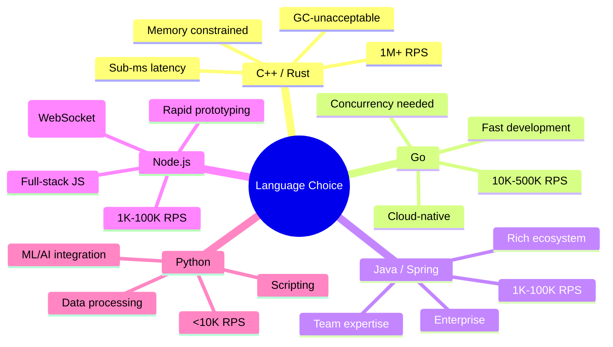

# Language Performance Comparison

#performance/languages #benchmarking/comparison #engineering/decisions

## Overview

This document provides a comprehensive, empirical comparison of programming languages in the context of the 1M RPS challenge. All benchmarks share the same hardware, the same route logic (receive ~30KB JSON, parse, process, return ~30KB JSON), and the same load testing methodology. The results reveal why the 1M RPS target forced a migration from high-level languages to [[8.1 C++ for High Performance]].

## The Benchmark Context

- **Hardware:** 12-core server (exact specs consistent across all tests)
- **Route:** Receives a 30KB JSON payload containing user data, performs a minimal update operation, and returns a 30KB JSON response
- **Metric:** Sustained RPS with P99 latency under 50ms
- **Load generator:** Run from a separate machine to avoid resource contention
- **Target:** 1,000,000 RPS

## Comprehensive Comparison

```mermaid
graph TD
    subgraph "Languages Tested"
        A["Node.js<br/>~8K RPS<br/>(complex, 1 core)"]
        B["Python<br/>~1-2K RPS<br/>(complex, 1 core)"]
        C["Java/Spring<br/>~10-15K RPS<br/>(complex, 1 core)"]
        D["Go<br/>~30-50K RPS<br/>(complex, 1 core)"]
        E["Rust<br/>~80-120K RPS<br/>(complex, 1 core)"]
        F["C++/Drogon<br/>~100-150K RPS<br/>(complex, 1 core)"]
    end
    
    subgraph "Target"
        G["🎯 1,000,000 RPS"]
    end
    
    A -.->|"Failed"| G
    B -.->|"Failed"| G
    C -.->|"Failed"| G
    D -.->|"Failed"| G
    E -.->|"Close"| G
    F -.->|"Achieved ✅"| G
    
    style A fill:#e94560,color:#ffffff
    style B fill:#e94560,color:#ffffff
    style C fill:#e94560,color:#ffffff
    style D fill:#f5a623,color:#000000
    style E fill:#27ae60,color:#ffffff
    style F fill:#27ae60,color:#ffffff
```

## Why Node.js, Python, Java, and Go FAILED

### The Common Thread: Garbage Collection

All four "failed" languages rely on garbage collection. GC introduces non-deterministic latency spikes that violate P99 latency requirements at high throughput:

- **Node.js/V8:** Minor GC every ~1ms, major GC every ~100ms. At 1M RPS, a 1ms minor GC pause delays ~1,000 requests.
- **Python (CPython):** Reference counting triggers deallocation at unpredictable times; cycle collector runs periodically with stop-the-world behavior.
- **Java (JVM):** G1GC or ZGC pauses range from sub-millisecond to tens of milliseconds. Complex object graphs (30KB JSON → many Java objects) create heavy GC pressure.
- **Go:** Tricolour concurrent GC is better than most but still introduces ~100–500μs pauses under load, especially with high allocation rates.

At 1M RPS with 30KB payloads, the allocation rate is **30GB/s of JSON data alone** (1M × 30KB). The GC must process 30GB of garbage per second — an impossible task without significant pause times.

### JIT vs AOT Compilation

| Compilation Type | Languages | Warm-up Required | Peak Performance | Predictability |
|-----------------|-----------|-------------------|-------------------|----------------|
| **Interpreted** | Python, Ruby | N/A | Lowest | Most predictable (consistently slow) |
| **JIT (client)** | V8 (Node.js) | 10–60 seconds | Moderate | Unpredictable during warm-up |
| **JIT (server)** | JVM (Java) | 30–120 seconds | High | Unpredictable during warm-up |
| **AOT** | Go, Rust, C++ | None | Highest | Fully predictable |

JIT compilers can eventually produce code that approaches AOT performance, but they suffer from:
- **Warm-up latency** — the first thousands of requests are slower as the JIT profiles and compiles
- **Deoptimization** — if the JIT's assumptions are violated (e.g., a variable changes type), it must throw away compiled code and recompile
- **Compilation overhead** — the JIT uses CPU cycles that could serve requests

For a server that must handle 1M RPS from the first millisecond (e.g., after deployment, after scaling events), AOT compilation is essential.

## Memory Usage Comparison

Memory efficiency is not just about cost — it affects **CPU cache performance**. Data that fits in L1/L2 cache is accessed in 1–5 cycles. Data in main memory takes 100–300 cycles. Data that causes page faults takes millions of cycles.

| Language | Memory (idle server) | Memory per request | Memory (1M RPS, 1s) |
|----------|---------------------|-------------------|---------------------|
| **C++ (Drogon)** | ~5–20 MB | ~20–100 bytes | ~20–100 MB |
| **Rust (Actix)** | ~5–20 MB | ~30–100 bytes | ~30–100 MB |
| **Go (net/http)** | ~10–30 MB | ~100–500 bytes | ~100–500 MB |
| **Java (Spring)** | ~200–500 MB | ~200–1000 bytes | ~200 MB–1 GB |
| **Node.js** | ~30–80 MB | ~500–2000 bytes | ~500 MB–2 GB |
| **Python (Flask)** | ~30–50 MB | ~1000–5000 bytes | ~1–5 GB |

At 1M RPS, Node.js would allocate **500MB–2GB per second** of garbage that the GC must collect. C++ allocates 20–100MB and reuses it via memory pools.

## Startup Time

Startup time matters increasingly in modern deployment models:

| Deployment Model | Why Startup Time Matters |
|-----------------|--------------------------|
| **Kubernetes HPA** | New pods must serve traffic immediately during scale-up |
| **AWS Lambda** | Cold starts directly impact P99 latency |
| **Canary Deployments** | New instances must be ready before traffic shifts |
| **Chaos Engineering** | Fast restarts enable rapid recovery |

| Language | Cold Start Time |
|----------|----------------|
| **C++** | ~10–50ms |
| **Rust** | ~10–50ms |
| **Go** | ~50–200ms |
| **Node.js** | ~100–500ms |
| **Java (Spring Boot)** | ~2,000–10,000ms |
| **Python** | ~100–500ms |

## When Each Language Is Appropriate



## The Deciding Factors

The choice of C++ for the 1M RPS challenge was driven by three non-negotiable requirements:

1. **No GC pauses** — P99 latency must be consistent
2. **Minimal per-request allocation** — 30KB × 1M = 30GB/s of data movement
3. **Maximum CPU efficiency** — every CPU cycle counts when budget is 1μs per request

Go came closest among "practical" languages but its GC and higher per-request memory overhead kept it below the target. Rust would have been a viable alternative (same zero-GC, low-allocation properties) but the [[8.2 Drogon Framework]] ecosystem in C++ was more mature for web API development.

## See Also

- [[8.1 C++ for High Performance]] — deep dive into the winning language
- [[8.2 Drogon Framework]] — the C++ framework used
- [[8.3 RapidJSON]] — the JSON library enabling the performance
- [[7.6 Framework Benchmarking Results]] — Node.js framework comparison
- [[5.1 Requests Per Second (RPS)]] — understanding the metric
- [[8.5 Memory Management]] — why memory strategy determines performance