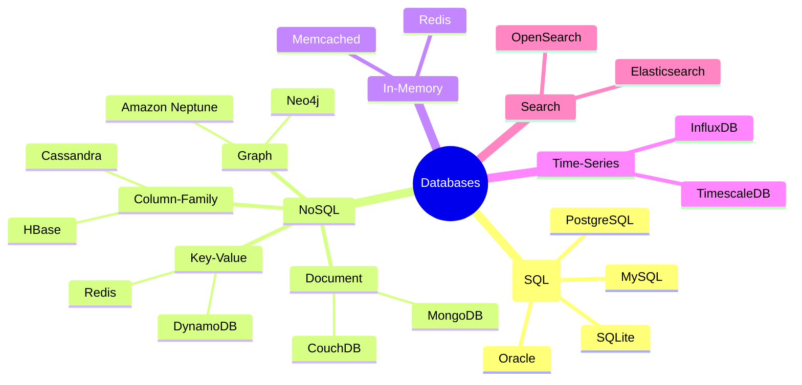

# What is a Database?

#database/fundamentals #concepts/storage

> **Definition**: A database is an organized collection of structured data stored electronically, typically managed by a Database Management System (DBMS) that provides interfaces for creation, querying, updating, and administration of data.

## Why Databases Exist

Databases solve four fundamental problems that raw files cannot address at scale:

1. **Persistent Storage**: Unlike in-memory data structures that vanish on process restart, databases durably store data to disk (or SSD/NVMe). This persistence survives power failures, kernel panics, and application crashes — a non-negotiable requirement for any system handling user data, financial transactions, or audit logs.

2. **Concurrent Access**: Multiple clients — potentially thousands or millions — need to read and write data simultaneously. A database provides concurrency control mechanisms (locks, MVCC, optimistic concurrency) that prevent data corruption when two transactions modify the same row at the same time. Without a DBMS, you would need to implement file-level locking yourself, which is error-prone and performs poorly.

3. **Query Capabilities**: Rather than scanning entire files and filtering in application code, databases allow you to express *what* data you want (declaratively) rather than *how* to find it (imperatively). A query engine with an optimizer examines your SQL statement, selects an execution plan, and uses indexes to retrieve results in milliseconds rather than minutes.

4. **ACID Guarantees**: The ACID properties — Atomicity, Consistency, Isolation, Durability — ensure that even in the presence of crashes, network partitions, or concurrent modifications, your data remains in a valid state. See [[9.3 PostgreSQL]] for a deep dive into how PostgreSQL implements these guarantees via MVCC and Write-Ahead Logging.

## Types of Databases

### Relational (SQL) Databases

Relational databases organize data into tables with rows and columns, enforcing a rigid schema via data types, constraints (NOT NULL, UNIQUE, CHECK), and foreign key relationships. They excel at complex queries involving JOINs, aggregations, and transactions. [[9.3 PostgreSQL]] is the gold standard here. Use relational databases when your data has clear structure, relationships between entities matter, and you need transactional guarantees.

### NoSQL Databases

NoSQL databases trade the rigid schema and ACID guarantees of relational databases for flexibility, horizontal scalability, and optimized access patterns:

- **Document stores** (MongoDB): Store JSON-like documents. Ideal when your schema evolves frequently or entities have heterogeneous attributes.
- **Key-Value stores** ([[9.4 Redis]], DynamoDB): Simplest model — store and retrieve values by key. O(1) lookups. Ideal for session storage, caching, configuration.
- **Column-family stores** (Cassandra): Optimized for writing massive amounts of time-ordered data. Used in telemetry, IoT, and analytics workloads.
- **Graph databases** (Neo4j): Optimized for traversing relationships. Ideal for social networks, recommendation engines, fraud detection.

### In-Memory Databases

In-memory databases like [[9.4 Redis]] store all data in RAM, achieving microsecond-level latency. The trade-off is cost (RAM is expensive per GB compared to disk) and that data size is bounded by available memory. At 1M RPS, an in-memory caching layer is not optional — it is mandatory.

### Time-Series Databases

Optimized for timestamped data: metrics, sensor readings, stock prices. They use specialized compression algorithms (like Gorilla compression) and efficient time-bucketed storage. TimescaleDB is actually built as an extension on top of PostgreSQL, bridging the relational and time-series worlds.

## Database as a Service vs Self-Managed

| Factor | DBaaS (Managed) | Self-Managed |
|--------|-----------------|--------------|
| Setup time | Minutes | Hours to days |
| Patching & upgrades | Automatic | Manual |
| High availability | Built-in | You build it |
| Cost at small scale | Lower (no ops overhead) | Higher |
| Cost at large scale | Premium pricing | Can optimize |
| Control | Limited | Full |
| Examples | AWS RDS, Cloud SQL, PlanetScale | Bare metal, VMs, Kubernetes |

For the 1M RPS benchmark, the choice of managed vs self-managed has direct cost implications. See [[13.5 RDS and Aurora]] for how AWS managed database services factor into high-performance architectures.

## The Role of Databases in Web Applications

Every web application has a database as its source of truth. The request lifecycle typically follows this pattern:

The database sits at the bottom of this chain. When the cache misses — and it will, eventually — the query must reach the database. If the database cannot handle the query load, no amount of application-level optimization will save you. This is why understanding database fundamentals, performance tuning ([[10.1 IOPS (Input-Output Operations Per Second)]], [[10.2 Database Indexing]]), and scaling strategies ([[11.2 Read Replicas]], [[11.3 Sharding]]) is essential for building high-throughput systems.

## Common Mistakes

- **Using a database as a queue**: Databases are not message brokers. Use [[9.4 Redis]] pub/sub or a proper message queue (RabbitMQ, Kafka) for async communication.
- **Storing large blobs in the database**: Put images, videos, and large files in object storage (S3) and store only the URL in the database.
- **Ignoring connection pooling**: Opening a new TCP connection per request is catastrophically expensive. See [[10.5 Connection Pooling]].

## Further Reading

- [[9.2 SQL Basics]] — the language of relational databases
- [[9.5 RDBMS vs NoSQL]] — when to choose which
- [[11.1 Vertical Scaling]] — making a single database more powerful